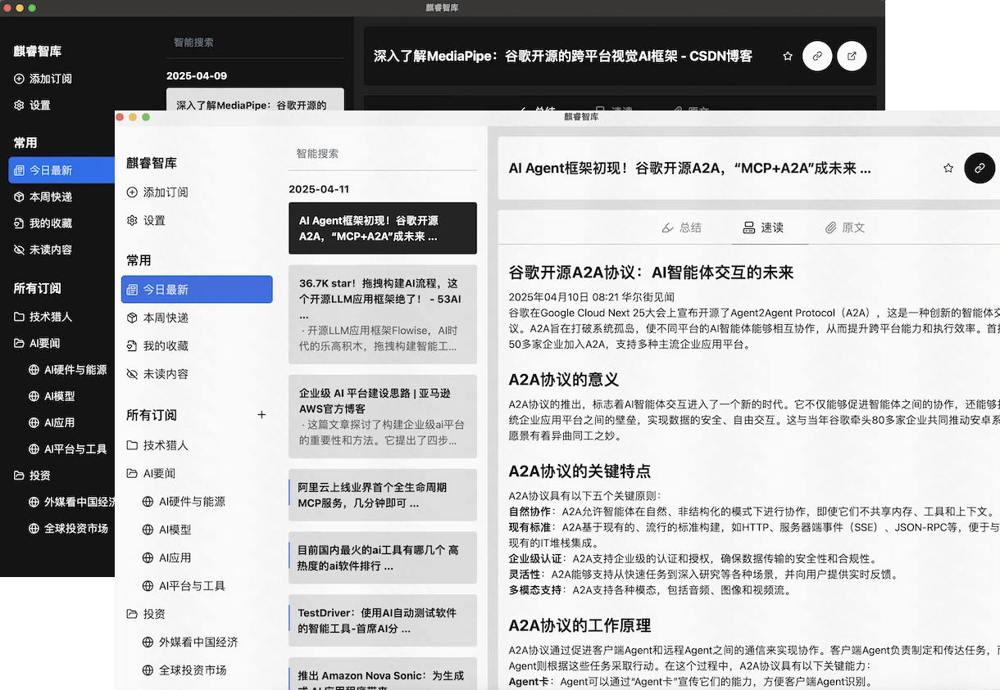
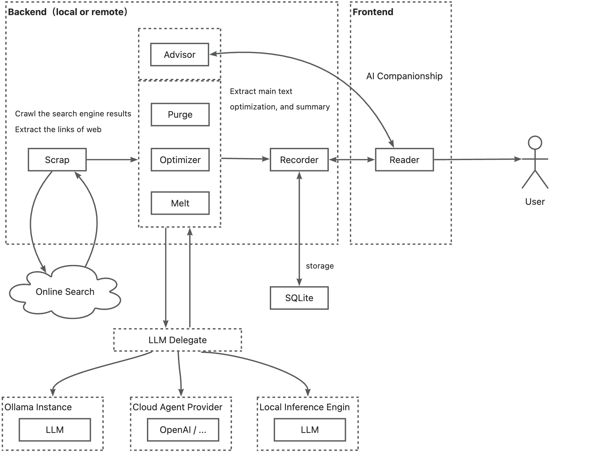

<p align="center">
  
</p>
<h3 align="center">Saga Reader</h3>

<p align="center">
    <a href="./README.md">English</a>
    |
    <a href="./README_zh.md">中文</a>
</p>

<p align="center">🛠️ A modern, cross-platform application built on top of <strong>Rust</strong>, <strong>Tauri</strong> & <strong>Svelte</strong>.</p>
<p align="center">💪🏻 <strong>Blazing-Fast</strong> and <strong>Extremely-Lightweight</strong> Internet Reader Client driven by <strong>AI</strong>.</p>
<p align="center">
  <a style="text-decoration:none" href="https://aiqino.netlify.app?s=github_website_tag">
    
  </a>
  
  
  
</p>
<hr />

> 🚀 Help me develop this software better by [sponsoring on GitHub](https://github.com/sponsors/sopaco)


## What's Saga Reader
Saga Reader is an AI-driven think tank-style reader that automatically retrieves information from the internet based on user-specified topics and preferences. It uses cloud or local large models to summarize and provide guidance, and it includes an AI-driven interactive companion reading function, allowing you to discuss and exchange ideas with AI about the content you've read.

Saga Reader is completely free and open-source, meaning all data is securely stored on your own computer and is not controlled by third-party service providers. Additionally, you can manage your subscription keywords based on your interests and preferences without being disturbed by advertisements and commercialized content.

Download it from [website](https://aiqino.netlify.app?s=github_download)!

**Thanks to the kind people**

[](https://github.com/sopaco/saga-reader/stargazers)

**Note: Installation and Usage Instructions**

For the installation precautions and the configuration method of the large language model required for the first use, please refer to the [**Help Document**](./docs/how-to-use-en.md).

## Snapshots



## How it works

[](https://deepwiki.com/sopaco/saga-reader)



## Key Features

- **Intelligent Content Subscription**: An interest-based content generation engine that supports flexible content subscription settings according to user interests. Users only need to define keywords of interest to independently search for relevant information across the entire network without complex subscription operations.
- **Efficient Information Retrieval**: A fully automated content engine implemented purely in Rust. It supports multiple retrieval modes such as search and RSS, enabling efficient collection of global internet information.
- **AI Immersive Reading Companion**: An innovative AI reading companion feature that allows users to communicate with AI in real - time during the reading process, get answers to questions, gain in - depth insights, and bid farewell to the solitude of reading.
- **Multilingual Intelligent Translation**: Equipped with intelligent translation capabilities, it breaks through language and regional barriers, automatically translating hundreds of foreign language information. Non - native language articles are automatically translated into the user's preferred language.
- **Security and Privacy Assurance**: It provides the best security and privacy protection. All data is completely stored on the user's personal computer, free from tracking or influence by any third - party service providers.
- **Multi - Model AI Support**: Supports connecting to cloud - based and local large - scale models for inference. Cloud - based large - scale models cover mainstream industry models to meet AI needs in different scenarios.
- **Smooth Operation on Old Devices**: Developed based on Rust and Svelte technologies, it has the lowest memory and CPU consumption among similar products. With a memory usage of less than 10MB, it ensures smooth operation even on old devices.
- **Clean and Refreshing UI**: Adopting a clean and refreshing UI design, the interface is simple, lightweight, practical, and easy to operate, free from annoying ads and commercial elements.
- **Flexible Reading Experience**: It offers flexible article reading methods. Users can choose to read the full content using the built - in article viewer or switch to their preferred browser for browsing.
- **Efficient Search and Background Updates**: Supports article search and can silently update content in the background. Relying on Rust technology, it has extremely low memory usage (only 10MB) and excellent operating performance.

## Development
### Prerequisites
- [**Rust**](https://www.rust-lang.org)
- [**Bun**](https://bun.sh) (recommended) or NodeJS


### Installation
The installation is straight forward, just follow the steps below:
<br>
1. Clone the repository.
    ```sh
    git clone https://github.com/sopaco/saga-reader.git --recursive
    ```
2. Step into the cloned project folder.
    ```sh
    cd saga-reader
    ```
3. Install Dependencies.

    *Recommend **[bun](https://bun.sh)**, this is blazing fast.*
    ```sh
    # **recommend, this is blazing fast**
    bun install

    # or use pnpm
    # pnpm install

    # or use npm
    # npm install
    ```
4. Run

    ```sh
    # **recommend, this is blazing fast**
    bun run dev

    # or use pnpm
    # pnpm run dev

    # or use npm
    # npm run dev
    ```
5. Or build it directly

> By default, it will build for the version of the system used by the machine you are compiling on. If you need to cross-compile, you can run the `build:macos` or `build:windows` scripts in the `package.json`.
    ```sh
    # **recommend, this is blazing fast**
    bun run build

    # or use pnpm
    # pnpm run build

    # or use npm
    # npm run build
    ```
<br>

### Monorepo App Architecture

We use a combination of Rust, Svelte (SvelteKit), Tauri, SeaORM, SqlLite, TailwindCSS throughout this monorepo.

#### App

- `desktop`: A [Tauri](https://tauri.app) (Rust) app, using [Svelte](https://svelte.dev/) on the frontend.

#### Packages / Crates

- `intelligent`: Article optimization workflow module, providing abstractions for article optimization processes and prompt engineering optimizations.
- `scrap`: Provides data scraping functionality, fetching internet information by calling mainstream search engines. This module is by default fully localized and does not rely on any third-party services.
- `recorder`: Provides local storage functionality, where user interest prompts, raw articles, and post-processed optimized articles are saved on the user's personal computer storage.
- `llm`: Provides internal LLM Provider abstractions and adapts to various cloud and local large model service implementations.
- `ollama`: Operates local ollama, including running basic instances, model updates, and management functions.
- `feed_api_rs`: The core capability API and implementation, based on the classic facade pattern.
- `tauri-plugin-feed-api`: Core capability API for frontend calls via tauri commands.
- `types`: Shared basic types module.

#### Schematic Diagram
```plaintext
+---------------------+     +---------------------+
|      Frontend       |     |     Backend         |
|  (Svelte/SvelteKit) |<--->|  (Rust Modules)     |
+---------------------+     +---------------------+
       ^   ^   ^                      |   |   |
       |   |   |                      |   |   |
+------+---+---+-------+       +------+---+---+-------+
|  UI/UX Components    |       |  tauri-plugin-feed-api|
|  State Management    |       |  feed_api_rs          |
|  Internationalization|       |  llm                  |
|  Styling (Tailwind)  |       |  ollama               |
|  Build Tools (Vite)  |       |  recorder             |
|                      |       |  scrap                |
|                      |       |  types                |
|                      |       |  intelligent          |
+----------------------+       +-----------------------+
```

### Contribute

Help improve Saga Reader by reporting bugs or submitting feature requests through [GitHub Issues](https://github.com/sopaco/saga-reader/issues).

Similarly, there are some features in wunderlist that need to be improved.

**For Example**

- You can help implement additional [Internet Search Providers](https://github.com/sopaco/saga-reader/tree/master/crates/scrap/src/search) beyond Bing, such as Google.
- You can assist in integrating more [Online LLM Providers](https://github.com/sopaco/saga-reader/tree/master/crates/llm/src/providers) besides GLM Flash, like OpenAI.
- You can also contribute to the internationalization of the app by providing [translations into additional languages](https://github.com/sopaco/saga-reader/tree/master/app/src/lib/i18n/locales). Refer to the [svelte-i18n](https://github.com/kaisermann/svelte-i18n/blob/main/docs/Getting%20Started.md#5-localizing-your-app) repository to get started with internationalization.

If you enjoy using this app, consider supporting its development by donating through [GitHub Sponsors](https://github.com/sponsors/sopaco), [Paypal](https://paypal.me/skyronj), or [Alipay](https://aiqino.netlify.app/uprise-assets/alipay.jpg).

### Developed with

- [Rust](https://github.com/rust-lang/rust)
- [Tauri](https://github.com/tauri-apps/tauri)
- [Svelte](https://github.com/sveltejs/svelte)
- [SvelteKit](https://github.com/sveltejs/kit)
- [Skeleton](https://github.com/skeletonlabs/skeleton)
- [sea-orm](https://github.com/SeaQL/sea-orm)

### License
MIT, A copy of the license is provided in the [LICENSE](./LICENSE) file.

### About Me

> 🚀 Help me develop this software better by [sponsoring on GitHub](https://github.com/sponsors/sopaco)

An experienced internet veteran, having navigated through the waves of PC internet, mobile internet, and AI applications. Starting from an individual mobile application developer to a professional in the corporate world, I possess rich experience in product design and research and development. Currently, I am employed at [Kuaishou](https://en.wikipedia.org/wiki/Kuaishou), focusing on the R&D of universal front-end systems and AI exploration.

WeChat: dokhell

Email: dokhell@hotmail.com
