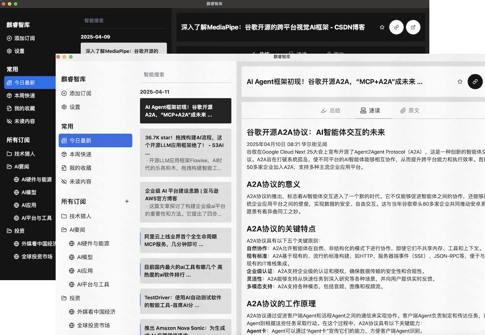
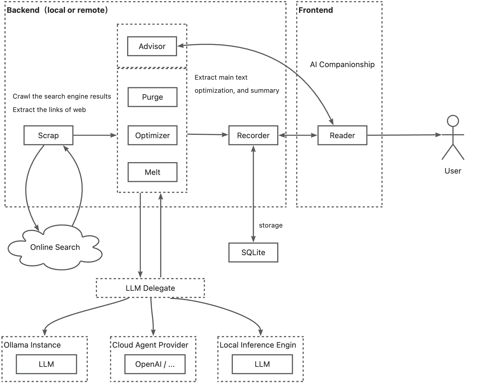

<p align="center">
  
</p>
<h3 align="center">麒睿智库(Saga Reader)</h3>
<p align="center">您的AI智能助手</p>
<p align="center">
  
  
  
</p>
<hr />

<p align="center">
    <a href="./README.md">English</a>
    |
    <a href="./README_zh.md">中文</a>
</p>

> 🚀 通过 [在 GitHub 上赞助](https://github.com/sponsors/sopaco)让这个软件更好的发展。

## 麒睿智库是什么
麒睿智库(Saga Reader) 是一个AI驱动的智库式阅读器，根据用户指定的主题和偏好关键词自动从互联网上检索信息。它使用云端或本地大型模型进行总结和提供指导，并包括一个AI驱动的互动阅读伴读功能，允许您与AI讨论和交换阅读内容的想法。

麒睿智库 完全免费和开源，这意味着所有数据都安全地存储在您自己的计算机上，不受第三方服务提供商的控制。此外，您可以根据自己的兴趣和偏好管理订阅关键词，而不会受到广告和商业化内容的打扰。

从[官方网站](https://aiqino.netlify.app)下载！

## 快照

---



## 工作原理

---



## 功能

### 内容订阅
- 根据您的兴趣灵活设置您的内容订阅。只需定义一些关键词即可自动从全球互联网收集信息。

### 翻译
- 自动翻译外语信息。您可以将其他语言的文章自动翻译成您喜欢的语言。

### 安全和隐私
- 提供最佳的安全和隐私功能。您的数据完全存储在您的个人计算机上，不受第三方服务提供商的跟踪或影响。

### 模型支持
- 支持连接到云端大型模型或本地大型模型进行推理。

### 性能
- 极其轻量和高性能，这个应用程序使用Rust和Svelte技术开发，具有同类中最低的内存和CPU消耗，内存使用量低于10MB。您可以在任何老设备上部署它。

### UI设计
- 简洁的UI设计，轻量、实用且易于使用。您不会被烦人的广告或商业元素所打扰。

### 文章查看器
- 使用内置文章查看器阅读完整内容，或切换到您喜欢的浏览器进行浏览。

### 搜索和后台更新
- 支持文章搜索。
- 可以在后台静默更新内容。由于Rust技术，它具有极小的内存占用，只有10MB，并且运行性能优越。

## 开发
### 前提条件
- [**Rust**](https://www.rust-lang.org)
- [**Bun**](https://bun.sh) (推荐) or NodeJS

### 安装
安装非常简单，只需按照以下步骤操作：
<br>
1. 克隆仓库。
    ```sh
    git clone https://github.com/sopaco/saga-reader.git
    ```
2. 进入克隆的项目文件夹。
    ```sh
    cd saga-reader
    ```
3. 安装依赖项。

    *推荐使用**[bun](https://bun.sh)，这非常快。*
    ```sh
    # **推荐，这非常快**
    bun install

    # 或使用 pnpm
    # pnpm install

    # 或使用 npm
    # npm install
    ```
4. 运行

    ```sh
    # **推荐，这非常快**
    bun run dev

    # 或使用 pnpm
    # pnpm run dev

    # 或使用 npm
    # npm run dev
    ```
5. 或直接构建

> 默认会构建为你编译时所用机器所用系统的版本，如果需要交叉编译，可以运行`package.json`中的`build:macos`、`build:windows`。

    ```sh
    # **推荐，这非常快**
    bun run build

    # 或使用 pnpm
    # pnpm run build

    # 或使用 npm
    # npm run build
    ```
<br>

### 单仓库应用架构

项目使用了Rust、Svelte（SvelteKit）、Tauri、SeaORM、SqlLite、TailwindCSS等技术。

#### App
基于[Tauri](https://tauri.app)（Rust）框架的应用，具备极致的性能与安全性优势；前端交互使用[Svelte](https://svelte.dev/)，基于编译时的现代Web框架在提供优秀开发体验的同时也提供了优异的性能基础。

#### Packages / Crates

- `intelligent`: 文章优化工作流模块，提供文章优化过程和提示工程优化的抽象。
- `scrap`: 提供数据抓取功能，通过调用主流搜索引擎从互联网获取信息。此模块默认是完全本地化的，不依赖任何第三方服务。
- `recorder`: 提供本地存储功能，用户兴趣提示、原始文章和后处理优化文章保存在用户个人计算机存储中。
- `llm`: 提供内部的LLM Provider抽象，并适配各种云端和本地大型模型服务实现。
- `ollama`: 运行本地ollama，包括运行基本实例、模型更新和管理功能。
- `feed_api_rs`: 基于经典门面模式的核心能力API和实现。
- `tauri-plugin-feed-api`: 通过tauri命令调用前端的核心能力API。
- `types`: 共享基本类型模块。

### 贡献

通过[GitHub Issues](https://github.com/sopaco/saga-reader/issues)报告错误或提出功能请求，帮助使麒睿智库变得更好。

同样，Wunderlist 也有一些需要改进的功能。

**例如**
- 你可以帮助实现除 Bing 之外的其他[互联网搜索引擎适配器](https://github.com/sopaco/saga-reader/tree/master/crates/scrap/src/search)，例如 Google。
- 你可以协助整合更多的[在线 LLM 提供商](https://github.com/sopaco/saga-reader/tree/master/crates/llm/src/providers)，除了 智普清言的GLM Flash，还有 OpenAI。
- 您还可以通过提供[其他语言的翻译](https://github.com/sopaco/saga-reader/tree/master/app/src/lib/i18n/locales)来帮助国际化应用程序。参考[svelte-i18n](https://github.com/kaisermann/svelte-i18n/blob/main/docs/Getting%20Started.md#5-localizing-your-app)国际化使用指南。

如果您喜欢使用这个应用程序，请考虑通过[GitHub赞助商](https://github.com/sponsors/sopaco)、[Paypal](https://paypal.me/skyronj)或[支付宝](https://aiqino.netlify.app/uprise-assets/alipay.jpg)捐款支持其开发。

### 使用以下技术开发

- [Rust](https://github.com/rust-lang/rust)
- [Tauri](https://github.com/tauri-apps/tauri)
- [Svelte](https://github.com/sveltejs/svelte)
- [SvelteKit](https://github.com/sveltejs/kit)
- [Skeleton](https://github.com/skeletonlabs/skeleton)
- [sea-orm](https://github.com/SeaQL/sea-orm)

### 许可证
MIT，协议的副本说明保留在[LICENSE](./LICENSE)文件中。

### 关于我

> 🚀 通过 [在 GitHub 上赞助我](https://github.com/sponsors/sopaco)让这个软件更好的发展。

  互联网老兵，经历PC互联网、移动互联网、AI应用三股浪潮，从早期的移动应用个人开发者角色入场，到现在的职场从业者角色，有丰富的产品设计与研发经验。现就职于快手，从事大前端体系以及AI探索方面的研发工作。

wx号：dokhell

邮箱：dokhell@hotmail.com
