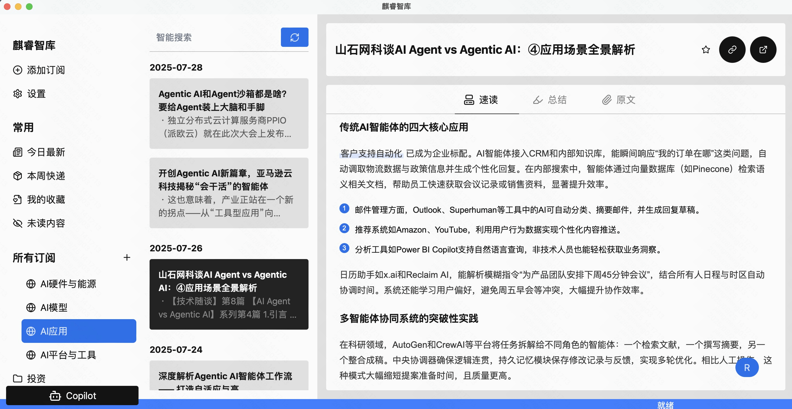

<p align="center">
  
</p>
<h3 align="center">麒睿智库(Saga Reader)</h3>

<p align="center">
    <a href="./README.md">English</a>
    |
    <a href="./README_zh.md">中文</a>
</p>

<p align="center">💪🏻 由人工智能驱动的 <strong>速度极快</strong> 且 <strong>极其轻量</strong> 的互联网阅读器</p>
<p align="center">🛠️ 基于<strong>Rust</strong>、<strong>Tauri</strong>和<strong>Svelte</strong>构建的现代跨平台应用程序</p>
<p align="center">
  <a style="text-decoration:none" href="https://aiqino.netlify.app?s=github_website_tag">
    
  </a>
  
  
  
</p>
<hr />

> 🚀 通过 [在 GitHub 上赞助](https://github.com/sponsors/sopaco)让这个软件更好的发展。

# 👋 麒睿智库是什么
📖 **麒睿智库(Saga Reader)** 是一个AI驱动的智库式阅读器，根据用户指定的主题和偏好关键词自动从互联网上检索信息。它使用云端或本地大型模型进行总结和提供指导，并包括一个AI驱动的互动阅读伴读功能，允许您与AI讨论和交换阅读内容的想法。

🆓 **麒睿智库** 完全免费和开源，这意味着所有数据都安全地存储在您自己的计算机上，不受第三方服务提供商的控制。此外，您可以根据自己的兴趣和偏好管理订阅关键词，而不会受到广告和商业化内容的打扰。

❤️ 喜欢 **麒睿智库**? 点亮小星星 🌟 或 [赞助](https://github.com/sponsors/sopaco)! ❤️

⏬ 现在就从[官方网站](https://aiqino.netlify.app?s=github_download)下载！兼容 Windows、Mac 和 Linux 系统，在老电脑上也非常流畅。

**注意：安装与使用说明**

📖 安装注意事项与初次使用需要的大模型配置方法，详见[**帮助文档**](./docs/how-to-use-zh.md)。

# 🌠 界面

<div style="text-align: center;">
  <table style="width: 100%; margin: 0 auto;">
    <tr>
      <td style="width: 50%;"></td>
      <td style="width: 50%;"></td>
    </tr>
  </table>
</div>

# 🧠 工作原理

[](https://deepwiki.com/sopaco/saga-reader)


# 🌟 功能与特性

- **智能内容订阅**：基于兴趣的内容生成引擎，支持根据用户兴趣灵活设置内容订阅。用户只需定义感兴趣的关键词，即可全网自主搜索相关信息，无需复杂的订阅操作。
- **高效信息抓取**：采用纯 Rust 实现的全自动内容引擎，支持搜索和 RSS 等多种抓取模式，可高效采集全球互联网信息。
- **AI 沉浸式伴读**：创新的 AI 伴读功能，让用户在阅读过程中与 AI 实时交流，答疑解惑，获得深度启发，告别阅读孤单。
- **多语言智能翻译**：具备智能翻译能力，突破语言与地域限制，自动翻译数百种外文信息，将非母语文章自动翻译成用户偏好的语言。
- **安全隐私保障**：提供最佳的安全和隐私保护，所有数据完全存储在用户个人计算机上，不受任何第三方服务提供商的跟踪或影响。
- **多模型 AI 支持**：支持连接云端和本地大型模型进行推理，云端大模型覆盖业界主流大模型，满足不同场景的 AI 需求。
- **老旧设备流畅运行**：基于 Rust 和 Svelte 技术开发，具备同类产品中最低的内存和 CPU 消耗，内存使用量低于 10MB，确保在老旧设备上也能流畅运行。
- **简洁清爽的UI**：采用干净清爽的 UI 设计，界面简洁、轻量实用、易于操作，无烦人的广告和商业元素干扰。
- **灵活阅读体验**：提供灵活的文章阅读方式，用户可选择使用内置文章查看器阅读完整内容，也能切换到偏好的浏览器进行浏览。
- **高效搜索更新**：支持文章搜索功能，可在后台静默更新内容。依托 Rust 技术，内存占用极小（仅 10MB），运行性能卓越。

# 🖥️ 开发
### 前提条件
- [**Rust**](https://www.rust-lang.org)
- [**Bun**](https://bun.sh) (推荐) or NodeJS

### 安装
安装非常简单，只需按照以下步骤操作：
<br>
1. 克隆仓库。
    ```sh
    git clone https://github.com/sopaco/saga-reader.git
    ```
2. 进入克隆的项目文件夹。
    ```sh
    cd saga-reader
    ```
3. 安装依赖项。

    *推荐使用**[bun](https://bun.sh)，这非常快。*
    ```sh
    # **推荐，这非常快**
    bun install

    # 或使用 pnpm
    # pnpm install

    # 或使用 npm
    # npm install
    ```
4. 运行

    ```sh
    # **推荐，这非常快**
    bun run dev

    # 或使用 pnpm
    # pnpm run dev

    # 或使用 npm
    # npm run dev
    ```
5. 或直接构建

> 默认会构建为你编译时所用机器所用系统的版本，如果需要交叉编译，可以运行`package.json`中的`build:macos`、`build:windows`。

    ```sh
    # **推荐，这非常快**
    bun run build

    # 或使用 pnpm
    # pnpm run build

    # 或使用 npm
    # npm run build
    ```
<br>

# 📝 核心模块说明

项目使用了Rust、Svelte（SvelteKit）、Tauri、SeaORM、SqlLite、TailwindCSS等技术。

#### App
基于[Tauri](https://tauri.app)（Rust）框架的应用，具备极致的性能与安全性优势；前端交互使用[Svelte](https://svelte.dev/)，基于编译时的现代Web框架在提供优秀开发体验的同时也提供了优异的性能基础。

#### Packages / Crates

- `intelligent`: 文章优化工作流模块，提供文章优化过程和提示工程优化的抽象。
- `scrap`: 提供数据抓取功能，通过调用主流搜索引擎从互联网获取信息。此模块默认是完全本地化的，不依赖任何第三方服务。
- `recorder`: 提供本地存储功能，用户兴趣提示、原始文章和后处理优化文章保存在用户个人计算机存储中。
- `llm`: 提供内部的LLM Provider抽象，并适配各种云端和本地大型模型服务实现。
- `ollama`: 运行本地ollama，包括运行基本实例、模型更新和管理功能。
- `feed_api_rs`: 基于经典门面模式的核心能力API和实现。
- `tauri-plugin-feed-api`: 通过tauri命令调用前端的核心能力API。
- `types`: 共享基本类型模块。

#### 示意图
```plaintext
+---------------------+     +---------------------+
|      Frontend       |     |     Backend         |
|  (Svelte/SvelteKit) |<--->|  (Rust Modules)     |
+---------------------+     +---------------------+
       ^   ^   ^                      |   |   |
       |   |   |                      |   |   |
+------+---+---+-------+       +------+---+---+-------+
|  UI/UX Components    |       |  tauri-plugin-feed-api|
|  State Management    |       |  feed_api_rs          |
|  Internationalization|       |  llm                  |
|  Styling (Tailwind)  |       |  ollama               |
|  Build Tools (Vite)  |       |  recorder             |
|                      |       |  scrap                |
|                      |       |  types                |
|                      |       |  intelligent          |
+----------------------+       +-----------------------+
```

# 🤝 贡献

通过[GitHub Issues](https://github.com/sopaco/saga-reader/issues)报告错误或提出功能请求，帮助使麒睿智库变得更好。

同样，Wunderlist 也有一些需要改进的功能。

**例如**
- 你可以帮助实现除 Bing 之外的其他[互联网搜索引擎适配器](https://github.com/sopaco/saga-reader/tree/master/crates/scrap/src/search)，例如 Google。
- 你可以协助整合更多的[在线 LLM 提供商](https://github.com/sopaco/saga-reader/tree/master/crates/llm/src/providers)，除了 智普清言的GLM Flash，还有 OpenAI。
- 您还可以通过提供[其他语言的翻译](https://github.com/sopaco/saga-reader/tree/master/app/src/lib/i18n/locales)来帮助国际化应用程序。参考[svelte-i18n](https://github.com/kaisermann/svelte-i18n/blob/main/docs/Getting%20Started.md#5-localizing-your-app)国际化使用指南。

如果您喜欢使用这个应用程序，请考虑通过[GitHub赞助商](https://github.com/sponsors/sopaco)、[Paypal](https://paypal.me/skyronj)或[支付宝](https://aiqino.netlify.app/uprise-assets/alipay.jpg)捐款支持其开发。

# ⚛️ 使用以下技术开发

- [Rust](https://github.com/rust-lang/rust)
- [Tauri](https://github.com/tauri-apps/tauri)
- [Svelte](https://github.com/sveltejs/svelte)
- [SvelteKit](https://github.com/sveltejs/kit)
- [Skeleton](https://github.com/skeletonlabs/skeleton)
- [sea-orm](https://github.com/SeaQL/sea-orm)

# 🪪 许可证
**MIT**，协议的副本说明保留在[LICENSE](./LICENSE)文件中。

**🙏感谢大家的支持，你们是国产开源的历史见证者**

[](https://github.com/sopaco/saga-reader/stargazers)

# 👨 关于我

> 🚀 通过 [在 GitHub 上赞助我](https://github.com/sponsors/sopaco)让这个软件更好的发展。

  互联网老兵，经历PC互联网、移动互联网、AI应用三股浪潮，从早期的移动应用个人开发者角色入场，到现在的职场从业者角色，有丰富的产品设计与研发经验。现就职于快手，从事大前端体系以及AI探索方面的研发工作。

wx号：dokhell

邮箱：dokhell@hotmail.com
