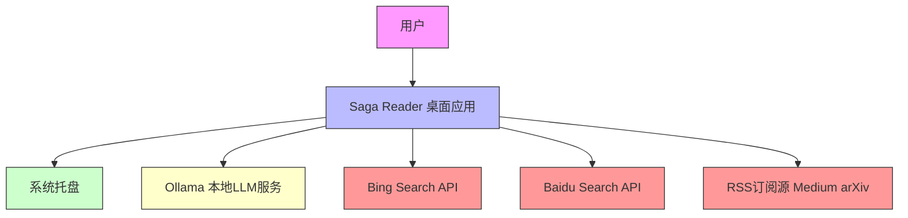

# 项目概述

## 1. 项目简介

**项目名称**：Saga Reader  
**项目类型**：桌面端智能阅读应用（Desktop Application）  
**技术架构**：Svelte + Tauri + Rust 多层异构架构  

Saga Reader 是一款面向知识工作者、技术爱好者与隐私敏感用户的**本地化、AI增强型桌面阅读工具**，旨在解决信息过载时代下内容碎片化、依赖云端、缺乏智能处理的痛点。系统通过**全本地化架构**实现数据主权保障，结合**轻量级AI推理引擎**，为用户提供从内容聚合、智能优化到交互式对话的端到端阅读体验。

### 核心功能与价值
- **多源内容聚合**：自动抓取并整合 RSS 订阅源、Bing 搜索结果、百度中文搜索结果，构建统一信息流。
- **AI增强阅读**：通过本地大语言模型（LLM）对原始文章执行三重智能处理：
  - **Purge**：净化广告、导航、评论等噪声内容；
  - **Optimizer**：重写语句，提升语言精炼度与专业性；
  - **Melt**：融合多篇相关文章，生成综合摘要。
- **AI对话助手**：在阅读场景中，基于当前文章内容与用户提问，调用本地LLM生成上下文感知的问答回复，实现“阅读即对话”的沉浸式体验。
- **隐私优先设计**：所有内容抓取、AI处理、数据存储均在本地完成，**无任何数据上传至云端**，符合GDPR与数据主权合规要求。
- **自动化更新**：后台守护进程定时触发内容刷新，无需用户手动干预。
- **系统级集成**：支持系统托盘最小化、快捷启动、深色/浅色主题、多语言（中英文）切换等桌面应用级体验。

### 技术特征概述
| 特征维度 | 技术实现 |
|----------|----------|
| **前端框架** | SvelteKit（响应式UI）、TypeScript、Tailwind CSS |
| **桌面容器** | Tauri（Rust后端 + Webview前端，体积小、性能高） |
| **核心引擎** | Rust（高性能、内存安全） |
| **AI推理** | 本地Ollama服务（支持Llama、Mistral、GLM等模型），通过HTTP RPC调用 |
| **数据存储** | SQLite（通过SeaORM封装），本地文件系统（app_config.toml, user_config.toml） |
| **通信机制** | Tauri插件（`tauri-plugin-feed-api`）实现前端（JS/TS）与后端（Rust）双向IPC |
| **系统集成** | 系统托盘（Tray）、单实例窗口管理、守护进程（Daemon）、自动启动（LaunchAgent） |
| **部署形态** | 本地安装的独立可执行文件（.exe / .app / .deb），无依赖云服务 |

> ✅ **核心价值主张**：**“你的阅读，不被云端窥探；你的智能，不依赖API调用。”**

---

## 2. 目标用户

Saga Reader 面向三类高度重叠但需求分层的用户群体，其设计以**隐私优先、智能增强、无干扰体验**为核心。

### 用户角色定义与需求分析

| 用户角色 | 描述 | 核心需求 | 使用场景 |
|----------|------|----------|----------|
| **知识工作者** （研究员、记者、分析师） | 需高效处理大量专业资讯的职场人士 | - 集中管理多源订阅（RSS/新闻/论文） - 自动过滤低质内容 - AI提炼核心观点与摘要 - 离线阅读保障数据安全 - 支持中英文混合内容 | 每日早晨启动应用，自动加载昨日更新的15篇论文与行业报告，使用“Melt”功能生成综合摘要，再通过AI助手提问“这三篇研究的共同局限是什么？” |
| **技术爱好者** （开源拥护者、本地AI玩家） | 对技术架构、可扩展性、自定义能力有强烈兴趣的用户 | - 开源架构与可调试插件系统 - 支持自定义LLM后端（Ollama/GLM/OpenAI） - 可配置爬取规则与搜索关键词 - 查看系统运行状态与版本信息 | 在GitHub上关注项目，自行编译二进制文件；修改`app_config.toml`切换为GLM-4.5模型；通过`scrap_text_by_url`命令测试自定义网页抓取 |
| **隐私敏感用户** （数据主权倡导者、安全合规从业者） | 拒绝将阅读内容上传至第三方平台的用户 | - 所有AI推理与内容处理100%本地化 - 无任何第三方SDK、无行为追踪 - 数据库与配置文件完全本地存储 - 无外部数据上报机制 | 使用该工具替代Notion、Pocket、Readwise等云端服务，确保敏感研究笔记、内部报告内容不离开本地设备 |

> 🔒 **隐私承诺**：系统**不收集任何用户行为数据**，不连接任何远程分析服务，不上传任何文章内容。所有AI处理均在用户设备上完成，数据仅存在于本地`qino_feed.app_data`目录中。

---

## 3. 系统边界

Saga Reader 的系统边界清晰，采用**封闭式智能阅读闭环**设计，所有核心处理均在客户端完成，严格排除外部依赖。

### ✅ 包含的核心组件（系统内）

| 组件类别 | 具体组件 | 说明 |
|----------|----------|------|
| **前端UI层** | Svelte组件（`+page.svelte`, `widgets/`） | 三栏式界面（FeedsList / ArticlesList / ArticleReader）、AISpritePanel、SearchBar、Settings页 |
| **状态管理** | Svelte Stores（`stores/`） | `feeds.svelte.ts`, `articles/list.svelte.ts`, `sprite.svelte.ts` 等，实现响应式数据流 |
| **前后端桥接** | Tauri插件（`tauri-plugin-feed-api`） | 暴露60+个`#[tauri::command]`，实现JS与Rust双向通信 |
| **Rust核心引擎** | `feed_api_rs`, `scrap`, `intelligent`, `llm`, `recorder`, `ollama`, `types` | 所有业务逻辑、AI处理、数据抓取、持久化均在此层实现 |
| **本地数据存储** | SQLite数据库（`article_recorder.db`） 配置文件（`app_config.toml`, `user_config.toml`） | 存储所有文章、订阅、用户偏好、系统设置 |
| **系统集成** | 系统托盘（Tray） 守护进程（`feeds_update.rs`） 单实例窗口管理 | 实现最小化到托盘、定时更新、启动时自动恢复窗口 |
| **本地LLM服务** | Ollama进程（由系统自动管理） | 虽非本应用代码，但作为**系统内生依赖**，应用会检测并自动启动 |

### ❌ 排除的外部依赖（系统外）

| 类别 | 排除项 | 说明 |
|------|--------|------|
| **操作系统层** | 文件系统、网络栈、GPU驱动 | 仅使用标准OS API（如`dirs`库获取AppData路径），不依赖特定驱动 |
| **外部服务端** | Bing/Baidu搜索引擎服务器 | 仅发起HTTP请求获取结果，不控制其后端逻辑 |
| **内容源服务器** | Medium.com、RSS.com、arXiv.org等 | 仅订阅其公开RSS或通过搜索API获取，不托管内容 |
| **云AI服务** | OpenAI API、Google Cloud、Azure AI | 明确排除，仅支持本地Ollama、GLM、Mistral等 |
| **其他软件** | 浏览器、IDE、终端 | 仅在需要时调用系统默认浏览器打开外部链接 |
| **云同步服务** | iCloud、Dropbox、OneDrive | 无任何同步功能，数据完全本地化 |

> 🛡️ **架构哲学**：**“我们不是在构建一个连接世界的阅读器，而是在构建一个属于你的阅读堡垒。”**

---

## 4. 外部系统交互

Saga Reader 与外部系统存在**明确、有限、可配置**的交互关系，所有交互均为**单向请求**，无反向数据推送或身份认证依赖。

### 外部系统交互列表

| 外部系统 | 交互类型 | 交互方式 | 依赖目的 | 安全与容错机制 |
|----------|----------|----------|----------|----------------|
| **Ollama** | RPC调用（HTTP） | `POST /api/generate` | 调用本地LLM进行文章优化与对话生成 | - 应用启动时自动检测Ollama服务状态 - 若未运行，尝试启动本地进程（`ollama serve`） - 若失败，降级为“AI功能不可用”提示，不影响核心阅读 |
| **Bing Search API** | HTTP请求 | `GET https://api.bing.microsoft.com/v7.0/search` | 搜索英文网页内容 | - 使用API密钥（用户配置） - 仅用于搜索，不存储API密钥于云端 - 请求失败时降级为本地缓存或提示“网络异常” |
| **Baidu Search API** | HTTP请求 | `GET https://api.baidu.com/json/sjson` | 搜索中文网页内容 | - 同上，支持用户自定义API Key - 针对中文语义优化搜索词构造 |
| **RSS Feed Sources** | HTTP请求 | `GET {feed_url}` | 获取订阅源文章（Atom/RSS 2.0） | - 支持HTTPS - 自动处理301/302重定向 - 使用`reqwest`客户端，带统一User-Agent - 失败时记录日志，不阻塞主流程 |
| **System Tray (OS Level)** | OS API调用 | Windows Tray API / macOS NSStatusItem | 实现最小化到托盘、双击唤醒、退出应用 | - 使用Tauri原生插件`tauri-plugin-tray` - 跨平台兼容（Windows/macOS/Linux） - 无权限要求，仅需UI交互权限 |

### 依赖关系分析

| 依赖项 | 依赖强度 | 是否关键 | 可降级 | 风险等级 |
|--------|----------|----------|--------|----------|
| Ollama | ⭐⭐⭐⭐⭐ | **是**（AI功能核心） | 是（AI功能禁用） | 中（用户可手动安装） |
| Bing/Baidu API | ⭐⭐⭐⭐ | 是（内容来源） | 是（仅搜索功能降级） | 低（可配置为禁用） |
| RSS源 | ⭐⭐⭐⭐ | 是（内容来源） | 否（订阅失效则无内容） | 低（用户可控） |
| 系统托盘 | ⭐⭐⭐ | 否（体验增强） | 是（仍可通过窗口操作） | 低 |

> ✅ **关键洞察**：系统**不依赖任何网络服务才能运行**。即使完全断网，用户仍可：
> - 查看历史文章
> - 使用本地LLM进行离线对话（若Ollama已下载模型）
> - 修改配置、切换主题
> - 搜索本地数据库

---

## 5. 系统上下文图

### 关键交互流程说明

1. **内容聚合流程**  
   `用户配置RSS/Bing/Baidu → 守护进程触发 → Tauri插件调用scrap模块 → HTTP请求外部源 → 获取HTML → 清洗内容 → 传递给AI处理 → 存入SQLite → 前端Store更新 → UI刷新`

2. **AI对话流程**  
   `用户在AISpritePanel输入问题 → 前端Store获取当前文章 → 调用`chat_with_article_assistant` → Tauri插件 → Rust的Assistant组件 → 构造Prompt → 调用Ollama API → 返回回答 → 前端渲染Markdown`

3. **系统启动流程**  
   `双击应用 → Tauri主进程启动 → 加载app_config.toml → 初始化日志 → 检测Ollama状态 → 若未运行则启动 → 初始化SQLite数据库 → 加载Svelte前端 → 首次自动刷新内容`

### 架构决策说明

| 决策点 | 选择 | 理由 |
|--------|------|------|
| **为何选择Tauri而非Electron** | Tauri | 体积小（<10MB）、性能高、Rust后端安全、避免Node.js依赖 |
| **为何选择本地LLM而非云API** | Ollama | 满足隐私敏感用户核心需求，避免API费用与限流，支持离线使用 |
| **为何不使用云同步** | 本地存储 | 避免数据泄露风险，符合“数据主权”理念，降低架构复杂度 |
| **为何使用Rust而非Go/Python** | Rust | 高性能、内存安全、与Tauri天然集成、适合系统级组件开发 |
| **为何不支持Web版** | 仅桌面 | 确保本地处理能力不被浏览器沙箱限制，保障AI推理性能与隐私 |

---

## 6. 技术架构概览

### 主要技术栈

| 层级 | 技术 | 用途 |
|------|------|------|
| **前端UI** | SvelteKit + TypeScript + Tailwind CSS | 响应式、组件化、高性能UI渲染 |
| **桌面容器** | Tauri 2.x | 将Web前端封装为原生桌面应用，提供系统级API访问 |
| **后端引擎** | Rust 1.78+ | 所有核心业务逻辑：爬虫、AI处理、数据库、守护进程 |
| **AI推理** | Ollama + Llama 3 / Mistral / GLM-4 | 本地运行的开源大模型，通过HTTP API调用 |
| **数据库** | SQLite + SeaORM | 轻量级、零配置、ACID事务支持，适合单机应用 |
| **配置管理** | TOML + serde | 结构化、人类可读的配置文件格式 |
| **通信协议** | Tauri IPC (JSON-RPC over WebSocket) | 前后端通信标准，类型安全（TypeScript ↔ Rust） |
| **构建工具** | Bun + Vite | 快速前端打包，支持Svelte热更新 |

### 架构模式

- **分层架构**（Layered Architecture）  
  前端UI → 状态管理 → 桥接层 → Rust业务层 → 系统集成层

- **插件化设计**  
  `tauri-plugin-feed-api` 作为核心插件，暴露所有功能接口，便于未来扩展（如新增插件支持Notion导入）

- **事件驱动与守护进程**  
  `feeds_update.rs` 作为独立守护进程，定时触发更新，避免主UI线程阻塞

- **无状态前端 + 有状态后端**  
  前端仅负责展示与交互，所有状态与数据均在Rust后端持久化管理

### 关键设计决策

| 决策 | 说明 |
|------|------|
| **“所有AI在本地”** | 这是产品差异化核心。即使Ollama未运行，应用仍可作为普通RSS阅读器使用，但AI功能灰显。 |
| **“配置即代码”** | `app_config.toml` 文件可手动编辑，支持高级用户自定义LLM端点、爬虫规则、日志级别。 |
| **“零依赖安装”** | 安装包不包含Ollama，用户需自行安装（或通过应用内“下载Ollama”按钮自动安装），降低包体积。 |
| **“单实例窗口”** | 防止重复打开多个窗口，提升桌面体验一致性。 |
| **“无追踪、无上报”** | 代码中无任何`analytics`, `crash-reporter`, `telemetry`相关代码，符合开源隐私承诺。 |

> 💡 **架构启示**：Saga Reader 不是“一个App”，而是一个**本地智能阅读操作系统**——它将内容获取、AI增强、数据存储、系统集成融为一体，为知识工作者打造了一个**可信赖、可控制、可扩展**的私有信息中枢。

---

## 总结：为什么Saga Reader是独特的？

| 维度 | 传统阅读器 | 云端AI阅读器 | Saga Reader |
|------|------------|--------------|-------------|
| **数据主权** | 本地存储 | 上传云端 | ✅ 100%本地处理 |
| **AI能力** | 无 | 依赖OpenAI等 | ✅ 本地LLM，可选模型 |
| **隐私保障** | 一般 | 低（数据外传） | ✅ 零数据外传 |
| **离线可用** | 部分 | 否 | ✅ 完全可用 |
| **扩展性** | 低 | 中 | ✅ 插件化架构，可自定义 |
| **系统集成** | 基础 | 基础 | ✅ 托盘、守护、自动启动 |

**Saga Reader 不是另一个阅读器，它是你知识工作的“本地AI副驾驶”——不联网，不窥探，不打扰，只专注。**