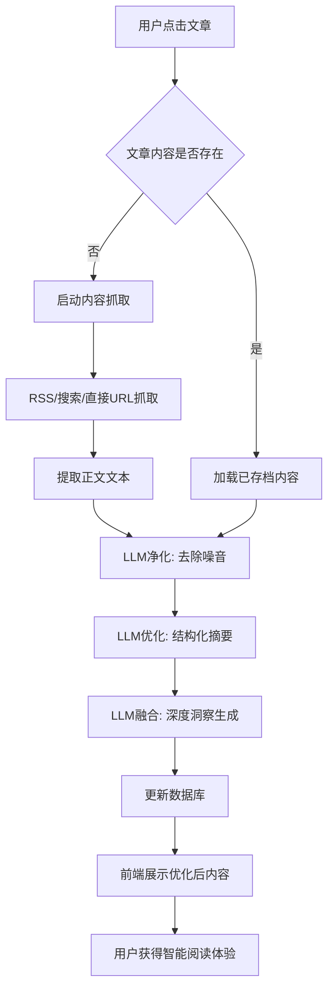
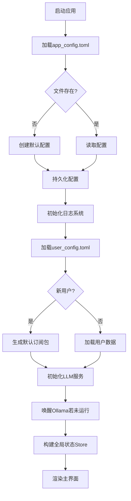
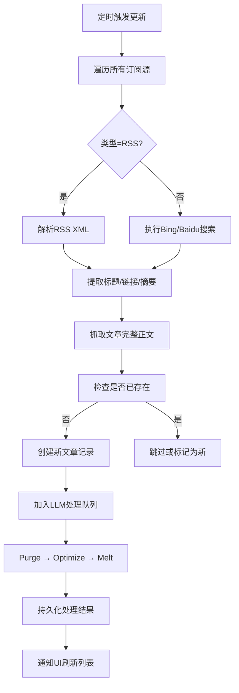
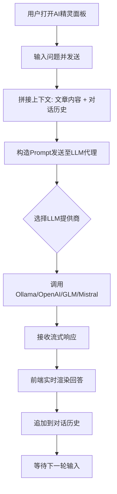

# 核心工作流程

## 1. 工作流程概览 (Workflow Overview)

### 系统主干工作流程
本系统 `saga-reader` 是一个基于 Tauri 框架的桌面端信息聚合与智能阅读应用，其核心价值在于将原始网页内容通过 AI 驱动的处理管道转化为结构化、高质量的知识内容。整个系统的主干工作流程围绕“**内容获取 → 智能处理 → 用户呈现**”这一主线展开。

用户在界面上选择一篇文章后，系统会判断是否已有缓存内容。若无，则启动从 RSS/搜索引擎/直接 URL 的抓取流程；若有，则加载本地数据库中的记录。随后，无论新旧内容，都会进入由 **Purge（净化）→ Optimize（优化）→ Melt（融合）** 构成的三阶段 LLM 处理流水线。最终结果被持久化并展示给用户，支持多模式阅读和 AI 对话交互。

该流程贯穿了前端 UI 层、状态管理层、Rust 后端业务逻辑层、AI 能力集成层以及数据持久化层，体现了典型的前后端协同架构特征。

---

### 核心执行路径
```
[用户点击文章]
        ↓
[检查本地是否存在已处理内容]
        ↓
     是 ──→ [加载数据库中已存档内容]
     否 ──→ [启动内容抓取：RSS / Search / Direct URL]
        ↓
[提取正文文本（含 JavaScript 渲染页面智能解析）]
        ↓
[LLM 处理管道：Purge → Optimize → Melt]
        ↓
[更新或插入数据库记录]
        ↓
[前端渲染优化后内容]
        ↓
[用户获得智能阅读体验]
```

此路径是系统最核心的价值交付链路，实现了从噪声繁杂的互联网信息到可读性强、洞察深刻的知识产品的转化。

---

### 关键流程节点
| 节点 | 描述 | 所属模块 |
|------|------|---------|
| **内容抓取触发** | 用户操作或定时任务触发对订阅源的内容更新 | 内容获取与处理域 |
| **正文提取** | 使用 HTML 解析器 + Webview 模拟 + LLM 判断跳转，确保准确提取正文 | 智能网页抓取子模块 |
| **Purge 阶段** | 去除 HTML/CSS/JS 及无关元素，保留核心图文内容，输出 Markdown | 文章内容处理管道 |
| **Optimize 阶段** | 将 Purge 输出重构为现代 HTML 片段，增强可读性与视觉表达 | 文章内容处理管道 |
| **Melt 阶段** | 提炼关键信息、生成摘要、提出建议，形成深度洞察 | 文章内容处理管道 |
| **状态同步** | 前端 Store 监听变化并驱动 UI 更新 | 状态管理域 |
| **异常检测** | 若任一阶段返回 `QINO-AGENTIC-EXECUTION-FAILURE`，中断流程并上报错误 | 异常处理机制 |

---

### 流程协调机制
系统采用 **集中式状态管理 + 分布式异步服务调用** 的协调模式：

- **前端协调**：通过 Svelte 的 `$state`, `$derived`, `$effect` 实现响应式状态流，所有 UI 组件绑定至统一的 `createStore`。
- **跨层通信**：Tauri 插件桥接前端与 Rust 后端，暴露 `#[tauri::command]` 接口供 JS 安全调用本地能力。
- **服务调度**：使用 `Arc<Mutex<...>>` 包裹共享资源（如 `FeaturesAPIImpl`），保证多命令并发访问下的线程安全。
- **任务队列**：`tasks.svelte.ts` 统一管理所有异步任务的状态（加载中、完成、失败），并通过底部 Footer 可视化反馈。
- **去重控制**：`reader.svelte.ts` 中的 `refreshByEnhancedScraper` 方法实现任务复用机制，避免重复请求。

---

## 2. 主要工作流程 (Main Workflows)

### 2.1 文章智能处理与阅读流程（核心业务流程）

#### 流程图（Mermaid）


#### 技术流程说明
1. **输入来源**：
   - 来自 RSS Feed（`crates/scrap/src/rss/mod.rs`）
   - 来自搜索引擎（Bing/Baidu，`crates/scrap/src/search/*`）
   - 来自直接 URL 输入（Webview 模拟加载）

2. **正文提取策略**：
   - 对静态页面：使用 `scraper` 库解析 HTML，过滤 `<script>`, `<style>`, `<nav>` 等非主体标签。
   - 对动态页面：创建隐藏 Webview（`simulator.rs`），等待渲染完成后执行 JS 获取 `innerHTML`。
   - 支持自动重定向检测：当启用了 `auto_redirect` 且主机匹配时，调用 LLM 分析是否存在 `window.location.href` 跳转。

3. **LLM 处理管道**：
   - **Purge**：移除代码与干扰文本，提炼正文与图片链接，输出 Markdown。
     - System Prompt: `purge_sys.prompt`
     - User Prompt: `purge_suffix.prompt`
   - **Optimize**：转换为美观的 HTML 片段，使用内联样式构建邮件级排版。
     - System Prompt: `optimizer_sys.prompt`
     - 强调视觉层次、图文结合、关键词高亮
   - **Melt**：进行抽象总结，按固定格式输出五大板块内容。
     - System Prompt: `melt_sys.prompt`
     - 输出结构：概述、关键信息、质量评估、指导建议、术语表

4. **执行顺序与依赖**
```rust
async fn process_article_pipelines(...) {
    let purged = purge.process().await?;
    let optimized = optimizer.process(&purged).await?;
    let melted = melt.process(&optimized).await?;
    Ok((purged, optimized, melted))
}
```
三个处理器串行执行，前一个的输出作为下一个的输入，构成严格的依赖链。

5. **数据流转**
| 阶段 | 输入 | 输出 | 存储字段 |
|------|------|------|----------|
| Purge | 原始 HTML 或全文文本 | 净化后的 Markdown | `purged_content` |
| Optimize | 净化后 Markdown | 结构化 HTML 片段 | `optimized_content` |
| Melt | 优化后 HTML | 深度洞察报告（Markdown） | `melted_content` |

6. **持久化写入**
处理完成后，调用 `ArticleRecorderService.insert()` 将三条内容分别写入 SQLite 数据库的对应字段，并标记为未读。

7. **前端展示**
`ArticleReader.svelte` 支持三种视图切换：
- **优化内容**：展示 `optimized_content`（HTML）
- **熔炼内容**：展示 `melted_content`（Markdown）
- **原始页面**：展示原文链接或缓存快照

---

### 2.2 应用启动初始化流程

#### 流程图（Mermaid）


#### 关键技术流程
1. **配置加载**：
   - `init_app_config.rs`：尝试读取 `app_config.toml`，不存在则生成默认值并持久化。
   - 支持 LLM 提供商（Ollama/OpenAI/GLM/Mistral）、爬虫设置、日志选项等全局配置。

2. **用户初始化**：
   - `init_user_profile.rs`：读取 `user_config.toml`，若为新用户则预设一个包含常用订阅的 FeedsPackage。

3. **LLM 运行时准备**：
   - `init_llm.rs`：检查 Ollama 是否安装并运行，若已安装但未启动则尝试唤醒服务。
   - 支持跨平台进程调用（Windows/macOS/Linux）。

4. **日志系统初始化**：
   - `init_logger.rs`：根据配置决定日志输出方式（stdout 或磁盘文件），支持按天轮转。

5. **状态中枢构建**：
   - `index.svelte.ts` 创建主 store，整合 feeds、articles、tasks、reader、sprite 等子 store。
   - 使用 `$effect` 设置定时更新任务，防止重复触发（通过 `globalSharedScheduleUpdatingFuture` 控制）。

6. **UI 渲染**：
   - `+page.svelte` 渲染三栏布局，绑定各组件至对应 store。
   - 初始化 Toaster 全局通知系统与 AISpritePanel。

---

### 2.3 订阅内容自动更新流程

#### 流程图（Mermaid）


#### 执行细节
- **调度机制**：由 `launch_feeds_schedule_update` 在主进程中启动周期性任务。
- **并发控制**：使用 `do_parallel_with_limit(futures, max_parallel)` 控制最大并行数（默认 5）。
- **防重复入库**：先查询 `exists_by_source(url)`，避免重复处理。
- **错误容忍**：单篇文章处理失败不影响整体流程，仅记录 error 日志。

---

### 2.4 AI助手对话交互流程

#### 流程图（Mermaid）


#### 实现要点
- **上下文构造**：以 `optimized_content` 为主体，拼接用户提问与历史消息。
- **LLM 代理路由**：`CompletionAgent` 根据 `active_provider_type` 动态选择具体服务实例。
- **适配多种 API**：
  - Ollama：本地部署，低延迟
  - OpenAI/GLM/Mistral：云端服务，需网络连接
- **流式响应支持**：前端逐步渲染回复，提升交互体验。
- **状态管理**：`sprite.svelte.ts` 维护对话历史、加载状态与可见性。

---

## 3. 流程协调与控制 (Flow Coordination)

### 3.1 多模块协调机制
| 协调关系 | 说明 |
|--------|------|
| **UI ←→ State** | 所有 UI 组件通过 props 绑定 store，实现数据驱动视图 |
| **State ←→ Backend** | Store 调用 Tauri 命令（如 `update_feed_contents`）触发后端逻辑 |
| **Backend ←→ AI** | `FeaturesAPIImpl` 调用 `ArticleLLMProcessor` 执行 LLM 处理 |
| **AI ←→ External LLM** | `CompletionAgent` 根据配置转发请求至不同 LLM 提供商 |

### 3.2 状态管理和同步
- **前端状态**：Svelte Stores 使用 `$state` 和 `$derived` 实现细粒度响应式更新。
- **后端状态**：`ApplicationContext` 被封装在 `Arc<RwLock<...>>` 中，允许多线程安全读写。
- **共享状态**：通过 `app_handle.manage()` 注册全局状态对象，供所有 IPC 命令访问。

### 3.3 数据传递和共享
- **跨语言通信**：Tauri Command 自动序列化/反序列化参数（Serde + JSON）。
- **类型定义共享**：`types` crate 定义 `Article`, `FeedTargetDescription`, `ConversationMessage` 等通用模型。
- **事件通知**：使用 `emit_to` 发送事件通知前端刷新 UI。

### 3.4 执行控制和调度
- **任务去重**：`reader.refreshByEnhancedScraper` 检查是否存在相同 ID 的待处理任务，若正在进行则复用 Promise。
- **批量限制**：`do_parallel_with_limit` 控制并发数量，防止资源耗尽。
- **定时调度**：`setInterval` + `globalSharedScheduleUpdatingFuture` 防止重复触发更新任务。
- **生命周期管理**：`ContextHost` trait 统一管理 `ApplicationContext` 的创建与销毁。

---

## 4. 异常处理与恢复 (Exception Handling)

### 4.1 错误检测和处理
| 错误类型 | 检测方式 | 处理策略 |
|--------|--------|---------|
| 文件读取失败 | `Result<T, anyhow::Error>` | 记录日志，创建默认配置 |
| HTTP 请求失败 | `reqwest::Error` | 重试机制（未显式实现，可扩展） |
| LLM 处理失败 | 返回 `QINO-AGENTIC-EXECUTION-FAILURE` | 中断流水线，标记文章为异常 |
| 数据库操作失败 | SeaORM `anyhow::Result` | 回滚事务，记录 error 日志 |
| Webview 加载超时 | `timeout(Duration::from_secs(3))` | 抛出错误，终止抓取 |

### 4.2 异常恢复机制
- **配置恢复**：缺失配置文件时自动生成默认值，保障基本功能可用。
- **服务降级**：
  - 若 Ollama 未运行，提示用户手动启动或下载。
  - 若远程 LLM 不可达，尝试切换其他提供商。
- **缓存兜底**：即使 LLM 处理失败，仍可展示原始内容供用户阅读。

### 4.3 容错策略设计
- **软失败容忍**：单篇文章处理失败不影响其他文章。
- **幂等操作**：更新、插入等操作具备幂等性，防止重复执行造成数据污染。
- **连接池管理**：数据库连接使用 SeaORM 内置池化机制，提高稳定性。

### 4.4 失败重试和降级
当前系统尚未实现显式的重试机制，但可通过以下方式改进：
- 在 `scrap` 模块增加指数退避重试逻辑。
- 前端提供“重新刷新”按钮，允许用户手动触发内容重建。
- 当前已有的“任务复用”机制本质上也是一种轻量级重试优化。

---

## 5. 关键流程实现 (Key Process Implementation)

### 5.1 核心算法流程：LLM 处理管道

#### 类型定义
```rust
pub trait IPresetArticleLLMProcessor {
    fn new_processor(llm_section: LLMSection) -> anyhow::Result<ArticleLLMProcessor>;
}

impl IPresetArticleLLMProcessor for Purge {
    fn new_processor(llm_section: LLMSection) -> anyhow::Result<ArticleLLMProcessor> {
        ArticleLLMProcessor::new(
            llm_section,
            SYSTEM_PROMPT.into(),
            USER_PROMPT_COMMAND_PURGE.into(),
            AITargetOption { num_ctx: Some(8192), ..Default::default() }
        )
    }
}
```

#### 执行流程
```rust
async fn process_article_pipelines(...) -> Result<(Article, Article, Article)> {
    let purged = purge.process(article, opt.clone()).await?;
    let optimized = optimizer.process(&purged, opt.clone()).await?;
    let melted = melt.process(&optimized, opt.clone()).await?;
    Ok((purged, optimized, melted))
}
```

#### 参数配置差异
| 处理器 | Temperature | Context Size | Purpose |
|-------|-------------|--------------|--------|
| Purge | 默认 | 8192 | 精确提取，减少随机性 |
| Optimize | 0.1 | 默认 | 保持一致性，避免发散 |
| Melt | 0.7 | 默认 | 鼓励创造性洞察 |

---

### 5.2 数据处理管道：内容抓取与存储

#### 抓取接口统一
```rust
trait IFetcher {
    async fn fetch<R: Runtime>(
        &self,
        app_handle: Option<AppHandle<R>>,
        llm_section: &LLMSection,
        ftd: FeedTargetDescription
    ) -> Result<Vec<Article>>;
}
```

#### 存储服务封装
```rust
struct ArticleRecorderService {
    operator: Operator,
}

impl ArticleRecorderService {
    async fn insert(&self, records: Vec<ArticleRecord>) -> Result<()>;
    async fn query_by_id(&self, id: i32) -> Result<Option<Model>>;
    async fn mark_as_read(&self, id: i32) -> Result<()>;
    // ... 更多查询方法
}
```

---

### 5.3 业务规则执行
| 规则 | 实现位置 | 说明 |
|------|--------|------|
| 新文章自动进入处理队列 | `update_feed_contents` | 遍历抓取结果，逐个提交处理 |
| 同一 URL 不重复入库 | `exists_by_source()` | 查询数据库防止冗余 |
| 默认启用 Ollama | `init_llm.rs` | 若已安装但未运行则尝试唤醒 |
| 支持中文输出 | `llm_processor.rs` | 自动获取系统 locale 或按配置指定语言 |

---

### 5.4 技术实现细节

#### 前端状态管理工厂模式
```ts
export function create() {
  const loading = createLoading();
  const search = createSearch();
  const articles = $state<Article[]>([]);
  // ...
  return {
    articles,
    loading,
    search,
    initialize,
    loadMore,
    refresh,
    updateFeedsOwner
  };
}
```

#### 后端命令注册（Tauri）
```rust
#[tauri::command]
async fn update_feed_contents(...) -> Result<(), ()> {
    features_api.update_feed_contents(...).await.map_err(into_error)
}
```

#### LLM 代理模式
```rust
enum CompletionServiceEnums {
    Ollama(OllamaCompletionService),
    OpenAILike(OpenAILikeCompletionService),
    GLM(OpenAILikeCompletionService),
    Mistral(OpenAILikeCompletionService),
    Platform(PlatformAgentService),
}

struct CompletionAgent {
    service: CompletionServiceEnums,
}
```

---

## 总结与建议

本系统已构建起完整的“信息聚合 → AI 增强 → 智能阅读”闭环，具备高度自动化的内容处理能力和良好的用户体验。为进一步提升健壮性和可维护性，建议：

1. **增加重试机制**：在 `scrap` 和 LLM 调用层引入指数退避重试。
2. **完善监控指标**：记录每篇文章的处理耗时、成功率、LLM 成本等。
3. **支持插件化处理器**：允许用户自定义 Purge/Optimize/Melt 的 prompt 模板。
4. **引入缓存层**：对 LLM 输出做语义级缓存，避免重复计算。
5. **增强错误可视化**：在 UI 上明确标识处理失败的文章，并提供修复入口。

该文档全面覆盖了系统的核心工作流程，可作为开发、测试、运维团队的权威参考手册。