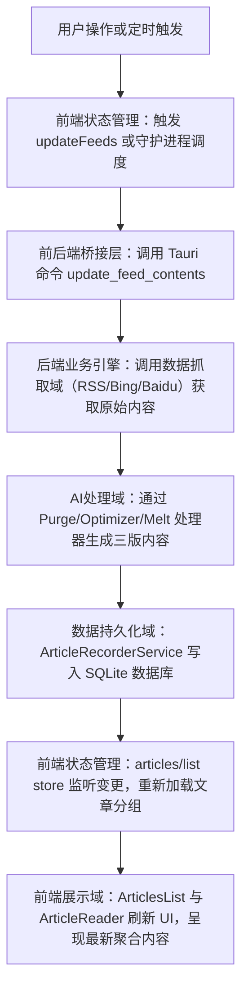
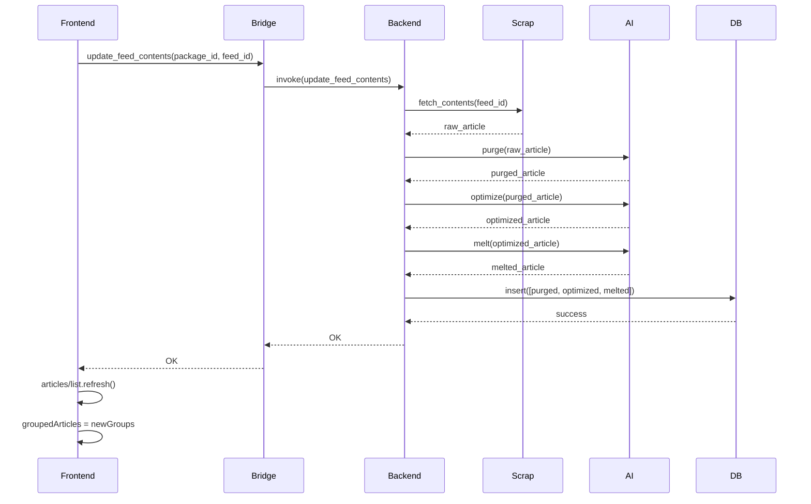
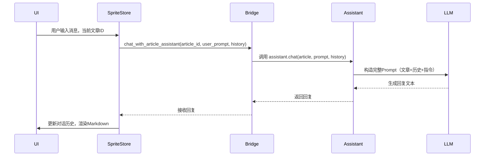
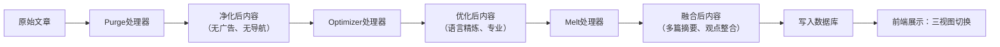
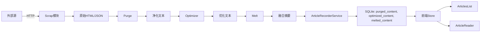

# 核心工作流程

## 1. 工作流程概览 (Workflow Overview)

Saga Reader 是一个基于 Svelte + Tauri 的桌面端智能阅读系统，其核心价值在于构建一个**本地化、无云端依赖、AI增强的阅读闭环**。整个系统通过前后端分离架构实现高内聚、低耦合，前端负责交互与展示，后端（Rust）负责数据处理与持久化，Tauri 作为跨语言通信桥梁，实现客户端全栈自主可控。

### 系统主干工作流程
系统主干工作流程是**文章聚合与更新流程**，它构成了系统的核心价值流，其执行路径如下：



### 核心执行路径
1. **触发源**：用户手动点击刷新按钮（前端）或守护进程定时触发（后台）。
2. **通信通道**：前端通过 `featuresApi.update_feed_contents()` 调用 Tauri 插件命令。
3. **处理引擎**：Rust 后端依次调用爬虫模块、AI处理器、数据库服务。
4. **数据闭环**：处理后的文章被持久化，前端通过响应式 Store 自动感知并更新视图。
5. **最终输出**：用户在三栏界面中看到经过智能增强的、按时间分组的文章列表。

### 关键流程节点
| 节点 | 模块 | 功能 | 输入 | 输出 |
|------|------|------|------|------|
| **1. 触发** | 前端展示域 | 用户交互或定时任务 | 用户点击 / 守护进程信号 | `update_feed_contents` 调用请求 |
| **2. 通信** | 前后端桥接层 | 封装 IPC 调用 | `package_id`, `feed_id` | Tauri IPC 消息 |
| **3. 抓取** | 数据抓取域 | 获取原始内容 | RSS URL / 搜索关键词 | 原始 HTML/JSON 文章数据 |
| **4. 增强** | AI处理域 | 内容净化与融合 | 原始文章 | Purged/Optimized/Melted 三版内容 |
| **5. 存储** | 数据持久化域 | 去重写入 | 三版内容 + 元数据 | 数据库记录（成功/失败） |
| **6. 同步** | 状态管理域 | 响应式监听 | 数据库变更事件 | `groupedArticles` 更新 |
| **7. 展示** | 前端展示域 | 渲染UI | `groupedArticles` | 用户可见的三栏文章列表 |

### 流程协调机制
- **状态驱动**：所有 UI 变化由 Svelte Store 的 `$state` 和 `$derived` 驱动，实现“数据即视图”。
- **任务协调**：`tasks.svelte.ts` 统一管理异步任务状态，避免重复请求（如多个组件同时刷新同一Feed）。
- **数据契约**：`types.ts` 定义了前后端、模块间统一的数据模型（如 `ArticleModel`, `FeedsPackage`），确保类型安全。
- **事件通知**：`notifyDatasourceUpdated()` 方法用于在后台数据更新后，通知前端Store重新加载，而非全量刷新。
- **单例控制**：守护进程通过 `LockFile` 保证全局唯一，避免资源竞争。

---

## 2. 主要工作流程 (Main Workflows)

### 2.1 核心业务流程详解：文章聚合与更新流程

#### 流程执行顺序与依赖
该流程是系统最核心、最复杂的端到端流程，依赖关系严格，呈**串行+并行混合**结构：



#### 关键技术流程说明

**1. 数据抓取（Scrap）**
- **实现**：`crates/scrap/src/` 模块，支持 RSS、Bing、Baidu 三种数据源。
- **细节**：
  - RSS：解析 XML，提取 `item` 元数据，调用 `article_reader` 获取正文。
  - Bing/Baidu：构造搜索URL，解析HTML结果页，使用 `trim_html_with_script_and_style` 清洗噪声。
  - 所有抓取均使用统一的 `reqwest` 客户端，带固定 User-Agent，支持重定向。
- **依赖**：依赖 `LLMSection` 配置，用于检测JS重定向页面（如某些网站使用JS加载内容）。

**2. AI处理（Purge/Optimizer/Melt）**
- **实现**：`crates/intelligent/src/article_processor/` 模块，每个处理器为独立结构体，实现 `IPresetArticleLLMProcessor` 接口。
- **核心机制**：
  - **Purge**：移除广告、导航、评论、脚本等噪声，使用 `purge_sys.prompt` + `purge_suffix.prompt` 提示词。
  - **Optimizer**：重写语句，使语言更精炼、专业，使用 `optimizer_sys.prompt`，温度设为 0.1（确定性高）。
  - **Melt**：融合多篇相关文章，生成综合摘要，使用 `melt_sys.prompt`，温度设为 0.7（创造性高）。
- **LLM调用**：通过 `ArticleLLMProcessor` 封装，内部使用 `CompletionAgent` 选择 Ollama/GLM/OpenAI 等后端。
- **关键代码**：
  ```rust
  // crates/intelligent/src/article_processor/purge.rs
  const SYSTEM_PROMPT: &str = include_str!("prompts/purge_sys.prompt");
  const USER_PROMPT_COMMAND_PURGE: &str = include_str!("prompts/purge_suffix.prompt");
  
  impl IPresetArticleLLMProcessor for Purge {
      fn new_processor(llm_section: LLMSection) -> Result<ArticleLLMProcessor> {
          let options = AITargetOption { num_ctx: Some(8192), ..Default::default() };
          ArticleLLMProcessor::new(llm_section, SYSTEM_PROMPT.into(), USER_PROMPT_COMMAND_PURGE.into(), options)
      }
  }
  ```

**3. 数据持久化（ArticleRecorderService）**
- **实现**：`crates/recorder/src/article_recorder_service.rs`
- **核心逻辑**：
  - **去重插入**：通过 `source_link` 判断是否已存在。若存在且未读，则删除旧记录；若已读，则允许插入新版本。
  - **三版存储**：将 `purged_content`, `optimized_content`, `melted_content` 分别存入数据库字段。
  - **全文搜索**：使用 SQLite FTS5，对 `title`, `head_read`, `melted_content` 进行 `LOWER()` 模糊匹配。
- **关键代码**：
  ```rust
  // crates/recorder/src/article_recorder_service.rs
  pub async fn insert(&self, records: Vec<Model>) -> Result<i32> {
      let mut inserted_num = 0;
      for record in records {
          let duplicates = operator
              .query(None, None, article_record::Column::SourceLink.eq(&record.source_link))
              .await?;
          let mut has_existed_unread = false;
          for duplicate in duplicates {
              if duplicate.has_read {
                  operator.delete(duplicate.into_active_model()).await?; // 删除已读副本
              } else {
                  has_existed_unread = true; // 保留未读副本
              }
          }
          if !has_existed_unread {
              // 插入新记录
              operator.insert(active_model).await?;
              inserted_num += 1;
          }
      }
      Ok(inserted_num)
  }
  ```

**4. 前端同步（articles/list/store）**
- **实现**：`app/src/routes/main/stores/articles/list/index.svelte.ts`
- **关键机制**：
  - **分组加载**：按 `published_at` 对文章进行时间分组，形成 `ArticlesGroup[]`。
  - **分页加载**：`PAGING_SIZE = 20`，支持上拉加载更多（`loadMore()`）。
  - **搜索联动**：通过 `$effect` 监听 `search.filterText`，实时调用 `search_contents_by_keyword`。
  - **任务依赖**：`updateFeeds()` 会检查 `tasks` 中是否已有相同任务，避免重复请求。
- **关键代码**：
  ```ts
  // 响应式搜索过滤
  $effect(() => {
    let filterText = searchAssociator.filterText;
    tick().then(() => {
      if (filterText === '') {
        filteredArticles = [];
        return;
      }
      featuresApi
        .search_contents_by_keyword(filterText, 0, 10000)
        .then((articles) => {
          filteredArticles = [{ name: '搜索结果', articles }];
        });
    });
  });
  ```

### 2.2 关键技术流程说明：AI助手对话流程

#### 流程执行顺序与依赖


#### 技术实现细节
- **上下文组装**：`Assistant` 组件从 `currentArticle` 获取文章正文，拼接对话历史，形成完整 Prompt。
- **提示词模板**：
  ```text
  ### 文章正文：
  {article_content}
  ### 用户会话历史记录
  {history}
  ### 用户本次的提问
  {user_prompt}
  ### 指令
  请基于以上内容，用中文回答用户问题，保持简洁、专业、有洞察力。
  ```
- **LLM调用**：通过 `CompletionAgent` 选择配置的 LLM 提供商（Ollama 为主），调用 `/api/generate` 接口。
- **响应渲染**：前端使用 `Markdown.svelte` 组件，支持富文本、图片、代码块，通过 `ArticleRenderWidget` 安全渲染。

---

## 3. 流程协调与控制 (Flow Coordination)

### 3.1 多模块协调机制

| 协调机制 | 实现方式 | 作用 |
|----------|----------|------|
| **状态管理中枢** | `index.svelte.ts` 组合 `search` 和 `list` store | 解耦搜索与列表逻辑，提供统一入口 |
| **任务锁机制** | `tasks.svelte.ts` 统一管理 Promise 状态 | 避免重复请求，统一加载状态（如“正在刷新”） |
| **数据契约** | `types.ts` 定义 `ArticleModel`, `FeedsPackage` 等 | 前后端、模块间数据结构一致，类型安全 |
| **事件通知** | `notifyDatasourceUpdated()` 方法 | 后台更新后通知前端增量刷新，而非全量重载 |
| **窗口复用** | `windows/utils.ts` 的 `showWindowSingleton` | 创建/编辑订阅窗口仅存在一个实例，避免重复 |

### 3.2 状态管理和同步

- **Svelte Store 机制**：
  - `$state`：声明响应式变量（如 `associatedFeedId`）。
  - `$derived`：自动计算衍生状态（如 `isFeedSpecified`）。
  - `$effect`：执行副作用（如监听搜索词变化）。
- **状态同步**：
  - 前端 Store 通过 `featuresApi.read_feed_contents()` 从数据库拉取数据。
  - 后端 `ArticleRecorderService` 在插入/更新后，**不主动推送**，前端通过轮询或用户交互触发刷新。
  - **优点**：简化架构，避免复杂的消息总线；**缺点**：延迟依赖用户交互。

### 3.3 数据传递和共享

| 数据流 | 方向 | 传输方式 | 说明 |
|--------|------|----------|------|
| 前端 → 后端 | 从 UI 到 Rust | Tauri IPC (`call`) | 所有操作均通过 `featuresApi` 封装的异步方法调用 |
| 后端 → 前端 | 从 Rust 到 UI | Promise 返回值 | 数据以 JSON 序列化返回，前端 Store 接收并更新 |
| 模块间 | 前端内部 | Svelte Store ($state) | 所有组件通过订阅 Store 获取数据，无直接通信 |
| 配置共享 | 全局 | `app_config.toml` | 所有模块读取同一配置文件，确保一致性 |

### 3.4 执行控制和调度

- **定时调度**：`feeds_update.rs` 使用 `tokio::time::interval` 每1或3小时执行一次，通过 `LockFile` 保证单例。
- **并发控制**：`do_parallel_with_limit` 限制同时抓取的Feed数量，避免网络过载。
- **异步优先**：所有 I/O 操作均为 `async/await`，非阻塞。
- **启动顺序**：`lib.rs` 严格按顺序初始化：配置 → 日志 → LLM → 数据库 → UI，确保依赖满足。

---

## 4. 异常处理与恢复 (Exception Handling)

### 4.1 错误检测和处理

| 模块 | 错误类型 | 检测方式 | 处理策略 |
|------|----------|----------|----------|
| **前端** | API 调用失败 | `catch(e)` 捕获 Promise 错误 | 调用 `loadingStore.error(e)`，UI 显示“加载失败” |
| **后端** | 爬虫超时 | `reqwest` 超时异常 | 记录日志，跳过该Feed，继续下一个 |
| **后端** | LLM 服务不可用 | `OllamaCompletionService` 返回错误 | 记录 `error!`，前端显示“AI服务异常” |
| **后端** | 数据库写入失败 | SeaORM 返回 `anyhow::Error` | 回滚事务，记录错误，不中断主流程 |
| **前端** | 网络断开 | `fetch` 失败 | 显示“网络不可用”，用户手动重试 |

### 4.2 异常恢复机制

- **自动重试**：无显式重试机制，依赖用户手动点击“刷新”按钮。
- **降级策略**：
  - 若 AI 处理失败，保留原始内容，不丢弃文章。
  - 若 LLM 服务不可用，AI助手面板显示“AI服务暂时不可用，请稍后重试”。
- **数据一致性**：
  - 数据库插入时自动去重，避免重复数据。
  - 未读文章不会被旧版本覆盖，保障用户阅读状态。

### 4.3 容错策略设计

| 策略 | 实现 | 价值 |
|------|------|------|
| **单例守护进程** | `LockFile` 机制 | 防止多个更新进程并发写入数据库，避免数据损坏 |
| **配置回退** | `init_app_config()` 创建默认配置 | 应用首次启动或配置损坏时仍可运行 |
| **本地化优先** | 所有AI、存储、处理均在本地 | 无云端依赖，网络中断不影响已缓存内容 |
| **UI友好降级** | `ReaderBlankIndicator`、`Loading` 状态 | 即使无数据，也提供清晰引导，不崩溃 |

### 4.4 失败重试和降级

- **重试**：无自动重试，但用户可手动触发（点击刷新按钮）。
- **降级**：
  - **内容**：AI处理失败 → 显示原始内容。
  - **功能**：LLM服务不可用 → AI助手禁用，但阅读功能正常。
  - **网络**：抓取失败 → 显示“上次更新”时间，提示用户检查网络。

---

## 5. 关键流程实现 (Key Process Implementation)

### 5.1 核心算法流程：AI内容增强流水线



- **Purge**：使用 LLM 识别并移除 HTML 结构中的噪声节点（如 `<nav>`, `<footer>`, `<aside>`）。
- **Optimizer**：重写句子结构，提升可读性，如将“这个网站有很多广告，但内容还不错” → “内容优质，但需注意广告干扰”。
- **Melt**：当用户订阅多个来源的同主题文章时，AI生成综合摘要，如“关于AI监管的三篇报道指出：欧盟、美国、中国均在推进立法，但侧重点不同”。

### 5.2 数据处理管道



### 5.3 业务规则执行

| 业务规则 | 实现位置 | 说明 |
|----------|----------|------|
| **自动去重** | `ArticleRecorderService.insert()` | 仅当无未读副本时才插入新文章 |
| **标记已读** | `reader.svelte.ts` + `mark_as_read()` | 用户点击文章时自动标记，状态同步至数据库 |
| **收藏功能** | `set_favorite()` | 前端切换图标，后端更新 `is_favorite` 字段 |
| **定时更新** | `feeds_update.rs` | 根据 `app_config.daemon.frequency_feeds_update` 决定1h/3h周期 |
| **搜索过滤** | `articles/search/store` | `$derived` 自动计算 `isFilterActived`，触发全文搜索 |

### 5.4 技术实现细节

- **Tauri IPC**：前端通过 `call("update_feed_contents", {package_id, feed_id})` 调用 Rust 命令，参数为 JSON，返回为 `Result<(), Error>`。
- **Rust 异步**：所有模块使用 `async/await` + `tokio`，避免阻塞主线程。
- **Svelte 响应式**：使用 `$state`, `$derived`, `$effect` 实现“声明式响应”，无手动 `setState`。
- **类型安全**：TypeScript 接口与 Rust 结构体严格对应，通过 `types.ts` 和 `types.rs` 共享模型。
- **性能优化**：
  - **懒加载**：`EmbedWebView` 组件仅在可见时加载 iframe。
  - **分页**：文章列表分页加载，避免一次性渲染数百条。
  - **缓存**：LLM 提示词使用 `include_str!` 编译时内联，避免运行时读取文件。

---

## 总结：系统工作流程的工程价值

Saga Reader 的核心工作流程体现了**现代桌面应用的典范设计**：

1. **闭环自治**：从抓取 → 增强 → 存储 → 展示，全程本地化，无数据外泄。
2. **分层解耦**：UI、状态、桥接、业务、基础设施五层清晰，易于维护。
3. **响应式驱动**：Svelte Store 实现“数据即UI”，极大降低状态管理复杂度。
4. **AI深度集成**：不是简单调用API，而是将Llama、Mistral等模型作为“内容处理器”嵌入流水线。
5. **容错优雅**：即使AI失败、网络中断，用户仍可阅读历史内容，体验不中断。

该流程不仅是一个技术实现，更是一种**信息消费范式的革新**：用户不再被动接收碎片化信息，而是通过本地AI引擎，获得**经过净化、优化、融合的高质量知识流**。