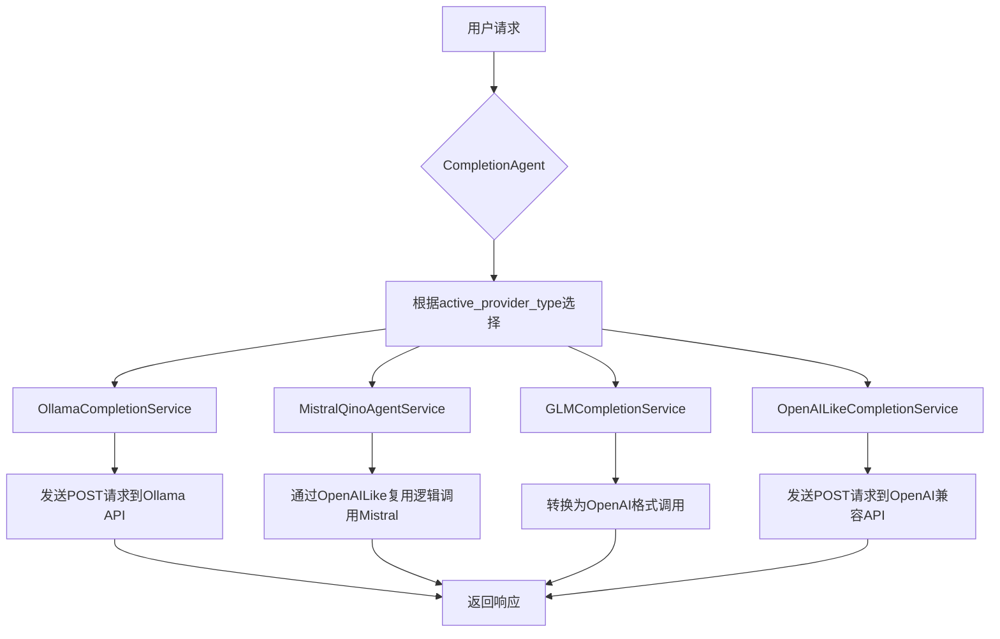
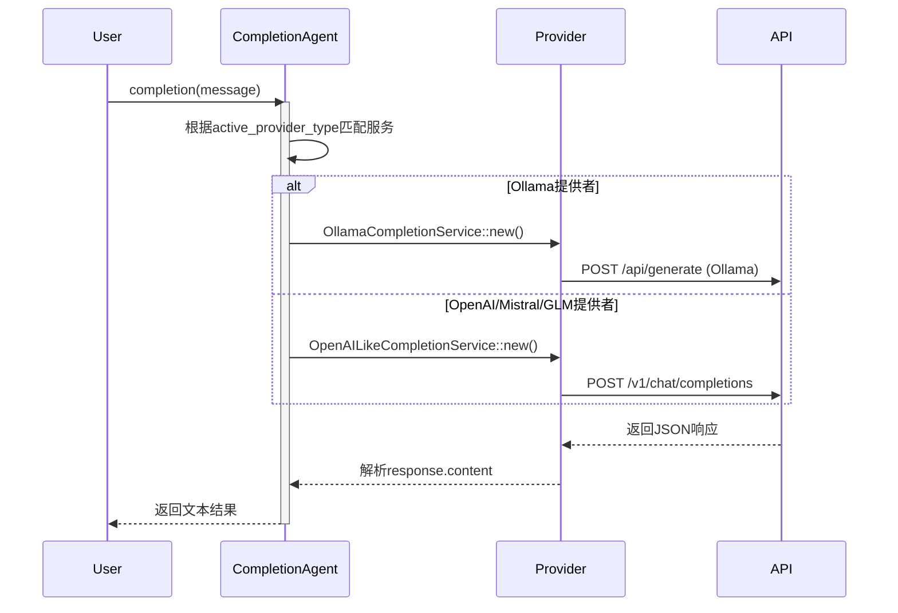

# **AI能力集成域技术实现文档**

---

## **1. 模块概述**

### **模块名称**  
`AI能力集成域`（AI Integration Domain）

### **核心职责**  
封装与多种大语言模型（LLM）提供商的交互逻辑，为上层应用提供统一、抽象的AI服务能力。该模块屏蔽了不同LLM服务在接口协议、认证方式和数据格式上的差异，使系统能够灵活切换本地或云端模型，支持私有化部署与高性能推理需求。

### **业务价值**  
- 实现“一次调用，多平台适配”的AI服务接入模式
- 支持用户根据场景选择最优模型（如隐私优先选Ollama，性能优先选OpenAI）
- 提供可扩展架构，便于未来接入更多LLM服务商

---

## **2. 架构设计与核心组件**

### **整体架构图**


### **关键设计原则**
- **代理模式（Proxy Pattern）**：`CompletionAgent`作为统一入口，动态路由至具体实现
- **适配器模式（Adapter Pattern）**：GLM、Mistral等厂商服务通过适配层复用通用逻辑
- **配置驱动**：运行时由 `LLMSection.active_provider_type` 决定实际使用的提供商
- **异步非阻塞**：所有网络通信基于 `tokio` 和 `reqwest` 异步执行

---

## **3. 核心组件详解**

### **3.1 CompletionAgent（LLM代理服务）**

#### **功能定位**
作为AI能力调用的顶层代理，负责根据当前配置初始化对应的服务实例，并转发文本生成请求。

#### **代码路径**
- `crates/llm/src/llm_agent.rs`

#### **结构定义**
```rust
pub struct CompletionAgent {
    provider: CompletionServiceEnums,
}
```

其中 `CompletionServiceEnums` 是一个枚举类型，包装了所有可用的LLM服务实现：
```rust
enum CompletionServiceEnums {
    Ollama(OllamaCompletionService),
    Mistral(MistralQinoAgentService),
    Platform(PlatformAgentService),
    GLM(GLMCompletionService),
    OpenAI(OpenAILikeCompletionService),
}
```

#### **初始化流程**
```rust
impl CompletionAgent {
    pub fn new(
        llm_section: LLMSection, 
        system_prompt: String, 
        options: AITargetOption
    ) -> anyhow::Result<CompletionAgent>
```
- 读取 `llm_section.active_provider_type`
- 匹配并构造对应的 `CompletionService` 实例
- 返回持有具体服务的 `CompletionAgent`

> ✅ **示例：当 active_provider_type = Ollama 时**
```rust
let provider = OllamaCompletionService::new(&llm_section.provider_ollama, system_prompt, options)?;
Ok(CompletionAgent { provider: CompletionServiceEnums::Ollama(provider) })
```

#### **调用接口**
```rust
pub async fn completion(&self, message: String) -> anyhow::Result<String>
```
使用 `match` 表达式分发到具体服务：
```rust
match &self.provider {
    CompletionServiceEnums::Ollama(p) => p.completion(message).await,
    CompletionServiceEnums::Mistral(p) => p.completion(message).await,
    // ...
}
```

---

### **3.2 CompletionService Trait（统一接口契约）**

#### **定义文件**
- `crates/llm/src/providers/types.rs`

#### **接口声明**
```rust
pub trait CompletionService {
    fn completion(&self, message: String) -> impl std::future::Future<Output=anyhow::Result<String>>;
}
```

> ⚠️ 注意：由于返回的是 `impl Future`，此 trait 不具备对象安全性（object safety），因此不能直接用于 `Box<dyn CompletionService>`，必须通过枚举封装。

---

### **3.3 具体服务实现**

| 服务 | 文件路径 | 类型 | 特点 |
|------|--------|------|------|
| `OllamaCompletionService` | `llm_ollama.rs` | 原生实现 | 直接对接 Ollama `/api/generate` 接口 |
| `OpenAILikeCompletionService` | `llm_openaibase_like.rs` | 原生实现 | 支持任何兼容 OpenAI v1 接口的服务 |
| `GLMCompletionService` | `llm_glm.rs` | 适配层 | 复用 OpenAI 兼容逻辑 |
| `MistralQinoAgentService` | `llm_mistral.rs` | 适配层 | 使用固定端点调用 Mistral Agent |
| `PlatformAgentService` | `llm_platform.rs` | 占位实现 | 当前未完成，预留扩展 |

---

#### **3.3.1 Ollama 集成（本地模型支持）**

##### **依赖**
- HTTP 客户端：`reqwest`
- 序列化：`serde`
- 端点管理：`types::LLMEndPoint`

##### **请求参数结构**
```rust
struct RequestParameter {
    model: String,
    system: String,
    prompt: String,
    options: AITargetOption,
    images: Option<String>,
    format: Option<String>,
    keep_alive: String,
    stream: bool,
}
```

##### **响应解析**
```rust
#[derive(Deserialize)]
struct CompletionReply {
    response: String,
}
```

##### **API 调用地址**
由 `LLMEndPoint.get_api_generate_completion()` 动态拼接：
```text
http://localhost:11434/api/generate
```

##### **连接器**
使用统一的 `connector::new()` 创建带超时和压缩支持的客户端：
```rust
Client::builder()
    .timeout(Duration::from_secs(60))
    .gzip(true)
    .deflate(true)
    .build()?
```

---

#### **3.3.2 OpenAI 兼容接口（云端模型基础）**

##### **适用范围**
- OpenAI 官方服务
- 其他遵循 OpenAI API 规范的服务（如 Azure、自建代理）

##### **消息格式**
采用标准 ChatML 结构：
```json
{
  "model": "gpt-3.5-turbo",
  "messages": [
    {"role": "system", "content": "..."},
    {"role": "user", "content": "..."}
  ]
}
```

##### **HTTP 请求头**
```http
Authorization: Bearer <api_key>
Content-Type: application/json
```

##### **响应处理**
提取首个 choice 中的消息内容：
```rust
let content = match &resp.choices[0].message {
    Some(m) => m.content.clone(),
    None => String::new(),
};
```

---

#### **3.3.3 GLM 与 Mistral 适配层**

##### **设计思路**
复用 `OpenAILikeCompletionService` 的核心逻辑，仅做配置映射。

##### **GLM 实现（`llm_glm.rs`）**
```rust
pub struct GLMCompletionService {
    inner: OpenAILikeCompletionService
}

impl GLMCompletionService {
    pub fn new(config: &GLMLLMProvider, ...) -> Result<Self> {
        Ok(GLMCompletionService {
            inner: OpenAILikeCompletionService {
                config: OpenAILLMProvider {
                    model_name: config.model_name.clone(),
                    api_base_url: config.api_base_url.clone(),
                    api_key: config.api_key.clone(),
                },
                system_prompt,
                client: connector::new()?,
            }
        })
    }
}
```

> ✅ **优势**：避免重复实现网络层逻辑，提升维护性。

##### **Mistral 实现（`llm_mistral.rs`）**
- 固定使用 `https://api.mistral.ai/v1/chat/completions`
- 使用硬编码的 `agent_id` 和空 `api_key`（待完善）
- 同样封装 `OpenAILikeCompletionService` 实例

---

## **4. 配置体系与类型定义**

### **4.1 关键配置结构（来自 `types/src/lib.rs`）**

| 结构体 | 描述 |
|-------|------|
| `LLMProviderType` | 枚举：`Ollama`, `GLM`, `OpenAI`, `Mistral`, `Platform` |
| `LLMSection` | 主配置节，包含各提供商配置及当前激活类型 |
| `OllamaLLMProvider` | 包含 `endpoint: LLMEndPoint` |
| `GLMLLMProvider` / `OpenAILLMProvider` | 包含 `model_name`, `api_base_url`, `api_key` |
| `AITargetOption` | 控制生成参数：temperature, top_p, seed 等 |

### **4.2 默认值设置**

#### `AITargetOption` 默认参数
```rust
impl Default for AITargetOption {
    fn default() -> Self {
        AITargetOption {
            temperature: Some(0.0),
            seed: Some(0),
            top_k: Some(40),
            top_p: Some(0.9),
            num_ctx: Some(4096),
        }
    }
}
```

#### `LLMEndPoint` 默认值
```rust
impl Default for LLMEndPoint {
    fn default() -> Self {
        LLMEndPoint {
            api_base_url: "http://localhost:11434".into(),
            api_path_generate_completion: "/api/generate".into(),
            api_path_chat_completion: "/api/chat".into(),
            model: "default_adaptived_llm".into(),
        }
    }
}
```

---

## **5. 交互流程时序图**



---

## **6. 技术栈与依赖**

### **Cargo.toml 依赖摘要**
```toml
[dependencies]
types = { path = "../types" }
tokio = { workspace = true, features = ["full"] }
reqwest = { workspace = true, features = ["gzip", "deflate", "json"] }
anyhow = { workspace = true }
serde = { workspace = true, features = ["derive"] }
```

### **关键技术点**
- **异步运行时**：`tokio`
- **HTTP 客户端**：`reqwest`（支持 gzip/deflate 压缩）
- **序列化**：`serde` + derive 宏
- **错误处理**：`anyhow::Result<T>`
- **连接池管理**：每个服务持有独立 `Client` 实例

---

## **7. 可扩展性分析**

### **新增LLM提供商步骤**
1. 在 `types::LLMProviderType` 中添加新枚举项
2. 创建新的 provider 配置结构体（如 `MyLLMProvider`）
3. 实现对应的 `XXXCompletionService` 并实现 `CompletionService` trait
4. 在 `CompletionAgent::new()` 中添加分支匹配
5. 更新 `LLMSection` 配置结构以包含新 provider 字段

> ✅ 示例：若要接入阿里通义千问，可创建 `QwenCompletionService` 并复用 `OpenAILikeCompletionService` 模式。

---

## **8. 待优化事项与建议**

| 问题 | 建议 |
|------|------|
| `PlatformAgentService` 尚未实现完整逻辑 | 明确其用途是调用内部平台还是预留插件接口 |
| `MistralQinoAgentService` 使用空 key 和 ID | 应从配置中读取凭证，而非硬编码 |
| 缺少流式响应支持 | 扩展 `completion()` 接口支持 `Stream<Item=String>` |
| 无缓存机制 | 对高频提示词增加本地缓存（如 LRU Cache） |
| 错误处理粒度较粗 | 增加对超时、认证失败、模型不存在等异常的分类捕获 |

---

## **9. 总结**

`AI能力集成域` 是 `saga-reader` 项目的核心能力中枢，其实现具有以下显著特点：

- ✅ **高度抽象**：通过 `CompletionAgent` + `CompletionService` 模式实现统一调用入口
- ✅ **灵活可配**：支持五种主流LLM提供商，可在运行时动态切换
- ✅ **本地优先**：深度集成 Ollama，保障用户隐私与离线可用性
- ✅ **工程规范**：清晰的模块划分、合理的错误处理、良好的异步支持

该模块不仅满足当前业务需求，也为未来接入更多AI服务奠定了坚实的基础，体现了现代桌面应用在“本地智能 + 云服务”融合方面的先进实践。