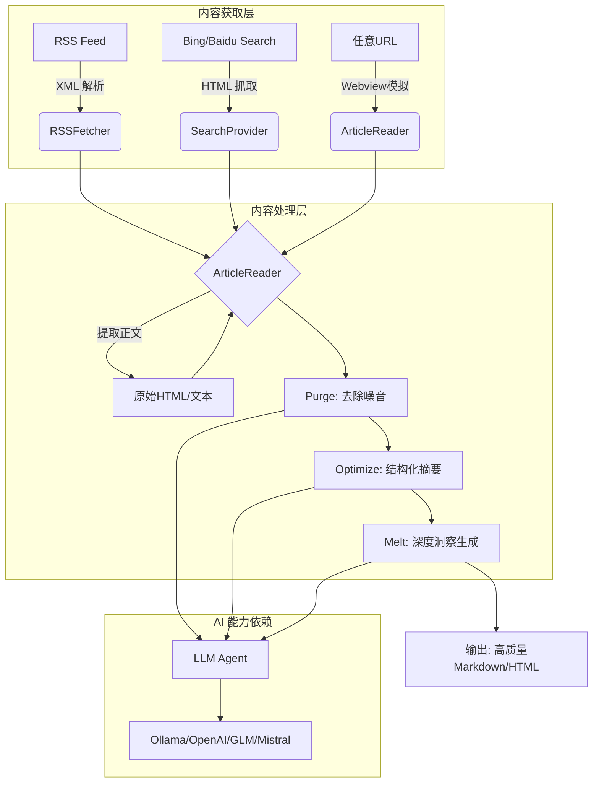
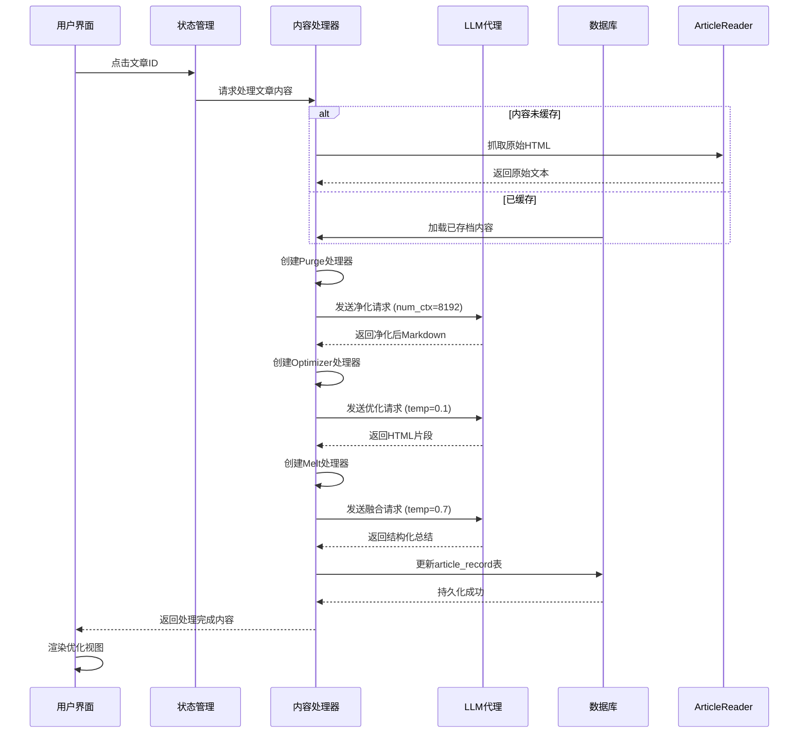

# **内容获取与处理域技术实现文档**

---

## **1. 模块概述**

### **模块名称**
**内容获取与处理域（Content Acquisition and Processing Domain）**

### **模块定位**
本模块是 `saga-reader` 系统的核心业务组件之一，承担从多源信息渠道抓取原始内容，并通过大语言模型（LLM）进行智能净化、结构化优化与深度洞察融合的全流程处理任务。其目标是将杂乱、低质量的网页内容转化为结构清晰、语义完整、可读性强的知识片段，为用户提供“去噪—提炼—升华”的三阶阅读增强体验。

### **核心价值**
- 实现对 RSS、搜索引擎结果页及 JavaScript 渲染页面的统一抓取能力
- 构建基于 LLM 的三阶段处理流水线（Purge → Optimize → Melt），提升内容可读性与信息密度
- 支持本地 AI 模型（如 Ollama）与云端服务（OpenAI/GLM/Mistral）无缝集成，保障隐私与灵活性
- 为前端提供高质量、标准化的内容输出，支撑智能阅读、AI 对话等高级功能

---

## **2. 模块架构设计**

### **整体架构图（Mermaid）**


### **分层职责划分**
| 层级 | 组件 | 职责 |
|------|------|------|
| **数据源适配层** | `RSSFetcher`, `BingProvider`, `BaiduProvider` | 封装不同来源的数据获取协议与解析逻辑 |
| **内容提取层** | `article_reader.rs`, `simulator.rs` | 执行实际的网页内容抓取与 DOM 提取 |
| **AI 处理管道层** | `purge.rs`, `optimizer.rs`, `melt.rs` | 定义 LLM 处理流程的三个阶段 |
| **抽象接口层** | `IPresetArticleLLMProcessor`, `IArticleProcessor` | 提供统一调度接口，支持扩展新处理器 |

---

## **3. 核心子模块详解**

### **3.1 RSS 内容抓取（RSSFetcher）**

#### **实现路径**
`crates/scrap/src/rss/mod.rs`

#### **关键技术点**
- 使用 `rss` crate 解析标准 RSS/XML 数据流
- 遍历 `<item>` 元素提取标题、链接、摘要等元信息
- 调用通用 `article_reader::read()` 方法进一步抓取全文内容（非仅摘要）

#### **代码示例**
```rust
let content = reqwest::get(url).await?.bytes().await?;
let channel = Channel::read_from(&content[..])?;
for item in channel.items() {
    let source_link = item.link().unwrap_or("").to_string();
    match article_reader::read(&source_link, None, llm_section.clone()).await {
        Ok((clean_content, final_url)) => {
            articles.push(Article { title, source_link, content: Some(clean_content), .. });
        }
        Err(_) => continue,
    }
}
```

#### **特点**
- 支持增量更新机制（结合数据库比对）
- 自动跳过无法访问或解析失败的文章

---

### **3.2 搜索引擎爬虫（Search Provider）**

#### **实现路径**
- Bing: `crates/scrap/src/search/bing.rs`
- Baidu: `crates/scrap/src/search/baidu.rs`

#### **关键技术点**
- 使用 `reqwest` 发起搜索请求，构造符合平台规范的 URL 参数
- 利用 `scraper` 库解析 HTML 结果页中的标题、摘要、链接
- 支持时间范围过滤（百度使用 `gpc=stf` 参数限定最近7天）
- 中文日期格式自动校准（如“3天前”转为具体日期）

#### **反重定向策略（Baidu 特有）**
由于百度返回的是中间跳转链接（`http://www.baidu.com/link?url=...`），直接请求会因 Host 不匹配被拦截。系统采用以下两种方式应对：
1. **Tauri Webview 模拟加载**：通过隐藏窗口执行 JS 重定向，获取真实目标 URL
2. **LLM 辅助判断**：若检测到重定向响应，调用 LLM 分析 HTML 是否包含 `window.location.href` 指令

#### **选择器配置**
| 引擎 | 选择器 | 示例 |
|------|--------|------|
| Bing | `.b_algo` | 主条目容器 |
|      | `h2 > a` | 标题链接 |
| Baidu | `.result.c-container` | 主条目容器 |
|       | `.c-title > a` | 标题链接 |

---

### **3.3 智能网页抓取（Simulator + ArticleReader）**

#### **实现路径**
- `crates/scrap/src/simulator.rs`
- `crates/scrap/src/article_reader.rs`

#### **核心技术原理**
针对 JavaScript 动态渲染页面（SPA、懒加载、前端路由），传统 HTTP 请求无法获取完整 DOM。系统采用 **Tauri Webview 模拟浏览器行为** 实现精准抓取：

1. 创建一个不可见的 Webview 窗口（`visible(false)`）
2. 加载目标 URL 并等待至少 3 秒以完成 JS 执行
3. 注入 JavaScript 脚本提取 `document.documentElement.innerHTML`
4. 通过 Tauri 事件系统回传 HTML 字符串
5. 关闭临时窗口释放资源

#### **关键代码片段（simulator.rs）**
```rust
let window = WebviewWindowBuilder::new(&app_handle, "WINDOW_SCRAP_HOST", WebviewUrl::External(url))
    .visible(false)
    .build()?;

// 注入脚本提取完整HTML
window.eval(r#"var ecruos_oniq_value = document.documentElement.innerHTML;
               window.__TAURI__.event.emit("ecruos_oniq_tneve", ecruos_oniq_value)"#);

// 监听事件并接收结果
window.once("ecruos_oniq_tneve", move |event| { tx.send(...); });
```

#### **优势**
- 可处理 React/Vue/Angular 等现代框架渲染的内容
- 支持自动识别并跟随前端跳转（如登录后跳首页）
- 与 LLM 协同判断是否存在隐式重定向

---

### **3.4 文章内容处理管道（Article Processing Pipeline）**

#### **实现路径**
- 核心类：`crates/intelligent/src/article_processor/llm_processor.rs`
- 处理阶段：`purge.rs`, `optimizer.rs`, `melt.rs`
- 提示词模板：`prompts/*.prompt`

#### **处理流程（三阶段流水线）**

| 阶段 | 名称 | 目标 | LLM 参数 | 提示词文件 |
|------|------|------|----------|------------|
| 1 | Purge（净化） | 去除广告、导航栏、JS/CSS 代码，保留正文与图片 | `num_ctx=8192`（长上下文） | `purge_sys.prompt` |
| 2 | Optimize（优化） | 结构化排版，生成适合阅读的 HTML 片段 | `temperature=0.1`（低随机性） | `optimizer_sys.prompt` |
| 3 | Melt（融合） | 多篇相关文章合并洞察，生成专业级总结 | `temperature=0.7`（适度创造性） | `melt_sys.prompt` |

#### **接口抽象设计**
通过 trait 实现处理器解耦：

```rust
pub trait IPresetArticleLLMProcessor {
    fn new_processor(llm_section: LLMSection) -> anyhow::Result<ArticleLLMProcessor>;
}

impl IPresetArticleLLMProcessor for Purge {
    fn new_processor(llm_section: LLMSection) -> anyhow::Result<ArticleLLMProcessor> {
        let options = AITargetOption { num_ctx: Some(8192), ..Default::default() };
        ArticleLLMProcessor::new(llm_section, SYSTEM_PROMPT.into(), USER_PROMPT_COMMAND.into(), options)
    }
}
```

#### **提示词设计要点**

##### **Purge 阶段（purge_sys.prompt）**
- 角色设定：**网页源码分析师**
- 输出要求：仅输出 Markdown 格式的正文内容，含图片链接
- 约束条件：
  - 移除 `<header>`, `<footer>`, `<nav>` 等非正文区域
  - 保留 `<p>`, `<h1-h6>`, `` 内容
  - 图片仅保留 jpeg/jpg/png 格式
  - 若失败则返回特定错误码 `QINO-AGENTIC-EXECUTION-FAILURE`

##### **Optimize 阶段（optimizer_sys.prompt）**
- 角色设定：**专业内容设计师**
- 输出要求：生成可用于邮件展示的现代 HTML 片段
- 视觉元素模板：
  - 标准段落（带字体与行高）
  - 关键点列表（带圆点编号）
  - 强调文本（渐变背景）
  - 引用块（左侧彩条+阴影）
  - 图片嵌入（自动添加 `referrerpolicy="no-referrer"`）
- 必须使用至少 2–3 种视觉元素组合
- 输出纯 HTML 片段，不含 `<html><body>` 包裹

##### **Melt 阶段（melt_sys.prompt）**
- 角色设定：**跨领域专家**
- 输出结构化模板：
  ```markdown
  ## 内容概述
  ## 关键信息提炼
  ## 文章质量以及所存在的疑点
  ## 指导建议
  ## 专业术语说明（表格形式）
  ```
- 要求保持客观严谨，避免主观臆断
- 鼓励提出建设性意见与行动指南

---

## **4. 数据流与交互流程**

### **主流程：文章智能处理流程**


### **依赖关系**
| 依赖方向 | 说明 |
|--------|------|
| → AI能力集成域 | 调用 `CompletionAgent` 执行 LLM 推理 |
| → 数据持久化域 | 读取原始内容、写入处理结果 |
| ← 状态管理域 | 接收处理触发指令，返回最终内容 |
| ← 用户界面域 | 响应用户点击事件启动处理 |

---

## **5. 性能与可靠性设计**

### **并发控制**
- `simulator.rs` 使用静态互斥锁防止多个 Webview 同时运行：
  ```rust
  static MUTEX: Lazy<Arc<Mutex<()>>> = Lazy::new(|| Arc::new(Mutex::new(())));
  let _lock = MUTEX.lock().await;
  ```
- 多篇文章处理采用队列机制，避免同时发起过多 LLM 请求

### **超时与降级**
- Webview 抓取设置 10 秒超时，失败后尝试备用方案（普通 HTTP + LLM 重定向分析）
- LLM 请求失败时记录日志并保留原始内容作为兜底

### **缓存复用**
- 已处理文章标记 `processed=true`，避免重复调用 AI 流水线
- 支持手动刷新强制重新处理

---

## **6. 扩展性与维护建议**

### **可扩展点**
1. **新增处理器类型**  
   实现 `IPresetArticleLLMProcessor` trait 即可添加新处理模式（如“翻译”、“摘要对比”）。
   
2. **支持更多搜索引擎**  
   实现 `IProvider` 接口即可接入 Google、DuckDuckGo 等。

3. **自定义提示词热更新**  
   当前提示词为编译期嵌入（`include_str!`），未来可改为运行时加载外部 `.prompt` 文件，支持动态调整。

### **待优化项**
| 问题 | 建议解决方案 |
|------|---------------|
| 百度跳转链接处理不稳定 | 引入 Puppeteer-like 工具或更完善的 Webview 重定向跟踪机制 |
| 提示词硬编码在二进制中 | 设计提示词管理中心，支持用户自定义编辑与版本管理 |
| 缺乏处理进度反馈 | 在 `tasks.svelte.ts` 中暴露处理阶段状态，UI 显示“正在净化…”、“正在优化…” |

---

## **7. 总结**

**内容获取与处理域** 是 `saga-reader` 的核心竞争力所在，它不仅实现了对多种信息源的统一接入，更重要的是构建了一套完整的 **AI 增强内容流水线**，真正实现了从“信息聚合”到“知识提炼”的跃迁。

该模块具备以下显著特征：
- ✅ **技术先进性**：融合 Webview 模拟、DOM 解析、LLM 流水线三大技术栈
- ✅ **架构清晰性**：分层明确，接口抽象良好，易于维护与扩展
- ✅ **用户体验导向**：每一阶段处理都服务于具体的阅读场景需求
- ✅ **本地化优先**：全面支持 Ollama，保障用户数据隐私

建议后续持续投入资源优化提示工程、增强错误恢复机制，并探索多文档联合处理能力，进一步巩固其在智能阅读领域的领先地位。