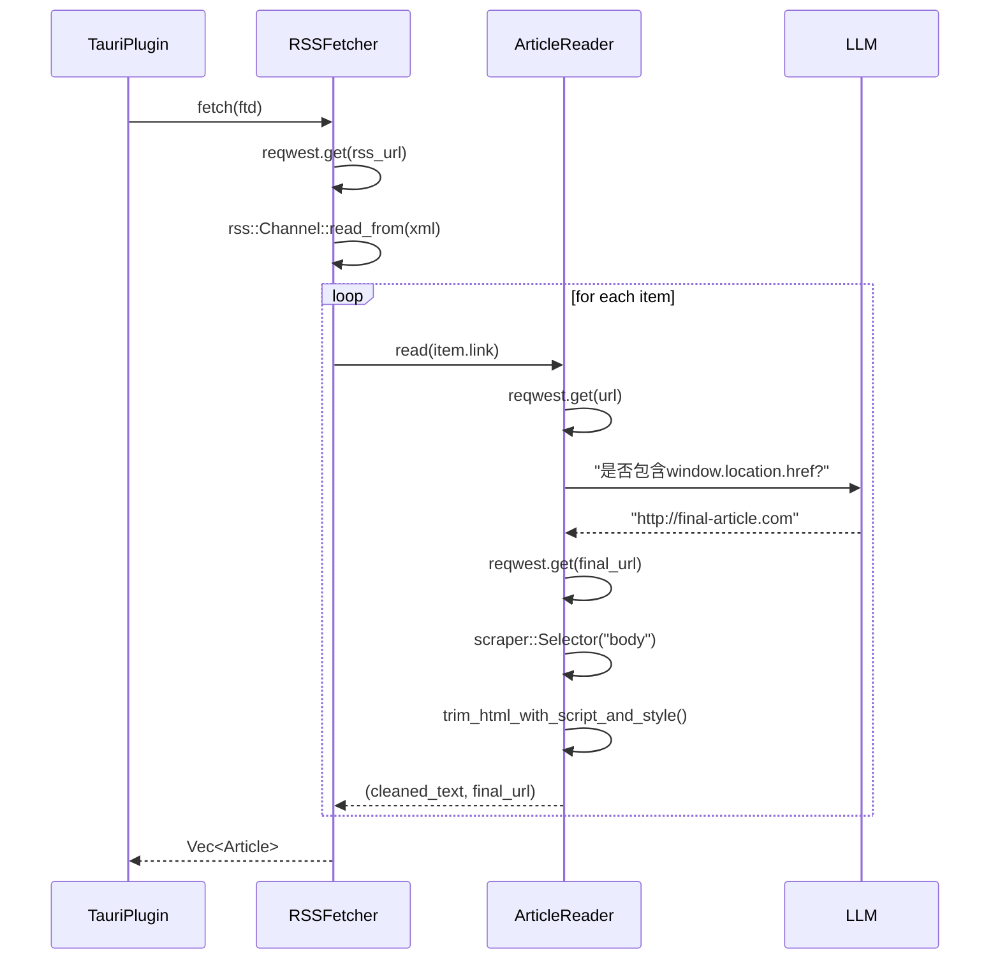

# 数据抓取域技术实现文档

## 1. 概述

数据抓取域是 Saga Reader 系统的核心基础设施之一，负责从多种外部数据源（RSS订阅、Bing、百度等搜索引擎）获取原始文章内容。该模块作为系统信息输入的源头，为后续的AI处理、持久化和前端展示提供基础数据。其设计遵循高内聚、低耦合原则，采用模块化架构，支持灵活扩展。

本模块的核心价值在于：
- **多源支持**：统一处理RSS、Bing、百度等多种异构数据源
- **智能提取**：结合HTML解析与LLM辅助判断，精准提取正文内容
- **容错机制**：内置重试、重定向、超时处理等网络健壮性设计
- **标准化输出**：统一输出结构化Article数据模型，供下游模块消费

## 2. 核心架构与模块组成

数据抓取域由以下核心模块构成，形成清晰的分层架构：

### 2.1 抽象接口层（IFetcher）
位于 `crates/scrap/src/types.rs`，定义了统一的抓取器接口，是模块扩展的基础。

```rust
pub trait IFetcher {
    fn fetch<R: Runtime>(
        &self,
        app_handle: Option<AppHandle<R>>,
        llm_section: &LLMSection,
        ftd: FeedTargetDescription,
    ) -> impl std::future::Future<Output = anyhow::Result<Vec<Article>>> + Send;
}
```

该接口定义了所有抓取器必须实现的 `fetch` 方法，参数包括：
- `app_handle`：Tauri应用句柄，用于在需要时调用原生功能（如模拟浏览器抓取）
- `llm_section`：LLM配置，用于内容校准
- `ftd`（FeedTargetDescription）：订阅源配置，包含ID、名称和数据URL列表

### 2.2 具体实现模块

#### 2.2.1 RSS抓取器（RSSFetcher）
- **文件**：`crates/scrap/src/rss/mod.rs`
- **依赖**：`rss`（RSS解析库）、`reqwest`（HTTP客户端）、`article_reader`（内容提取器）
- **工作流程**：
  1. 接收订阅源URL（通常为一个）
  2. 使用 `reqwest::get(url).await?.bytes().await?` 发送HTTP请求获取RSS XML
  3. 使用 `rss::Channel::read_from(&content[..])?` 解析XML结构
  4. 遍历每个 `<item>`，提取：
     - `title`：文章标题
     - `link`：文章链接
     - `description`：摘要（head_read）
  5. 对每个文章链接，**异步调用 `article_reader::read()`** 获取完整正文
  6. 将提取的元数据与正文封装为 `Article` 结构体返回

**关键设计**：
- **异步并发**：对多个item的正文抓取是异步并行的，提升效率
- **错误容忍**：若某篇文章正文抓取失败，仅跳过该条，不影响其他文章
- **解耦设计**：RSS解析与正文提取分离，便于独立测试和替换

#### 2.2.2 搜索引擎爬虫（Baidu/Bing Provider）
- **文件**：`crates/scrap/src/search/baidu.rs`、`crates/scrap/src/search/bing.rs`
- **依赖**：`reqwest`、`scraper`（HTML解析）、`urlencoding`、`article_reader`
- **工作流程**：
  1. 构造搜索URL（如Bing：`https://www.bing.com/search?q=关键词`）
  2. 发送HTTP请求获取搜索结果页HTML
  3. 使用 `scraper::Selector` 定位结果容器（如Bing的 `.b_algo`）
  4. 从每个结果项中提取：
     - `title`：`h2` 标签文本
     - `head_read`：摘要文本（`.b_caption`），并调用 `trim_head_read_days_ago()` 清洗“3天前”等相对时间
     - `source_link`：`a` 标签的 `href` 属性
  5. 对每个提取的链接，**异步调用 `article_reader::read()`** 获取完整正文
  6. 返回结构化 `Article` 列表

**关键创新**：
- **中文日期处理**：`trim_head_read_days_ago()` 函数能智能解析“3天前”、“2小时前”等非标准日期格式，转换为标准格式
- **双模式抓取**：支持通过 `app_handle` 调用 `scrap_text_by_url()`（模拟浏览器）或直接 `reqwest` 抓取，应对反爬机制
- **动态选择器**：使用CSS选择器定位元素，便于维护和适配不同网站布局

#### 2.2.3 内容阅读器（ArticleReader）
- **文件**：`crates/scrap/src/article_reader.rs`
- **核心作用**：从任意URL提取网页正文，是RSS和搜索引擎模块的共同依赖。
- **工作流程**：
  1. 使用 `reqwest::Url::parse()` 解析URL
  2. 创建自定义HTTP客户端（通过 `connector::new_builder()`）
  3. 发送GET请求，处理重定向：
     - 若为3xx重定向，获取 `Location` 头，递归调用自身
  4. **LLM辅助重定向检测**（核心创新）：
     - 若 `auto_redirect=true` 且来自搜索源（如baidu.com），将HTML内容发送给LLM
     - 提示词：“上述代码中是否包括一个通过window.location.href重定向的新页面链接...”
     - LLM返回“http://...”或“没有”，若为链接则跳转到新地址
  5. 使用 `scraper::Selector::parse("body")` 提取 `<body>` 内容
  6. 调用 `trim_html_with_script_and_style()` 清洗：
     - 移除 `<script>`、`<style>`、`<meta>`、`<link>`、`<iframe>`、`<noscript>` 标签
  7. 返回 `(cleaned_text, final_url)` 元组

**关键设计**：
- **智能重定向**：解决搜索引擎返回的中间跳转链接问题，直接获取最终目标页
- **内容净化**：自动移除广告、导航、脚本等噪声，保留纯文本内容
- **可配置客户端**：使用统一的 `ClientOption` 配置User-Agent、超时等，避免被识别为爬虫

#### 2.2.4 网络工具（Connector）
- **文件**：`crates/scrap/src/connector.rs`
- **作用**：封装HTTP客户端的标准化配置，确保所有抓取请求具有一致的行为。
- **关键配置**：
  - **User-Agent**：模拟主流浏览器（Chrome/Edge）
  - **超时**：20秒
  - **压缩**：启用gzip/deflate
  - **Header**：设置 `Accept`、`Accept-Encoding`、`Accept-Language`、`Cache-Control`、`Connection`、`DNT` 等标准头
  - **Cookie**：启用Cookie存储，支持需要登录的站点

### 2.3 工具函数模块
- **`utils.rs`**：提供通用文本清洗函数，如 `trim_head_read_days_ago()`、`trim_html_with_script_and_style()`
- **`selector_extensions.rs`**：扩展 `scraper::Selector` 的功能，提供更安全的文本提取方法
- **`types.rs`**：定义 `Article`、`FeedTargetDescription`、`LLMSection` 等核心数据模型

## 3. 关键数据模型

### Article 结构体（`crates/types/src/lib.rs`）
```rust
pub struct Article {
    pub title: String,                    // 文章标题
    pub head_read: Option<String>,        // 摘要（来自RSS或搜索结果）
    pub source_link: String,              // 原始来源链接
    pub summary: Option<String>,          // AI生成的摘要（后续由AI处理域填充）
    pub content: Option<String>,          // 清洗后的正文（由article_reader填充）
    pub date_created: String,             // 发布日期（格式化为"2025年04月05日"）
    pub date_read: Option<String>,        // 阅读时间（由持久化域填充）
}
```

### FeedTargetDescription 结构体
```rust
pub struct FeedTargetDescription {
    pub id: String,                       // 唯一标识符
    pub name: String,                     // 用户友好的名称
    pub fetcher_id: String,               // 指定抓取器类型（如"rss"、"bing"）
    pub data: Vec<String>,                // 数据源URL列表（RSS为1个，搜索为关键词）
}
```

## 4. 工作流与交互模式

### 4.1 核心工作流：文章聚合与更新


### 4.2 模块间协作
- **上游依赖**：由 `Tauri插件` 通过 `FeaturesAPI` 调用 `update_feed_contents` 触发
- **下游依赖**：输出 `Vec<Article>` 传递给 `AI处理域` 进行净化与优化
- **横向依赖**：所有抓取器都依赖 `article_reader` 和 `connector` 模块

## 5. 技术亮点与创新

1. **LLM辅助内容校准**：通过LLM判断JS重定向，解决了搜索引擎中间链接的抓取难题，这是本模块最核心的创新点。
2. **统一的异步抓取框架**：所有抓取器实现同一接口，便于扩展新数据源（如Twitter、Medium）。
3. **智能日期处理**：自动识别并转换“3天前”等非标准日期，提升数据一致性。
4. **健壮的网络层**：标准化的HTTP客户端配置，有效规避反爬机制。
5. **内容净化**：自动移除HTML噪声，确保输出内容干净、可读性强。

## 6. 总结

数据抓取域是Saga Reader系统的信息入口，其设计体现了“简单、健壮、智能”的工程哲学。通过模块化设计、标准化接口和LLM增强，该模块不仅高效地完成了从多源获取原始内容的任务，还为后续的AI处理提供了高质量的输入，是整个智能阅读闭环的基石。