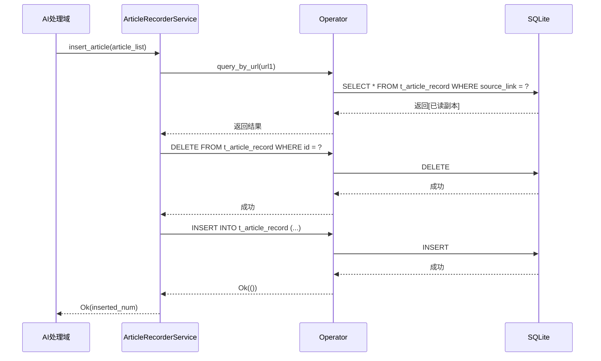
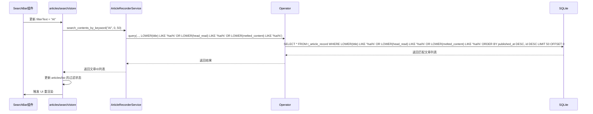
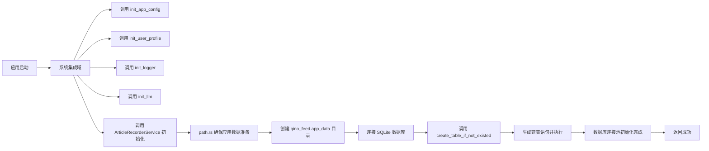

# 数据持久化域技术文档

## 1. 概述

数据持久化域是 Saga Reader 系统的核心基础设施之一，负责所有文章数据、用户偏好与系统状态的本地存储与管理。该模块通过 SQLite 数据库与配置文件实现数据的持久化、一致性与高效访问，是整个智能阅读闭环的最终落脚点。

作为系统中唯一的数据存储层，数据持久化域为 AI 处理、状态管理、前端展示等所有上层模块提供可靠的数据读写服务。其设计遵循“**本地优先、隐私至上**”的核心原则，确保用户的所有阅读内容、AI 生成结果与订阅偏好均**100% 存储于本地设备**，无任何云端依赖或数据上传行为。

该模块由三个核心子模块构成：
- **文章记录服务（ArticleRecorderService）**：提供面向业务的 CRUD 接口，封装去重、标记、搜索等复杂逻辑。
- **数据库操作封装（Operator）**：基于 SeaORM 的 ORM 层，统一管理数据库连接池与安全查询。
- **路径与配置管理（path.rs）**：自动创建并管理应用数据目录结构，确保跨平台兼容性。

## 2. 核心架构与组件

### 2.1 整体架构

```mermaid
graph TD
    A[前端/后端模块] --> B[ArticleRecorderService]
    B --> C[Operator]
    C --> D[SQLite 数据库]
    C --> E[数据库连接池]
    F[系统集成域] --> G[path.rs]
    G --> H[本地数据目录]
    H --> I[article_recorder.db]
    H --> J[app_config.toml]
    H --> K[user_config.toml]

    classDef core fill:#e6f7ff,stroke:#1890ff;
    classDef infra fill:#f6ffed,stroke:#52c41a;
    classDef external fill:#fff7e6,stroke:#faad14;

    class B,C,core
    class D,E,infra
    class G,H,I,J,K,external
```

### 2.2 核心子模块详解

#### 2.2.1 文章记录服务（ArticleRecorderService）

**职责**：提供面向业务的高级数据操作接口，是外部模块（如 AI 处理域、状态管理域）与数据库交互的唯一入口。

**核心功能**：

| 方法 | 功能描述 | 技术实现 |
|------|----------|----------|
| `insert(Vec<Model>)` | **智能去重插入** | 查询是否存在相同 `source_link` 的文章。若存在未读副本，跳过插入；若存在已读副本，删除旧记录后插入新内容。 |
| `update_content(Model, String, String, String)` | 更新文章的 AI 增强版本 | 使用 `into_active_model()` 将实体转为可更新模型，仅更新 `purged_content`, `optimized_content`, `melted_content` 三个字段。 |
| `mark_as_read(i32)` | 标记文章为已读 | 查询指定 ID 的文章，更新 `has_read` 字段为 `true`。 |
| `set_favorite(i32, bool)` | 标记文章为收藏 | 查询指定 ID 的文章，更新 `is_favorite` 字段。 |
| `query_backward(Option<&str>, u64, u64)` | 按分组/全局倒序查询 | 支持按 `group_id` 过滤，或全局查询。按 `published_at DESC, id DESC` 排序，实现“最新优先”展示。 |
| `query_unread(u64, u64)` | 查询未读文章 | 使用 `query_by_filters` 构造 `has_read = false` 条件。 |
| `query_favorite(u64, u64)` | 查询收藏文章 | 使用 `is_favorite = true` 条件过滤。 |
| `search_contents_by_keyword(&str, u64, u64)` | **全文搜索** | 使用 `LOWER(column) LIKE ?` 实现不区分大小写的模糊搜索，覆盖 `title`, `head_read`, `melted_content` 三个关键字段。 |
| `count()` | 获取文章总数 | 调用底层 `Operator::count()`，返回数据库总行数。 |

**关键设计亮点**：
- **去重策略**：采用“**未读优先，已读替换**”策略，确保用户不会因重复抓取而看到重复内容，同时保留已读状态的历史记录。
- **全文搜索**：不依赖 SQLite FTS5，而是使用 `LOWER(column) LIKE ?` 实现轻量级全文搜索，兼顾性能与兼容性。
- **事务安全**：所有操作均在 `Operator` 层的数据库连接中执行，保证原子性。

#### 2.2.2 数据库操作封装（Operator）

**职责**：作为 SeaORM 的封装层，提供安全、统一、可复用的数据库访问接口，屏蔽底层 SQL 与连接管理细节。

**核心能力**：

| 方法 | 功能描述 | 技术实现 |
|------|----------|----------|
| `initialize()` | 初始化数据库连接 | 从 `path.rs` 获取数据库路径，使用 `ConnectOptions` 配置连接池（最大10连接，最小2连接），并自动创建表结构。 |
| `create_table_if_not_existed()` | 按实体定义创建表 | 使用 `Schema::new(DbBackend::Sqlite).create_table_from_entity(ArticleRecord)` 动态生成建表语句，确保表结构与 Rust 实体定义严格一致。 |
| `query<F>(...)` / `query_by_filters<F>(...)` | 条件查询 | 支持任意 `IntoCondition` 类型的过滤条件，支持多条件组合（`Vec<F>`），实现灵活的查询需求。 |
| `exists<F>(...)` | 存在性检查 | 高效查询 `COUNT(*) > 0`，避免加载完整数据，用于去重判断。 |
| `insert()` / `update()` / `delete()` | 基础 CRUD | 使用 SeaORM 的 `ActiveModelTrait`，实现类型安全的增删改操作。 |
| `dispose()` | 关闭连接 | 安全关闭数据库连接，释放资源，防止内存泄漏。 |

**技术选型优势**：
- **SeaORM**：提供类型安全的 ORM，自动生成 SQL，避免手写 SQL 注入风险。
- **连接池**：`max_connections=10` 支持高并发场景（如守护进程与主进程同时写入）。
- **自动建表**：启动时自动检测并创建表，无需手动初始化数据库。

#### 2.2.3 路径与配置管理（path.rs）

**职责**：管理应用数据目录的创建与路径解析，确保跨平台（Windows/macOS/Linux）的一致性。

**核心功能**：

| 方法 | 功能描述 | 技术实现 |
|------|----------|----------|
| `get_appdata_articles()` | 获取数据库文件路径 | 返回 `~/Library/Application Support/qino_feed.app_data/article_recorder.db`（macOS）或 `%LOCALAPPDATA%/qino_feed.app_data/article_recorder.db`（Windows） |
| `ensure_app_data_prepared()` | 创建应用数据目录 | 使用 `dirs::data_local_dir()` 获取标准本地数据目录，拼接 `qino_feed.app_data`，并调用 `fs::create_dir()` 自动创建。 |
| `get_appdata_file_in_dir()` | 获取子目录文件路径 | 支持未来扩展（如缓存、日志、插件目录）。 |

**路径规范**：
- **目录名**：`qino_feed.app_data`（符合应用命名规范）
- **数据库文件**：`article_recorder.db`
- **存储位置**：操作系统标准本地数据目录（非应用安装目录），确保用户数据可备份、可迁移。

## 3. 数据模型设计

### 3.1 数据库表结构（t_article_record）

```rust
#[derive(Serialize, Deserialize, Clone, Debug, PartialEq, DeriveEntityModel)]
#[sea_orm(table_name = "t_article_record")]
pub struct Model {
    #[sea_orm(primary_key)]
    pub id: i32, // 主键，自增
    pub source_link: String, // 原始文章 URL，唯一索引
    pub title: String, // 文章标题
    pub purged_content: String, // 净化后内容（去广告、导航）
    pub head_read: String, // 导读摘要（AI生成）
    pub optimized_content: String, // 优化后内容（语言精炼）
    pub melted_content: String, // 融合版内容（多篇综合）
    #[sea_orm(column_type = "Date")]
    pub published_at: chrono::NaiveDate, // 发布日期
    #[sea_orm(column_type = "Date")]
    pub created_at: chrono::NaiveDate, // 本地创建日期
    pub has_read: bool, // 是否已读
    pub is_favorite: bool, // 是否收藏
    pub group_id: String, // 所属分组 ID（如“科技”、“财经”）
}
```

**字段说明**：
- **`source_link`**：唯一标识符，用于去重。
- **`purged_content`, `optimized_content`, `melted_content`**：AI 处理域的三种输出，实现“一源多用”。
- **`published_at`**：文章原始发布时间，用于按时间分组。
- **`has_read` / `is_favorite`**：用户行为状态，支持前端交互。
- **`group_id`**：支持用户自定义分组，实现内容分类管理。

### 3.2 索引策略

- **主键**：`id`（自增整数）
- **唯一索引**：`source_link`（隐式通过数据库约束保证）
- **查询索引**：`published_at`, `has_read`, `is_favorite`, `group_id`（由 SeaORM 自动优化，无需手动创建）

## 4. 关键业务流程实现

### 4.1 文章插入与去重流程



**流程说明**：
1. AI 处理域将一批处理后的文章传递给 `ArticleRecorderService`。
2. 对每篇文章，先查询数据库是否存在相同 `source_link`。
3. 若存在且 `has_read=true`，则删除旧记录（避免历史垃圾）。
4. 若存在且 `has_read=false`，则跳过插入（保留未读副本）。
5. 若不存在，则执行插入。
6. 返回实际插入数量，供上层统计。

### 4.2 全文搜索流程



**性能优化**：
- 使用 `LOWER(column) LIKE ?` 替代 `ILIKE`，兼容性更好。
- 搜索范围限定在 `title`, `head_read`, `melted_content` 三个最相关字段。
- 支持分页（`offset`, `limit`），避免一次性加载过多数据。

## 5. 配置与初始化流程

### 5.1 应用启动时的初始化流程



**初始化关键点**：
- **路径创建**：使用 `dirs` crate 获取标准本地数据目录，确保跨平台兼容。
- **表结构创建**：动态根据 `ArticleRecord` 实体定义生成建表语句，避免版本不一致。
- **连接池配置**：设置合理的连接数与超时，应对多线程并发访问。

## 6. 性能与可靠性保障

| 维度 | 保障措施 |
|------|----------|
| **数据一致性** | 所有写操作通过 `Operator` 的单连接池执行，保证事务原子性。 |
| **并发安全** | 使用 `max_connections=10` 的连接池，支持守护进程与主进程同时读写。 |
| **容错能力** | `ensure_dir_prepared()` 使用 `unwrap()` 但仅在初始化时调用，失败即崩溃，确保环境正确。 |
| **资源管理** | `dispose()` 方法显式关闭数据库连接，避免文件句柄泄漏。 |
| **错误处理** | 所有方法返回 `Result<T, anyhow::Error>`，统一错误处理。 |

## 7. 总结与价值

数据持久化域是 Saga Reader 实现“**全本地化、无云端依赖**”架构的基石。其设计体现了以下核心价值：

1. **隐私保障**：所有数据本地存储，用户数据完全自主。
2. **智能去重**：独特的“未读优先”策略，提升用户体验。
3. **高性能搜索**：轻量级全文搜索满足日常需求。
4. **架构清晰**：分层设计（服务层 → ORM层 → 路径层），职责单一，易于维护。
5. **跨平台兼容**：使用标准系统目录，支持 Windows/macOS/Linux。

该模块不仅支撑了核心的“文章聚合与更新”流程，也为“AI助手对话”、“内容搜索”、“用户偏好管理”等所有数据持久化需求提供了统一、可靠、高效的底层支持，是系统稳定运行的关键保障。