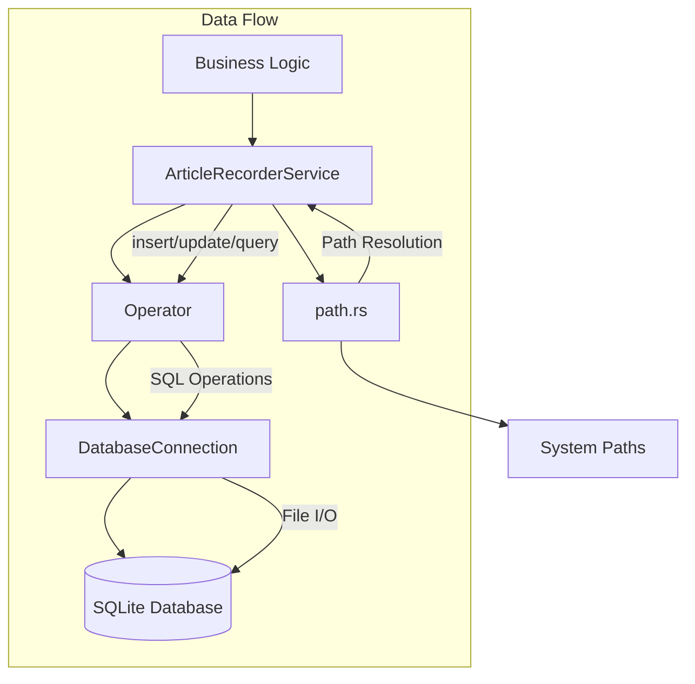
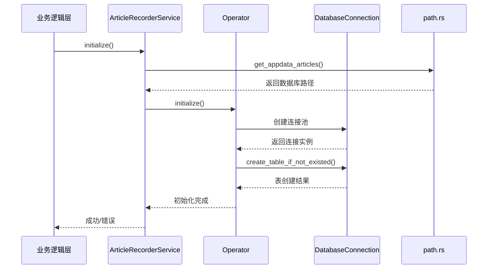
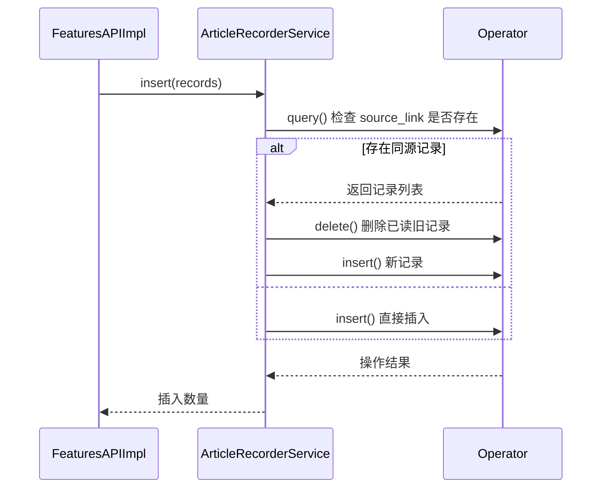

# **saga-reader 数据持久化域技术实现文档**

---

## **1. 模块概述**

**数据持久化域**是 `saga-reader` 项目的核心基础设施模块，负责管理所有应用数据的存储、检索与生命周期。该模块采用 **SQLite + SeaORM** 的技术组合，实现了轻量级、高性能且跨平台兼容的本地数据持久化方案。

作为连接业务逻辑与底层存储的关键中介，该域主要承担以下职责：
- 管理文章记录（`t_article_record`）的全生命周期（CRUD）
- 提供结构化的查询接口支持分页、过滤、搜索等操作
- 封装数据库连接池与初始化流程
- 统一管理应用程序的数据存储路径

其设计遵循 **关注点分离原则**，通过分层架构将路径管理、数据库操作与业务服务解耦，确保系统的可维护性与扩展性。

---

## **2. 架构设计与组件分解**

### **2.1 整体架构图**


### **2.2 核心组件说明**

| 组件 | 路径 | 职责 |
|------|------|------|
| **ArticleRecorderService** | `crates/recorder/src/article_recorder_service.rs` | 面向业务层的服务接口，封装文章记录的高级操作逻辑 |
| **Operator** | `crates/recorder/src/operator.rs` | 底层数据库操作器，基于 SeaORM 实现 ORM 操作 |
| **path.rs** | `crates/recorder/src/path.rs` | 数据路径管理，确保跨平台兼容性 |
| **Entity (Model)** | `crates/recorder/src/entity/article_record.rs` | SeaORM 实体模型定义，映射数据库表结构 |

---

## **3. 关键技术实现细节**

### **3.1 数据库选型与连接管理**

#### **数据库引擎：SQLite**
- 使用 SQLite 作为嵌入式数据库，无需独立服务进程，符合“本地优先”设计理念。
- 数据文件路径：`{LOCAL_DATA_DIR}/qino_feed.app_data/article_recorder.db`
- 连接字符串格式：`sqlite://{DB_PATH}?mode=rwc`，支持读写创建模式。

#### **连接池配置（SeaORM + SQLx）**
```rust
let mut opt = ConnectOptions::new(format!("sqlite://{}", db_path));
opt.max_connections(10)
   .min_connections(2)
   .connect_timeout(Duration::from_secs(10))
   .acquire_timeout(Duration::from_secs(10))
   .idle_timeout(Duration::from_secs(16))
   .max_lifetime(Duration::from_secs(16))
   .sqlx_logging(true);
```
- 最大连接数：10
- 最小连接数：2
- 超时控制：连接/获取超时均为 10 秒
- 日志级别：Info，便于调试 SQL 执行过程

> ✅ **优势**：轻量、零配置、事务支持良好，适合单用户桌面应用。

---

### **3.2 表结构设计与实体映射**

#### **数据库表：`t_article_record`**
由 SeaORM 自动生成并维护，首次运行时自动建表。

#### **实体模型定义（`article_record.rs`）**
```rust
#[derive(Serialize, Deserialize, Clone, Debug, PartialEq, DeriveEntityModel)]
#[sea_orm(table_name = "t_article_record")]
pub struct Model {
    #[sea_orm(primary_key)]
    pub id: i32,
    pub source_link: String,
    pub title: String,
    pub purged_content: String,
    pub head_read: String,
    pub optimized_content: String,
    pub melted_content: String,
    #[sea_orm(column_type = "Date")]
    pub published_at: chrono::NaiveDate,
    #[sea_orm(column_type = "Date")]
    pub created_at: chrono::NaiveDate,
    pub has_read: bool,
    pub is_favorite: bool,
    pub group_id: String,
}
```

#### **字段语义说明**
| 字段 | 类型 | 说明 |
|------|------|------|
| `id` | INTEGER | 主键自增ID |
| `source_link` | TEXT | 原文链接（唯一标识） |
| `title` | TEXT | 文章标题 |
| `purged_content` | TEXT | LLM 净化后的内容（去噪） |
| `head_read` | TEXT | 导读摘要 |
| `optimized_content` | TEXT | LLM 优化后的结构化内容 |
| `melted_content` | TEXT | 多篇融合生成的深度洞察 |
| `published_at` | DATE | 内容发布时间 |
| `created_at` | DATE | 记录创建时间 |
| `has_read` | BOOLEAN | 是否已读状态 |
| `is_favorite` | BOOLEAN | 收藏状态 |
| `group_id` | TEXT | 所属订阅组ID |

> 📌 **设计考量**：所有AI处理结果均持久化存储，避免重复调用LLM，提升用户体验响应速度。

---

### **3.3 路径管理机制**

#### **核心函数：`get_appdata_articles()`**
```rust
pub fn get_appdata_articles() -> PathBuf {
    ensure_app_data_prepared().join(FILE_NAME_DB_RECORD)
}
```

#### **路径生成逻辑**
1. 使用 `dirs::data_local_dir()` 获取系统标准数据目录：
   - Windows: `%LOCALAPPDATA%`
   - macOS: `~/Library/Application Support`
   - Linux: `~/.local/share`
2. 拼接子路径：`qino_feed.app_data/article_recorder.db`
3. 自动创建缺失目录结构（幂等性保证）

#### **辅助功能**
- `get_appdata_file()`：获取 App Data 下任意文件路径
- `get_appdata_file_in_dir()`：支持子目录层级组织

> ✅ **跨平台兼容性保障**：依赖成熟 crate `dirs`，规避手动拼接路径的风险。

---

### **3.4 数据库操作器（Operator）实现**

#### **核心职责**
- 封装 SeaORM 的 CRUD 操作
- 管理 `DatabaseConnection` 生命周期
- 提供异步安全的操作接口

#### **关键方法实现**
| 方法 | 功能 | 技术要点 |
|------|------|--------|
| `initialize()` | 初始化连接池并建表 | 异步连接 + `create_table_if_not_existed()` |
| `insert()` | 插入新记录 | 使用 `ActiveModel` 模式 |
| `update()` | 更新现有记录 | `into_active_model()` 转换 |
| `query()` | 条件查询 | 支持分页、排序（按发布时间倒序） |
| `exists()` | 判断记录是否存在 | 基于 `source_link` 去重 |
| `dispose()` | 关闭连接池 | 安全释放资源 |

#### **表自动创建机制**
```rust
pub async fn create_table_if_not_existed(&self) -> anyhow::Result<()> {
    let db = self.ensure_db_initialized();
    if article_record::Entity::find().count(db).await.is_ok() {
        return Ok(());
    }
    let schema = Schema::new(DbBackend::Sqlite);
    let statement = db_sqlite.build(&schema.create_table_from_entity(...));
    db.execute(statement).await?;
    Ok(())
}
```
- 先尝试执行 `count` 查询判断表是否存在
- 若失败则使用 SeaORM 的 `Schema` 模块生成建表语句
- 支持未来添加索引或约束的扩展性

---

### **3.5 文章记录服务（ArticleRecorderService）**

#### **定位**
作为面向上层业务逻辑的**服务门面（Facade）**，屏蔽底层数据库复杂性。

#### **核心 API 接口**
| 方法 | 功能描述 |
|------|----------|
| `initialize()` | 启动时初始化服务（连接数据库、建表） |
| `insert(Vec<Model>)` | 批量插入文章，自动处理重复未读逻辑 |
| `update_content()` | 更新 AI 处理结果（Purge/Optimize/Melt） |
| `query_backward()` | 按时间倒序分页查询 |
| `query_favorite()` / `query_unread()` | 收藏/未读专项查询 |
| `mark_as_read(id)` | 标记为已读 |
| `set_favorite(id, bool)` | 设置收藏状态 |
| `search_contents_by_keyword()` | 全文关键词搜索（标题/导读/熔炼内容） |
| `dispose()` | 资源清理（关闭数据库连接） |

#### **智能去重策略**
在 `insert()` 中实现精细化逻辑：
```rust
for record in records {
    let duplicates = operator.query(source_link_eq);
    let mut has_existed_unread = false;
    for duplicate in duplicates {
        if duplicate.has_read {
            operator.delete(duplicate).await?; // 删除已读旧记录
        } else {
            has_existed_unread = true; // 存在未读，跳过插入
        }
    }
    if !has_existed_unread {
        operator.insert(new_record).await?;
        inserted_num += 1;
    }
}
```
> ✅ **用户体验优化**：防止重复推送已存在但未阅读的文章。

---

## **4. 交互流程与序列图**

### **4.1 初始化流程**


### **4.2 插入新文章流程**


---

## **5. 依赖与集成**

### **5.1 依赖项分析（Cargo.toml）**
```toml
[dependencies]
sea-orm = { version = "^1.1.4", features = ["sqlx-sqlite", "runtime-tokio-native-tls", "macros"] }
dirs = "6.0.0"
anyhow = { workspace = true }
chrono = { workspace = true }
log = { workspace = true }
serde = { workspace = true }
types = { path = "../types" }
```
- **SeaORM**: 异步 ORM 框架，提供类型安全的数据库访问
- **dirs**: 跨平台系统路径获取
- **anyhow**: 错误处理统一包装
- **chrono**: 日期时间处理
- **types**: 共享类型定义（如 `Model` 结构）

### **5.2 与其他模块的协作关系**
| 依赖方向 | 说明 |
|--------|------|
| ← **系统启动与配置域** | 获取 `user_config.toml` 中指定的数据存储路径 |
| → **内容获取与处理域** | 接收抓取和 AI 处理后的文章结果并持久化 |
| ← **状态管理域** | 提供初始数据加载接口，供 Svelte Store 初始化 |

---

## **6. 设计亮点与最佳实践**

| 特性 | 说明 |
|------|------|
| ✅ **本地优先 & 隐私保障** | 所有数据本地存储，不依赖云端服务 |
| ✅ **异步非阻塞 I/O** | 全程 `async/await` 模型，避免 UI 卡顿 |
| ✅ **自动建表与路径初始化** | 首次运行即自动准备环境，降低用户使用门槛 |
| ✅ **智能去重机制** | 区分“已读”与“未读”状态，避免信息冗余 |
| ✅ **结构化查询能力** | 支持分页、多条件过滤、全文搜索 |
| ✅ **清晰的分层架构** | 服务层、操作层、实体层职责分明，易于测试与维护 |

---

## **7. 总结**

`saga-reader` 的数据持久化域是一个设计精良、实现稳健的基础设施模块。它以 **SQLite + SeaORM** 为核心，结合 Rust 的内存安全与异步性能优势，构建了一个高效、可靠、易扩展的本地数据管理系统。

该模块不仅满足了基本的 CRUD 需求，更通过智能去重、全文搜索、自动初始化等特性显著提升了用户体验。其清晰的分层结构也为未来的功能演进（如支持云同步、增加索引优化查询性能）奠定了坚实基础。

作为整个系统的信息中枢，数据持久化域成功支撑了从内容抓取到 AI 处理再到前端展示的完整闭环，是 `saga-reader` 实现“一站式深度阅读体验”的关键技术基石。