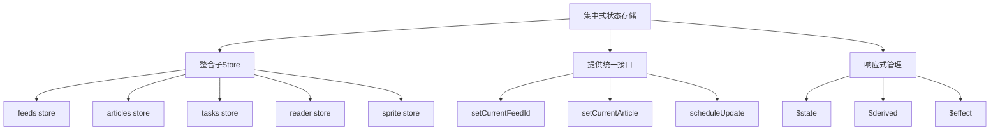
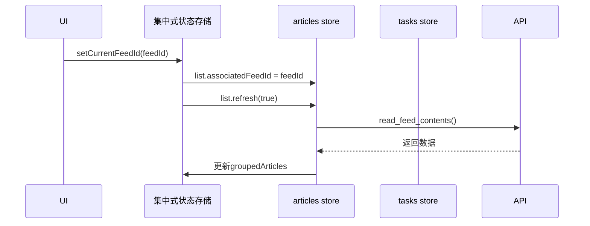
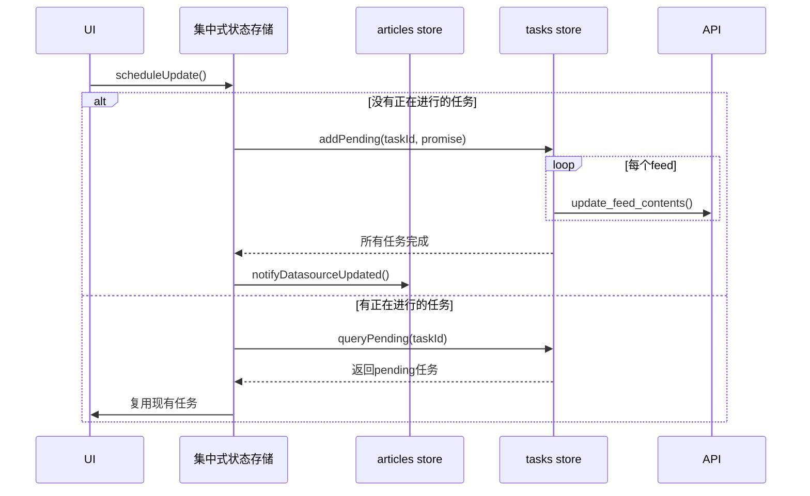

# **saga-reader 项目状态管理域技术实现文档**

---

## **1. 概述**

**状态管理域**是 `saga-reader` 应用的核心中枢，负责集中管理全局应用状态、协调前后端数据流，并驱动用户界面的响应式更新。该模块基于 Svelte 的反应式特性（Reactivity）构建，采用分层的 Store 架构模式，实现了高内聚、低耦合的状态管理体系。

本技术文档将深入剖析状态管理域的设计理念、核心组件、交互机制与关键实现细节，为开发者提供全面的技术参考。

---

## **2. 设计理念与架构**

### **2.1 核心设计原则**

- **集中式管理**：通过 `index.svelte.ts` 创建统一的根状态存储（Store），整合所有子模块状态。
- **分层解耦**：采用“根Store → 子Store → 功能Store”的层级结构，职责清晰，便于维护。
- **响应式驱动**：充分利用 Svelte 的 `$state`, `$derived`, `$effect` 实现自动视图更新。
- **任务去重**：通过 `tasks` 模块对异步操作进行调度与复用，避免重复请求。
- **上下文隔离**：使用工厂函数 `create()` 生成具名 Store 实例，支持依赖注入与测试隔离。

### **2.2 整体架构图**



> 如上图所示，`index.svelte.ts` 作为状态中枢，聚合了多个功能性的子 Store，并对外暴露统一的操作接口。

---

## **3. 核心模块详解**

### **3.1 集中式状态存储 (`index.svelte.ts`)**

**文件路径**：`app/src/routes/main/stores/index.svelte.ts`  
**重要性**：⭐️⭐️⭐️⭐️⭐️ (10/10)  
**功能描述**：整个应用的状态中枢，负责初始化和整合所有子 Store，并提供跨模块的状态访问与操作方法。

#### **关键实现细节**

- **状态定义**：
  ```ts
  let currentFeedId: string | undefined = $state(undefined);
  let currentArticle: Article | null = $state(null);
  ```
  使用 Svelte 的 `$state` 宏声明可变状态，任何对其的修改都会触发订阅者的更新。

- **派生状态**：
  ```ts
  const isTodaySelected = $derived(currentFeedId === SPECIFY_FEED_IDSET.TODAY_FILTER);
  ```
  利用 `$derived` 自动计算布尔标志位，UI 组件可直接绑定这些值进行条件渲染。

- **子 Store 初始化**：
  ```ts
  const tasks = createTasks();
  const articles = createArticles(tasks);
  const feeds = createFeeds();
  const reader = createReader({ tasks });
  const sprite = createSprite(context);
  ```
  所有子 Store 均通过工厂函数 `create()` 创建，支持依赖传递（如 `tasks` 被多个模块共享）。

- **核心方法**：
  - `setCurrentFeedId(value)`：切换当前选中的信息源，触发文章列表刷新。
  - `scheduleUpdate()`：启动全局内容更新任务，利用 `globalSharedScheduleUpdatingFuture` 确保同一时间只运行一个调度任务。
  - `getCurrentArticle()`：异步获取当前文章详情，供 AI 处理流程使用。

- **初始化副作用**：
  ```ts
  $effect(() => {
    feeds.refresh().then(() => {
      setCurrentFeedId(SPECIFY_FEED_IDSET.TODAY_FILTER).then(() => {
        // 启动后自动检查是否需要更新订阅内容
        if (!has_update_feeds_on_boot && ...) {
          has_update_feeds_on_boot = true;
          scheduleUpdate();
        }
      });
    });
  });
  ```
  在应用启动时自动加载订阅列表并根据最新文章日期决定是否触发更新。

---

### **3.2 文章状态管理 (`articles/list/index.svelte.ts`)**

**文件路径**：`app/src/routes/main/stores/articles/list/index.svelte.ts`  
**重要性**：⭐️⭐️⭐️⭐️☆ (9/10)  
**功能描述**：专门管理文章列表的展示逻辑，包括分组、分页、搜索过滤和刷新操作。

#### **关键实现细节**

- **状态结构**：
  ```ts
  let groupedArticles: ArticlesGroup[] = $state([]);
  let filteredArticles: ArticlesGroup[] = $state([]);
  ```
  支持两种视图：按日期分组的文章列表和全文搜索结果。

- **搜索联动**：
  ```ts
  $effect(() => {
    let filterText = searchAssociator.filterText;
    tick().then(() => {
      featuresApi.search_contents_by_keyword(filterText, 0, 10000)
        .then(articles => { ... })
    });
  });
  ```
  监听搜索框输入变化，自动触发关键词检索并更新 `filteredArticles`。

- **分页加载**：
  - `refresh()`：首次加载或刷新指定 Feed 的前 N 条文章。
  - `loadMore()`：滚动到底部时加载更多内容，偏移量动态计算。
  - 分组逻辑在前端完成，确保相同发布日期的文章归入同一组。

- **任务复用机制**：
  ```ts
  const pending = tasks.queryPending(taskId);
  if (pending) {
    return pending.promise; // 复用已有任务
  }
  ```
  在 `updateFeeds()` 中查询是否存在正在进行的任务，避免重复调用 API。

---

### **3.3 异步任务管理 (`tasks.svelte.ts`)**

**文件路径**：`app/src/routes/main/stores/tasks.svelte.ts`  
**重要性**：⭐️⭐️⭐️⭐☆ (8.5/10)  
**功能描述**：集中跟踪所有后台异步任务的执行状态，为用户提供可视化的进度反馈。

#### **关键实现细节**

- **任务模型**：
  ```ts
  type PendingItem = {
    description: string;
    loadingStore: LoadingStore;
    promise: Promise<unknown>;
  };
  ```
  每个任务包含描述、状态和原始 Promise。

- **状态聚合**：
  ```ts
  const pendingStatus: Status = $derived.by(() => {
    for (const pending of pendings) {
      if (pending.loadingStore.status === Status.Loading) return Status.Loading;
      if (pending.loadingStore.status === Status.Error) hasError = true;
    }
    return hasError ? Status.Error : Status.Completed;
  });
  ```
  派生出整体任务状态（加载中/完成/错误），用于顶部状态栏显示。

- **生命周期管理**：
  - `addPending(description, promise)`：注册新任务，自动监听其完成或失败。
  - `queryPending(description)`：根据描述查找现有任务，支持复用。
  - `remove(pending)`：清理已完成或失败的任务条目。

---

### **3.4 阅读状态管理 (`reader.svelte.ts`)**

**文件路径**：`app/src/routes/main/stores/reader.svelte.ts`  
**重要性**：⭐️⭐️⭐★ (8/10)  
**功能描述**：管理单篇文章的阅读状态和内容刷新逻辑，支持智能去重的任务调度。

#### **关键实现细节**

- **标记已读**：
  ```ts
  function markAsRead(articleId: number) {
    return featuresApi.mark_as_read(articleId);
  }
  ```
  调用后端 API 更新数据库中的阅读状态。

- **增强抓取**：
  ```ts
  async function refreshByEnhancedScraper(articleId: number, url: string): Promise<Article> {
    const taskId = `Article Updating For ArticleID = ${articleId}`;
    const pending = tasks.queryPending(taskId);
    if (pending) return pending.promise as Promise<Article>; // 复用任务
    
    const promise = featuresApi.update_article_by_source(...)...
    tasks.addPending(taskId, promise);
    return promise;
  }
  ```
  实现“一次请求，多处复用”的优化策略，防止多次点击导致重复处理。

---

### **3.5 AI对话状态 (`sprite.svelte.ts`)**

**文件路径**：`app/src/routes/main/stores/sprite.svelte.ts`  
**重要性**：⭐️⭐️⭐★ (8/10)  
**功能描述**：管理 AI 精灵面板的对话历史、加载状态和可见性控制。

#### **关键实现细节**

- **对话上下文**：
  ```ts
  let history = $state<ConversationMessage[]>([]);
  ```
  维护完整的对话记录，作为 LLM 提示词的一部分发送。

- **消息发送**：
  ```ts
  async function send(input: ConversationInput): Promise<boolean> {
    loading.load();
    try {
      const replyText = await featuresApi.chat_with_article_assistant(...);
      history.push(replyMessage);
      loading.complete();
      return true;
    } catch (e) {
      loading.error(e);
      return false;
    }
  }
  ```
  封装完整的消息发送流程，包含错误处理和 UI 状态同步。

- **状态联动**：
  对话依赖于 `context.currentArticle`，确保提问始终基于当前阅读的文章内容。

---

## **4. 辅助工具模块**

| 模块 | 文件路径 | 功能 |
|------|--------|------|
| **Loading Store** | `loading.svelte.ts` | 封装通用加载状态（未设定/加载中/完成/错误），被多个 Store 复用 |
| **Toast Store** | `toast.ts` | 基于 Skeleton UI 的通知系统，提供全局和 AI 面板专用的消息弹窗 |
| **Context Interface** | `context.ts` | 定义跨 Store 共享的数据契约，如 `IContext` |

---

## **5. 关键交互流程**

### **5.1 切换信息源流程**



### **5.2 定时更新调度流程**



---

## **6. 总结与最佳实践**

`saga-reader` 的状态管理域展现了现代前端框架下高效、可维护的状态管理模式：

- ✅ **响应式优先**：深度利用 Svelte 编译期反应性，减少手动状态同步。
- ✅ **模块化设计**：各 Store 职责单一，易于单元测试和独立演进。
- ✅ **性能优化**：通过任务复用机制显著降低网络请求频率。
- ✅ **用户体验导向**：加载状态、错误提示、自动刷新等细节均考虑周全。

**建议后续优化方向**：
1. 引入 Zustand 或 Redux Toolkit 进行状态持久化快照调试；
2. 增加状态变更日志追踪，便于问题排查；
3. 对大型 Store（如 `articles`）实施虚拟滚动优化。

该状态管理体系不仅满足当前业务需求，也为未来功能扩展提供了坚实的基础。