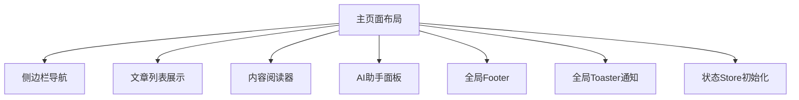
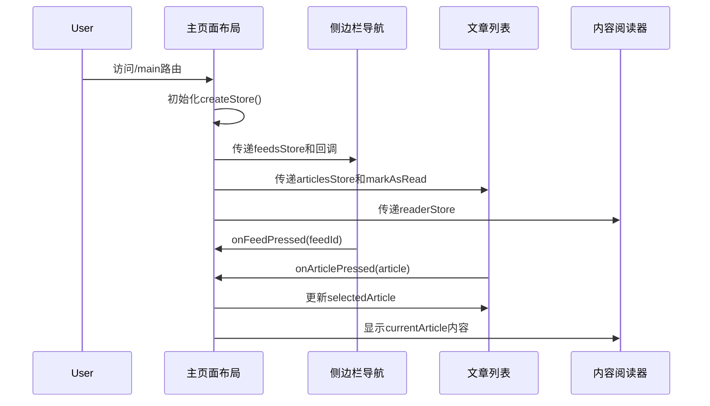
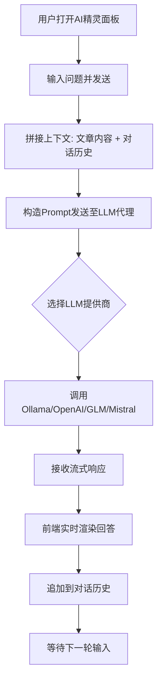

# 用户界面域技术实现文档

## 1. 模块概述

### 1.1 模块定位
用户界面域是 `saga-reader` 应用的核心业务域之一，负责整个应用的视觉呈现、用户交互和前端状态管理。该模块基于 SvelteKit 构建响应式 UI，通过 Tauri 桥接 Rust 后端逻辑，为用户提供直观、高效的操作体验。

### 1.2 核心价值
- 提供三栏式布局结构，实现信息源列表、文章列表和内容阅读器的协调展示
- 实现智能交互功能，包括自动标记已读、滚动加载更多等
- 支持多模式阅读体验，提供优化、熔炼和原始三种视图切换
- 集成悬浮式 AI 助手面板，支持与文章内容相关的智能对话交互

### 1.3 技术栈
| 组件 | 技术 |
|------|------|
| 前端框架 | SvelteKit |
| UI 组件库 | Skeleton Svelte |
| 图标库 | Lucide Svelte |
| 状态管理 | Svelte Stores |
| 国际化 | svelte-i18n |
| 样式方案 | Tailwind CSS + CSS 类预设 |

---

## 2. 架构设计

### 2.1 整体架构关系


### 2.2 模块依赖关系
用户界面域与其他核心模块存在紧密协作：
- **强依赖**：状态管理域（所有组件都依赖 store 获取数据）
- **功能调用**：内容获取与处理域（通过 hybrid-apis 调用刷新内容等功能）
- **服务调用**：AI能力集成域（AI助手面板直接发送消息并接收回复）

---

## 3. 核心子模块详解

### 3.1 主页面布局 (`+page.svelte`)

#### 功能描述
作为整个主界面的布局容器，负责协调各组件、初始化全局状态存储并集成全局通知系统。

#### 技术实现
```svelte
<script lang="ts">
  import { createStore } from './stores/index.svelte';
  let mainStore = createStore();
  let feedsStore = mainStore.feeds;
  let articlesStore = mainStore.articles;
  // ... 其他 store 实例化
</script>

<div class="flex w-screen h-screen overflow-hidden flex-col">
  <!-- 左侧边栏 -->
  <aside>
    <FeedsList 
      store={feedsStore}
      selectedFeedId={mainStore.currentFeedId}
      onFeedPressed={mainStore.setCurrentFeedId}
      onSelectToday={mainStore.onSelectToday}
      isTodaySelected={mainStore.isTodaySelected}
    />
  </aside>
  
  <!-- 中间文章列表 -->
  <aside>
    <SearchBar store={articlesStore.search} />
    <ArticlesList 
      store={articlesStore.list}
      markAsRead={readerStore.markAsRead}
      onArticlePressed={mainStore.setCurrentArticle}
      selectedArticle={mainStore.currentArticle}
    />
  </aside>
  
  <!-- 主内容区 -->
  <main>
    {#if mainStore.currentArticle}
      <ArticleReader articleId={mainStore.currentArticle.id} store={readerStore} />
    {:else}
      <ReaderBlankIndicator />
    {/if}
  </main>
  
  <!-- 全局组件 -->
  <Footer tasksStore={mainStore.tasks} />
  <AISpritePanel store={spriteStore} />
  <Toaster toaster={globalToaster} />
  <Toaster toaster={spriteToaster} />
</div>
```

#### 关键特性
- 使用 `$state()` 创建响应式变量
- 通过 props 向子组件传递 store 实例和回调函数
- 实现跨模块状态同步机制
- 集成全局 Toaster 通知系统

---

### 3.2 侧边栏导航 (`FeedsList.svelte`)

#### 功能描述
提供结构化的订阅包和订阅项管理界面，支持聚合视图切换和上下文菜单操作。

#### 技术实现
```svelte
<script lang="ts">
  function createRefreshFeedsAction(call: () => Promise<unknown>) {
    return async () => {
      await call();
      store.refresh();
    };
  }

  function createFeedPackageMenus(feedPackage: FeedsPackage) {
    return [
      {
        name: 'new',
        onClick: createRefreshFeedsAction(async () => {
          await openFeedCreateWindow(id);
          expandGroup(id);
        }),
        displayText: $_('main.feeds.menu.actions.create')
      },
      // ... 其他菜单项
    ];
  }
</script>

{#snippet listSection(text: string)}
  <h5 class="h6 p-2 mt-4 cursor-default">{text}</h5>
{/snippet}

{#snippet listItem(text: string, IconRender, onclick, stateSelected, menus)}
  <a href="#" {onclick}>
    {#if menus && menus.length !== 0}
      <ContextMenuProvider {menus}>
        {@render listItemInner(text, IconRender, stateSelected)}
      </ContextMenuProvider>
    {:else}
      {@render listItemInner(text, IconRender, stateSelected)}
    {/if}
  </a>
{/snippet}
```

#### 关键特性
- 支持分组展开/折叠
- 提供右键上下文菜单
- 实现动态菜单创建
- 使用 i18n 国际化文本

---

### 3.3 文章列表展示 (`ArticlesList.svelte`)

#### 功能描述
负责文章条目的分组渲染、加载状态管理和自动标记已读等交互逻辑。

#### 技术实现
```svelte
<script lang="ts">
  $effect(() => {
    console.log(`the articles list's associatedFeedId has been changed to ${store.associatedFeedId}`);
    scroller?.scrollTo(0, 0);
  });

  $effect(() => {
    if (!selectedArticle) return;
    if (!selectedArticle.has_read) {
      markAsRead(selectedArticle.id).then(() => (selectedArticle.has_read = true));
    }
  });
</script>

{#if articles_init_loading.status === Status.Loading}
  <Progress classes="mb-2 mt-2 w-full" value={null} meterAnimate="articles_nav_loading_indicator"/>
{:else if store.articles_init_loading.status === Status.Completed}
  {@render render_articles_list(isFilterActived ? store.filteredArticles : store.groupedArticles)}
{/if}

{#snippet render_articles_list(groups: ArticlesGroup[])}
  <div class="flex flex-1 h-full flex-col overflow-y-auto overflow-x-clip" bind:this={scroller}>
    {#each groups as { name, articles } (name)}
      <h6 class="mt-4 font-bold">{name}</h6>
      {#each articles as article (article.id)}
        <a class={`flex flex-row card ${selectedArticle?.id === article.id ? 'preset-filled-surface-900-100' : 'preset-filled-surface-100-900'}`}
           href='#' onclick={() => onArticlePressed(article)}>
          {#if !article.has_read && selectedArticle?.id !== article.id}
            <div class="h-10 w-0.5 mt-4 mr-3 preset-filled-primary-500"></div>
          {/if}
          <article class={`hover:scale-105 transition-transform flex-1 pt-4 pb-4 pr-4 ${article.has_read || selectedArticle?.id == article.id ? 'pl-4' : ''}`}>
            <h6 class="font-bold">{article.title}</h6>
            <p class={`line-clamp-2 ${selectedArticle?.id === article.id ? 'text-surface-400-600' : 'text-surface-600-400'}`}>
              {article.head_read}
            </p>
          </article>
        </a>
      {/each}
    {/each}
    
    {#if !isFilterActived}
      {#if store.groupedArticles.length !== 0}
        <hr class="hr mb-3" />
        {#if articles_continous_loading.status === Status.Completed}
          <button type="button" class="btn preset-filled" onclick={loadMore}>{$_('main.articles.tip_click_to_load_more')}</button>
        {:else}
          <button type="button" class="btn preset-filled">{$_('main.articles.tip_loading')}</button>
        {/if}
      {/if}
    {/if}
  </div>
{/snippet}
```

#### 关键特性
- 按日期分组显示文章
- 实现滚动加载更多
- 自动标记阅读状态
- 支持搜索过滤
- 显示加载进度指示器

---

### 3.4 内容阅读器 (`ArticleReader.svelte`)

#### 功能描述
提供文章内容的多模式阅读体验，支持优化、熔炼和原始三种视图切换。

#### 技术实现
```svelte
<script lang="ts">
  let group: ArticleReadMode = $state('optimized');
  let { articleId, store }: ArticleReaderProps = $props();
  let article: Article | null = $state(null);

  $effect(() => {
    featuresApi
      .query_by_id(articleId)
      .then((queried_article) => {
        article = queried_article;
      })
      .catch((e) => console.error('reader.article query failured', e));
  });
</script>

<Tabs value={group} onValueChange={(e) => (group = e.value as ArticleReadMode)}>
  {#snippet list()}
    <Tabs.Control classes="border-b-4" value="optimized">
      <IconOptimize size={20} />
      {`${$_('reader.tab_optimized_content')}`} &nbsp;&nbsp;&nbsp;&nbsp;&nbsp;
    </Tabs.Control>
    <Tabs.Control classes="border-b-4" value="melted">
      <IconMelt size={20} />
      {`${$_('reader.tab_melted_content')}`} &nbsp;&nbsp;&nbsp;&nbsp;&nbsp;
    </Tabs.Control>
    <Tabs.Control classes="border-b-4" value="original">
      <IconOriginal size={20} />
      {`${$_('reader.tab_melted_original')}`} &nbsp;&nbsp;&nbsp;&nbsp;&nbsp;
    </Tabs.Control>
  {/snippet}
  
  {#snippet content()}
    {#if article}
      <Tabs.Panel value="optimized">
        {#key `optimized-${article.id}-${articleUpdatedSeq}`}
          <ArticleRenderWidget value={article.optimized_content} />
        {/key}
      </Tabs.Panel>
      <Tabs.Panel value="melted">
        {#key `melted-${article.id}-${articleUpdatedSeq}`}
          <ArticleRenderWidget value={article.melted_content} />
        {/key}
      </Tabs.Panel>
      <Tabs.Panel value="original" classes="h-full">
        <EmbedWebView src={article.source_link} />
      </Tabs.Panel>
    {/if}
  {/snippet}
</Tabs>
```

#### 关键特性
- 三标签页视图切换（优化/熔炼/原始）
- 使用 `{#key}` 指令强制重新渲染
- 支持外部链接打开
- 可复制文章链接
- 收藏/取消收藏功能
- "R"按钮触发增强型抓取

---

### 3.5 AI助手面板 (`AISpritePanel.svelte`)

#### 功能描述
实现悬浮式 AI 聊天界面，支持与当前文章内容相关的智能对话交互。

#### 技术实现
```svelte
<script lang="ts">
  async function addMessage() {
    if (store.isLoading) {
      toaster.info({ description: $_('aisprite.tip_wait_llm_response') });
      return;
    }

    if (!currentMessage) {
      toaster.info({ description: $_('aisprite.tip_no_input') });
      return;
    }

    const payload = currentMessage;
    currentMessage = '';
    requestAnimationFrame(() => {
      scrollChatBottom('smooth');
    });
    
    const success = await store.send({
      mtype: 'text',
      payload
    });
    
    if (!success) {
      toaster.info({ description: $_('aisprite.tip_error_llm_error') });
    }
    
    requestAnimationFrame(() => {
      scrollChatBottom('smooth');
    });
  }
</script>

{#if store.opened}
  <div class="absolute flex flex-col overflow-scroll h-full w-[36rem] preset-filled-surface-100-900 shadow-[0px_0px_10px_1px_rgba(0,0,0,0.3)]">
    <header class="flex justify-between preset-filled-surface-50-950 p-3 shadow-[0px_0px_10px_1px_rgba(0,0,0,0.3)]">
      <p class="h6 cursor-default mt-0.5">{$_('aisprite.label')}</p>
      <button class="btn-icon hover:preset-tonal" onclick={store.toggle}><XIcon /></button>
    </header>

    <section bind:this={elemChat} class="h-full p-4 overflow-y-auto space-y-4">
      {#each store.history as bubble (bubble.created_at)}
        {#if bubble.role !== 'user'}
          <div class="grid grid-cols-[auto_1fr] gap-2">
            <Avatar name={bubble.role} size="size-12" classes="preset-filled-primary-500">
              <Bot size="28" />
            </Avatar>
            <div class="card pt-4 pl-4 pr-4 pb-2 preset-tonal rounded-tl-none rounded-bl-none space-y-2">
              <header class="flex justify-between items-center">
                <p class="font-bold">Copilot</p>
                <small class="opacity-50">{toDateText(bubble.created_at).toLocaleString()}</small>
              </header>
              <Markdown value={bubble.payload} />
            </div>
          </div>
        {:else}
          <div class="grid grid-cols-[1fr_auto] gap-2">
            <div class="card pt-4 pl-4 pr-4 pb-2 preset-filled-primary-50-950 rounded-tr-none rounded-br-none space-y-2">
              <header class="flex justify-between items-center">
                <p class="font-bold">{$_('aisprite.chat_me')}</p>
                <small class="opacity-50">{toDateText(bubble.created_at).toLocaleString()}</small>
              </header>
              <Markdown value={bubble.payload} />
            </div>
            <Avatar name={bubble.role} size="size-12" classes="preset-filled-primary-500">
              <UserIcon size="32" />
            </Avatar>
          </div>
        {/if}
      {/each}

      {#if store.isLoading}
        <ProgressRing classes="mt-2" value={null} size="size-6" strokeWidth="5px" meterStroke="stroke-primary-500" trackStroke="stroke-primary-100"/>
      {/if}
    </section>
    
    <section class="p-4 mb-12">
      <div class="input-group grid-cols-[auto_1fr_auto] divide-x divide-surface-200-800 rounded-container-token">
        <button disabled class="pl-2 pr-2 input-group-cell preset-tonal cursor-not-allowed">+</button>
        <textarea autofocus value={currentMessage} oninput={(e) => (currentMessage = e.currentTarget.value)} class="resize-none bg-transparent border-0 ring-0" name="prompt" id="prompt" placeholder={$_('aisprite.tip_placeholder_please_input')} rows={Math.min(Math.trunc(currentMessage.length / 26) + 1, 3)} onkeydown={onPromptKeydown}></textarea>
        {#if store.isLoading}
          <button class="pl-2 pr-2 input-group-cell preset-tonal cursor-not-allowed" disabled>
            <ProgressRing classes="mr-2" value={null} size="size-4" strokeWidth="2px" meterStroke="stroke-primary-500" trackStroke="stroke-primary-100"/>
          </button>
        {:else}
          <button class="{currentMessage ? 'preset-filled-primary-500 cursor-pointer' : 'preset-tonal cursor-not-allowed'}" disabled={!currentMessage} onclick={addMessage}>
            <SendHorizontal />
          </button>
        {/if}
      </div>
    </section>
  </div>
{/if}

<div class="absolute left-3 bottom-3">
  <button type="button" class="btn w-60 preset-filled hover:preset-filled-primary-900-100" onclick={store.toggle}>
    <Bot />
    <span>Copilot</span>
  </button>
</div>
```

#### 关键特性
- 浮动式设计，默认隐藏，点击按钮展开
- 支持 Markdown 渲染回复内容
- 显示时间戳和角色标识
- 输入框自动调整高度
- 发送按钮根据输入状态启用/禁用
- 加载状态显示进度环

---

## 4. 状态管理集成

### 4.1 Store 初始化流程
```typescript
// app/src/routes/main/stores/index.svelte.ts
function createStore() {
  let currentFeedId: string | undefined = $state(undefined);
  let currentArticle: Article | null = $state(null);

  const context: IContext = {
    get currentArticle() {
      return currentArticle!;
    },
    get currentFeedId() {
      return currentFeedId!;
    }
  };

  const tasks = createTasks();
  const articles = createArticles(tasks);
  const feeds = createFeeds();
  const reader = createReader({ tasks });
  const sprite = createSprite(context);

  return {
    get feeds() { return feeds; },
    get currentFeedId() { return currentFeedId; },
    get currentArticle() { return currentArticle; },
    get articles() { return articles; },
    get tasks() { return tasks; },
    get reader() { return reader; },
    get sprite() { return sprite; },
    setCurrentFeedId,
    setCurrentArticle,
    getCurrentArticle,
    scheduleUpdate,
    onSelectToday,
    onSelectWeekend,
    onSelectFavorite,
    onSelectUnread,
    get isTodaySelected() { return isTodaySelected; },
    get isWeekendSelected() { return isWeekendSelected; },
    get isFavoriteSelected() { return isFavoriteSelected; },
    get isUnreadSelected() { return isUnreadSelected; },
    get isFeedSpecified() { return isFeedSpecified; }
  };
}
```

### 4.2 状态派生计算
使用 `$derived` 实现派生状态：
```typescript
const isTodaySelected = $derived(currentFeedId === SPECIFY_FEED_IDSET.TODAY_FILTER);
const isWeekendSelected = $derived(currentFeedId === SPECIFY_FEED_IDSET.WEEKEND_FILTER);
const isFavoriteSelected = $derived(currentFeedId === SPECIFY_FEED_IDSET.FAVORITE_FILTER);
const isUnreadSelected = $derived(currentFeedId === SPECIFY_FEED_IDSET.UNREAD_FILTER);
const isFeedSpecified = $derived(isSpecifyFeed(currentFeedId));
```

---

## 5. 与后端通信机制

### 5.1 Hybrid API 调用链路
前端通过 hybrid-apis 与后端 Rust 逻辑通信：

```
frontend:
  app/src/lib/hybrid-apis/feed/api.ts       → 定义 TypeScript 接口
  app/src/lib/hybrid-apis/feed/impl.ts     → 实现调用 tauri.invoke
  app/src/lib/hybrid-apis/tauri-regular/index.ts → 封装 invoke 方法

backend:
  crates/tauri-plugin-feed-api/src/lib.rs   → 注册 Tauri 插件
  crates/tauri-plugin-feed-api/src/commands.rs → 定义 #[tauri::command]
  crates/feed_api_rs/src/features/impl_default.rs → 实际业务逻辑
```

### 5.2 通信示例
```typescript
// 前端调用
featuresApi.update_feed_contents(packageId, feedId);

// 转换为 Tauri invoke
async function call<T>(methodName: string, args: InvokeArgs): Promise<T> {
  return invoke<T>(`plugin:feed-api|${methodName}`, args);
}
```

---

## 6. 交互流程分析

### 6.1 用户点击文章流程


### 6.2 AI 对话交互流程


---

## 7. 最佳实践总结

### 7.1 设计亮点
1. **响应式架构**：充分利用 Svelte 的反应性系统，实现高效的 UI 更新
2. **模块化设计**：将 UI 拆分为独立可复用的组件
3. **状态集中管理**：通过 createStore 统一管理全局状态
4. **用户体验优先**：自动标记已读、平滑滚动、加载动画等细节处理
5. **国际化支持**：全面采用 i18n 方案，便于多语言扩展

### 7.2 性能优化建议
1. **虚拟滚动**：对于大量文章列表，考虑引入虚拟滚动以提升性能
2. **懒加载**：非首屏组件可采用动态导入实现懒加载
3. **缓存策略**：对频繁访问的数据增加内存缓存层
4. **Web Worker**：复杂计算任务可移至 Web Worker 避免阻塞主线程

### 7.3 扩展性建议
1. **主题系统**：可进一步完善主题切换机制，支持更多自定义选项
2. **插件体系**：探索 UI 插件化可能，允许第三方扩展界面功能
3. **快捷键支持**：增加键盘导航和操作快捷键，提升效率
4. **无障碍访问**：加强 ARIA 标签和屏幕阅读器支持

---

## 8. 结论

用户界面域作为 `saga-reader` 应用的门面，不仅实现了美观、易用的交互界面，更重要的是构建了一个高效、稳定的状态管理和通信机制。通过 SvelteKit 的现代化开发范式，结合 Tauri 的原生能力，成功打造了兼具桌面应用性能和 Web 应用灵活性的优秀用户体验。

该模块的设计充分体现了关注点分离原则，各子模块职责清晰，耦合度低，为后续功能扩展和维护提供了良好基础。特别是其与状态管理域的深度整合，确保了数据流的一致性和可预测性，是整个应用架构中的关键枢纽。