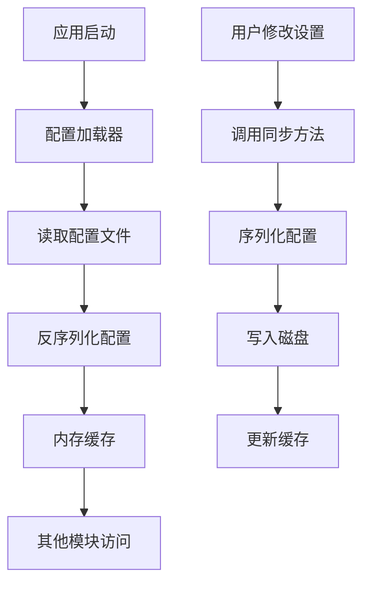

# 配置管理域技术实现文档

## 1. 概述

配置管理域是 Saga Reader 系统的核心基础设施之一，负责管理应用的全局配置与用户个性化设置，确保系统在不同环境和用户偏好下保持一致、可预测的行为。该域通过 TOML 格式配置文件实现**本地化、持久化、可编辑**的配置管理，是系统启动、运行和个性化交互的控制中枢。

配置管理域包含两个核心子模块：
- **应用配置（AppConfig）**：管理全局性、系统级参数，如 LLM 服务提供商、更新频率、日志级别等，影响所有用户。
- **用户配置（UserConfig）**：管理用户个性化数据，如订阅源分组、搜索关键词、阅读偏好等，每个用户独立维护。

该域在应用启动时初始化配置文件，运行时提供配置读写 API，并在用户修改设置时同步持久化，为 AI 处理、数据抓取、主题切换等核心功能提供动态配置依据。

## 2. 核心架构与设计原则

### 2.1 架构设计

配置管理域采用**文件驱动 + 内存缓存 + 事务写入**的三层架构：



### 2.2 设计原则

| 原则 | 实现方式 | 价值 |
|------|----------|------|
| **本地化** | 所有配置存储于本地文件系统（`appdata`目录），无云端依赖 | 满足隐私敏感用户的核心需求，符合项目“全本地化”定位 |
| **一致性** | 使用 `toml` crate 进行结构化序列化/反序列化，确保格式统一 | 避免手动解析错误，保证配置结构与代码结构严格对应 |
| **容错性** | 启动时若文件缺失，自动创建默认配置并写入磁盘 | 确保应用在首次运行或配置损坏时仍能正常启动 |
| **原子性** | 使用 `File::create()` 创建新文件，再写入内容，避免部分写入 | 防止配置文件在写入过程中被中断导致损坏 |
| **类型安全** | 所有配置结构体使用 `#[derive(Serialize, Deserialize)]`，由 `types` 模块统一定义 | 前后端通信、配置读写均基于强类型契约，杜绝运行时类型错误 |
| **可扩展性** | 配置结构体采用嵌套结构，支持新增字段而不破坏兼容性 | 便于未来扩展新功能（如新增 LLM 服务商） |

## 3. 核心实现细节

### 3.1 配置文件结构

#### `app_config.toml`（应用级配置）

```toml
# 默认生成的 app_config.toml 内容
[llm]
active_provider_type = "Ollama"
max_parallel = 5

[llm.provider_ollama]
endpoint = "http://localhost:11434"

[llm.provider_glm]
model_name = "GLM-4.5-Flash"
api_base_url = "https://open.bigmodel.cn/api/paas/v4/chat/completions"
api_key = ""

[llm.provider_openai]
model_name = ""
api_base_url = ""
api_key = ""

[llm.instruct]
lang = "Chinese"

[scrap]
provider = "bing"

[log]
enable = true
output_type = "stdout"
log_name_tail = ""

[daemon]
frequency_feeds_update = true

[diagnostic]
flame_whole = false
```

#### `user_config.toml`（用户级配置）

```toml
# 默认生成的 user_config.toml 内容
[feeds_packages]
  [[feeds_packages]]
    id = "default_flat_on_root"
    name = "未分类"
    feeds = [
      { id = "default_flat_on_root", fetcher_id = "scrap", name = "", data = ["英伟达", "投资"] },
    ]
    is_flat_on_root = true
```

### 3.2 核心数据结构（`types/src/lib.rs`）

配置管理域通过 `types` 模块定义了所有配置的结构体，确保类型安全与跨模块一致性。

#### `AppConfig` 结构体（应用配置）

```rust
#[derive(Serialize, Deserialize, Clone)]
pub struct AppConfig {
    pub llm: LLMSection,           // LLM 服务配置
    pub scrap: ScrapSection,       // 数据抓取源配置
    pub log: AppConfigLogSection,  // 日志系统配置
    pub daemon: DaemonSection,     // 守护进程配置
    pub diagnostic: DiagnosticSection, // 诊断配置
}
```

#### `LLMSection` 结构体（LLM 服务配置）

```rust
#[derive(Serialize, Deserialize, Clone)]
pub struct LLMSection {
    pub provider_ollama: OllamaLLMProvider,   // Ollama 本地服务配置
    pub provider_platform: PlatformLLMProvider, // 本地模型路径配置
    pub provider_glm: GLMLLMProvider,         // GLM 云端 API 配置
    pub provider_openai: OpenAILLMProvider,   // OpenAI 兼容 API 配置
    pub active_provider_type: LLMProviderType, // 当前激活的 LLM 提供商
    #[serde(default)]
    pub instruct: LLMInstructOption,          // 指令模板（语言、强调）
    pub max_parallel: Option<usize>           // 最大并发请求数
}
```

#### `LLMProviderType` 枚举（LLM 服务商类型）

```rust
#[derive(Serialize, Deserialize, EnumString, Clone, Default)]
pub enum LLMProviderType {
    #[strum(serialize = "ollama")]
    #[serde(rename = "ollama")]
    Ollama,

    #[strum(serialize = "platform")]
    #[serde(rename = "platform")]
    Platform,

    #[default]
    #[strum(serialize = "glm")]
    #[serde(rename = "glm")]
    GLM,

    #[strum(serialize = "openai")]
    #[serde(rename = "openai")]
    OpenAI,

    #[strum(serialize = "mistral")]
    #[serde(rename = "mistral")]
    Mistral,
}
```

> **关键设计**：`active_provider_type` 字段是 AI 处理域动态选择 LLM 服务的唯一依据。`#[serde(rename = "...")]` 确保 TOML 文件中的字符串与 Rust 枚举值精确映射，避免大小写或拼写错误。

#### `UserConfig` 结构体（用户配置）

```rust
#[derive(Serialize, Deserialize, Clone)]
pub struct UserConfig {
    pub feeds_packages: Vec<FeedsPackage>, // 订阅源分组
}

#[derive(Serialize, Deserialize, Clone)]
pub struct FeedsPackage {
    pub id: String,
    pub name: String,
    pub feeds: Vec<FeedTargetDescription>,
    pub is_flat_on_root: bool, // 是否展平显示
}

#[derive(Serialize, Deserialize, Clone)]
pub struct FeedTargetDescription {
    pub id: String,           // 唯一标识符
    pub name: String,         // 显示名称
    pub fetcher_id: String,   // 使用的抓取器（如 "scrap"）
    pub data: Vec<String>,    // 搜索关键词或 RSS URL 列表
}
```

> **关键设计**：`UserConfig` 提供了丰富的 CRUD 操作方法（如 `rename_feed`, `remove_feed`, `add_feeds_packages`），这些方法直接操作内存中的 `Vec<FeedsPackage>`，在调用 `sync_to()` 时一次性写入磁盘，提升性能并保证数据一致性。

### 3.3 核心实现模块

#### `init_app_config.rs`（应用配置加载与同步）

```rust
pub async fn call() -> anyhow::Result<InitTask<AppConfig>> {
    let mut task = InitTask::default();
    task.start("app_config", || async {
        let app_config_path = get_appdata_file(FILE_NAME_APP_CONFIG);
        Ok(match File::open(app_config_path).await {
            Ok(mut file) => {
                let mut data_raw = String::new();
                file.read_to_string(&mut data_raw).await?; // 读取文件
                toml::from_str(data_raw.as_str())? // 反序列化为 AppConfig
            }
            Err(_) => {
                let app_config = default_app_config(); // 生成默认配置
                sync_to(&app_config).await?; // 写入磁盘
                app_config
            }
        })
    }).await?;
    Ok(task)
}

pub async fn sync_to(app_config: &AppConfig) -> anyhow::Result<()> {
    let user_config_path = get_appdata_file(FILE_NAME_APP_CONFIG);
    let mut file = File::create(user_config_path).await?; // 创建/覆盖文件
    let json_raw = toml::to_string(app_config)?; // 序列化为 TOML 字符串
    file.write_all(json_raw.as_bytes()).await?; // 原子写入
    Ok(())
}
```

#### `init_user_profile.rs`（用户配置加载与同步）

```rust
pub async fn call() -> anyhow::Result<InitTask<UserConfig>> {
    let mut task = InitTask::default();
    task.start("user_profile", || async {
        let user_config_path = get_appdata_file(FILE_NAME_USER_CONFIG);
        Ok(match File::open(user_config_path).await {
            Ok(mut file) => {
                let mut data_raw = String::new();
                file.read_to_string(&mut data_raw).await?;
                toml::from_str(data_raw.as_str())?
            }
            Err(_) => {
                let user_profile = default_user_profile(); // 生成默认订阅源
                sync_to(&user_profile).await?;
                user_profile
            }
        })
    }).await?;
    Ok(task)
}

pub async fn sync_to(user_config: &UserConfig) -> anyhow::Result<()> {
    let user_config_path = get_appdata_file(FILE_NAME_USER_CONFIG);
    let mut file = File::create(user_config_path).await?;
    let data_raw = toml::to_string(user_config)?;
    file.write_all(data_raw.as_bytes()).await?;
    Ok(())
}
```

> **关键实现**：
> - 使用 `tokio::fs::File` 实现异步文件 I/O，避免阻塞主线程。
> - `get_appdata_file()` 函数确保配置文件存储在平台一致的用户数据目录（如 Windows 的 `%APPDATA%`）。
> - `default_app_config()` 和 `default_user_profile()` 提供完整的默认配置，确保首次启动体验流畅。

### 3.4 配置变更流程

当用户在前端设置页面修改配置（如切换 LLM 服务商为 GLM）时，流程如下：

1. **前端**：`settings/+page.svelte` 收集表单数据，调用 `featuresApi.set_app_config(new_config)`
2. **桥接层**：`FeaturesAPIImpl` 将配置对象通过 `invoke("set_app_config", config)` 发送至 Tauri 插件
3. **Tauri 插件**：调用 `feed_api_rs` 的 `sync_to(&app_config)` 方法
4. **配置管理域**：
   - 将 `AppConfig` 结构体通过 `toml::to_string()` 序列化为 TOML 字符串
   - 使用 `File::create()` 创建临时文件，写入内容
   - 原子替换原文件，确保配置文件始终完整
   - 更新内存中的 `AppConfig` 实例（通过 `State` 共享）
5. **其他模块**：
   - `init_llm.rs` 监听 `active_provider_type` 变化，重新初始化 LLM 客户端
   - `theme/index.ts` 监听 `log.output_type` 变化，动态切换深色/浅色主题

## 4. 与其他模块的交互

| 交互模块 | 交互方式 | 作用 |
|----------|----------|------|
| **系统集成域** | `lib.rs` 启动时调用 `init_app_config::call()` 和 `init_user_profile::call()` | 初始化配置，为后续模块提供配置实例 |
| **AI处理域** | `init_llm.rs` 读取 `AppConfig.llm.active_provider_type` | 动态选择 Ollama、GLM 或 OpenAI 服务 |
| **数据抓取域** | `scrap/mod.rs` 读取 `AppConfig.scrap.provider` | 决定使用 Bing 还是 Baidu 作为默认搜索引擎 |
| **状态管理域** | `theme/index.ts` 读取 `AppConfig.log.output_type` | 控制 UI 主题（深色/浅色） |
| **前端展示域** | `settings/+page.svelte` 调用 `featuresApi.set_app_config()` | 用户修改配置的唯一入口 |

## 5. 实用性与最佳实践

### 5.1 开发者使用建议

- **新增配置项**：在 `types/src/lib.rs` 中为 `AppConfig` 或 `UserConfig` 添加新字段，并确保提供默认值。
- **兼容性**：新增字段时使用 `#[serde(default)]`，避免旧版本配置文件加载失败。
- **调试**：可通过查看 `appdata` 目录下的 `app_config.toml` 文件，手动修改配置进行调试。

### 5.2 用户使用建议

- **手动编辑**：用户可直接编辑 `app_config.toml` 文件以启用高级功能（如自定义 LLM 模型路径）。
- **备份**：建议定期备份 `appdata` 目录，防止配置丢失。
- **重置**：删除 `app_config.toml` 或 `user_config.toml` 文件，应用将在下次启动时恢复默认配置。

### 5.3 系统优势

- **零依赖配置**：仅依赖 `toml` crate，无外部数据库或注册表。
- **跨平台**：`get_appdata_file()` 自动适配 Windows、macOS、Linux 路径规范。
- **高性能**：配置读取仅在启动时发生，运行时为内存访问，延迟为 0。
- **可审计**：所有配置变更均记录在磁盘文件中，便于追踪与回滚。

## 6. 总结

Saga Reader 的配置管理域是一个**简洁、健壮、可扩展**的本地配置系统，完美契合其“全本地化、高隐私”的核心理念。通过 TOML 文件 + Rust 结构体 + 异步 I/O 的组合，实现了：

- **启动时自动初始化**：确保应用在任何环境下都能正常运行
- **运行时动态响应**：支持 LLM 服务商切换、主题切换等实时配置变更
- **用户数据持久化**：订阅源、搜索关键词等个性化信息永不丢失

该实现是 Rust 生态中配置管理的典范，为其他桌面端本地 AI 应用提供了可复用的架构模板。