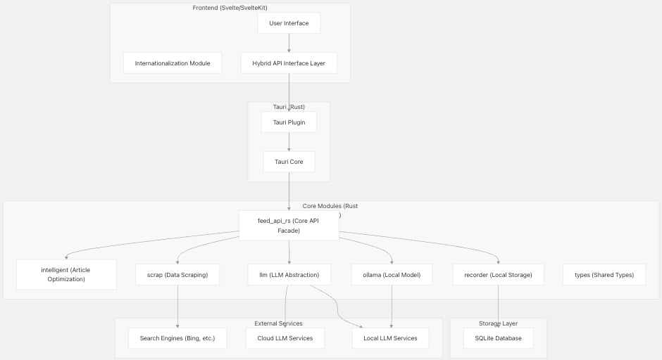
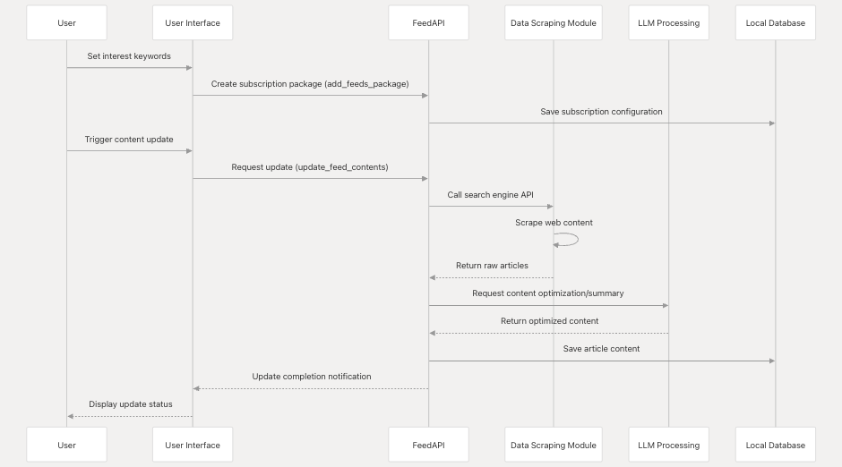
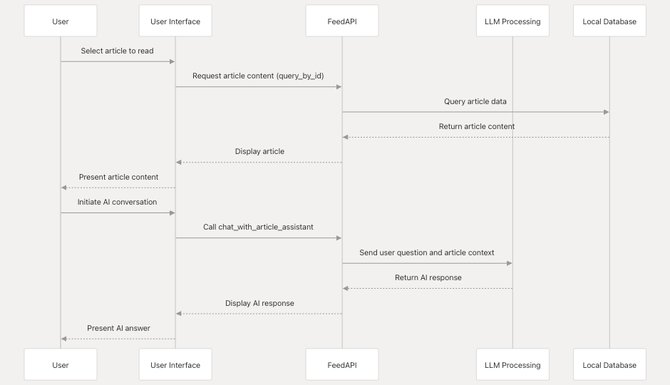
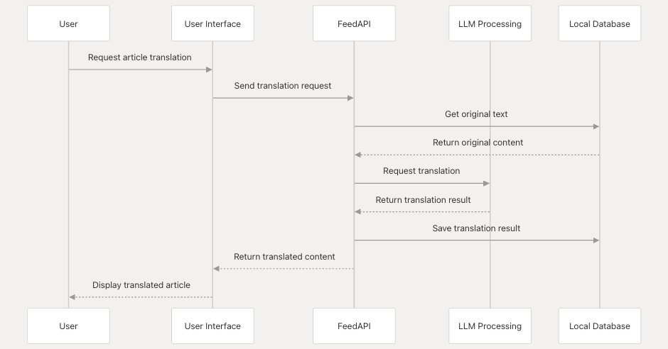

<p align="center">
    <a href="./Introduction-of-the-solution.md">English</a>
    |
    <a href="./Introduction-of-the-solution-zh.md">中文</a>
    |
    <a href="./Introduction-of-the-solution-ja.md">日本語（にほんご）</a>
</p>

# Saga Reader Technical Solution Document

## I. Project Overview
Saga Reader is an AI-driven intelligent reading assistant that provides functions such as multi-source content acquisition, article rapid reading, summarization, and AI accompanying reading. This solution will elaborate on the systematic nature and complexity of its architecture, as well as the significant advantages in performance optimization compared to the traditional Electron + React solution.

## II. Technical Architecture
### 2.1 Systematic Nature and Complexity of the Overall Architecture
The project adopts a modular and hierarchical system architecture. Each module is independent yet closely collaborative, forming a complex and orderly whole.

#### 2.1.1 Hierarchical Architecture
```plaintext
+---------------------+     +---------------------+
|      Frontend       |     |     Backend         |
|  (Svelte/SvelteKit) |<--->|  (Rust Modules)     |
+---------------------+     +---------------------+
       ^   ^   ^                      |   |   |
       |   |   |                      |   |   |
+------+---+---+-------+       +------+---+---+-------+
|  UI/UX Components    |       |  tauri-plugin-feed-api|
|  State Management    |       |  feed_api_rs          |
|  Internationalization|       |  llm                  |
|  Styling (Tailwind)  |       |  ollama               |
|  Build Tools (Vite)  |       |  recorder             |
|                      |       |  scrap                |
|                      |       |  types                |
|                      |       |  intelligent          |
+----------------------+       +-----------------------+
```

#### 2.1.2 Complexity of Module Interaction

- Frontend module: Involves multi-component interaction, state management, and internationalization processing. Components share states through Svelte Store, and the internationalization module dynamically switches language resources according to user settings.
- Backend module: tauri-plugin-feed-api serves as a Tauri plugin, interacting with the frontend and coordinating other business modules. feed_api_rs is responsible for the core business process, linking modules such as llm, recorder, and scrap, and handling complex business logic.
- Cross-module collaboration: After an article is crawled, the scrap module passes the data to the intelligent module. The intelligent module invokes llm for content processing, and the final result is stored by the recorder. The whole process involves the collaborative work of multiple modules.

##### Content Subscription and Update Flow


##### Article Reading and AI Interaction Flow


##### Multilingual Translation Flow



### 2.2 Frontend Architecture (Svelte)
#### 2.2.1 Compile-time Optimization
Svelte is a compile-time framework that converts component code into efficient JavaScript during the build phase, reducing runtime overhead. Compared with React, which calculates the differences in virtual DOM at runtime, Svelte directly operates on the real DOM, resulting in higher performance.

#### 2.2.2 Fine-grained Updates
Svelte achieves fine-grained updates through its reactive system. When the state changes, only the affected DOM nodes are updated, avoiding unnecessary rendering and improving rendering performance.

### 2.3 Backend Architecture (Rust + Tokio)
#### 2.3.1 Memory Safety and High Performance
Rust, with its ownership system and borrowing checker, avoids issues such as memory leaks and dangling pointers during compilation, ensuring the memory safety of the program. Meanwhile, Rust's zero-cost abstraction feature makes the code performance close to that of native code, outperforming Node.js (Electron backend).

#### 2.3.2 Asynchronous Programming
Tokio is Rust's asynchronous runtime, providing efficient asynchronous I/O operations. Through asynchronous task scheduling, it avoids thread blocking and improves concurrent processing capabilities. Compared with the single-threaded event loop of Node.js-based Electron, Tokio can better handle high-concurrency scenarios.

## III. Performance Optimization Comparison with the Traditional Electron + React Solution
### 3.1 Resource Occupancy
#### 3.1.1 Memory Occupancy
- Saga Reader (Rust + Svelte): Rust's memory management mechanism makes the memory occupancy lower during program operation. The compiled code of Svelte is concise and efficient, reducing the memory overhead at the frontend runtime.
- Electron + React: Electron is based on the Chromium browser and includes a complete browser kernel, resulting in a large memory footprint. React's virtual DOM mechanism also adds additional memory overhead.

#### 3.1.2 CPU Occupancy
- Saga Reader (Rust + Svelte): The high performance of Rust and the asynchronous programming of Tokio lead to higher CPU utilization. When handling high-concurrency tasks, the CPU occupancy is relatively stable.
- Electron + React: The single-threaded event loop of Node.js is prone to CPU bottlenecks when handling a large number of concurrent tasks, causing the program to respond more slowly.

### 3.2 Startup Speed
#### 3.2.1 Frontend Startup
- Saga Reader (Svelte): Svelte's compile-time optimization and fine-grained updates make the frontend code smaller in size, faster to load, and shorter in startup time.
- Electron + React: React projects need to load a large number of JavaScript libraries and framework codes. During startup, virtual DOM initialization is required, resulting in a slower startup speed.

#### 3.2.2 Backend Startup
- Saga Reader (Rust): The binary file compiled by Rust starts quickly without the need for interpretation execution, and the backend service can be ready rapidly.
- Electron + React: Node.js needs to load the interpreter and modules during startup, resulting in a relatively long startup time.

### 3.3 Response Performance
#### 3.3.1 Frontend Interaction Response
- Saga Reader (Svelte): Svelte directly operates on the real DOM, reducing the time for virtual DOM difference calculation, and making user interaction responses more rapid.
- Electron + React: React needs to perform virtual DOM comparison and update operations. In complex interaction scenarios, the response delay may be more obvious.

#### 3.3.2 Backend Processing Response
- Saga Reader (Rust + Tokio): Tokio's asynchronous I/O processing capability enables the backend to respond to requests quickly, with lower latency when handling multiple concurrent tasks.
- Electron + React: The single-threaded processing of Node.js is prone to request queuing in high-concurrency scenarios, increasing the response time.

## IV. Specific Implementation of Performance Optimization
### 4.1 Frontend Performance Optimization
#### 4.1.1 Code Splitting
SvelteKit automatically performs code splitting, dividing the application into multiple small chunks and loading them on demand, reducing the first-screen loading time.

#### 4.1.2 Reactive Optimization
Use Svelte's reactive system to precisely control state updates and avoid unnecessary rendering.

### 4.2 Backend Performance Optimization
#### 4.2.1 Asynchronous Processing
Use Tokio's asynchronous task scheduling to handle I/O-intensive tasks such as network requests and database operations, improving concurrent processing capabilities.

#### 4.2.2 Connection Pool Management
Use connection pools for database and network requests to reduce the overhead of connection establishment and destruction, and improve resource utilization.

```rust
// db_pool.rs
use sea_orm::DatabaseConnection;
use std::sync::Arc;
use tokio::sync::Mutex;

pub type DBConnPool = Arc<Mutex<DatabaseConnection>>;

// Database connection pool implementation
```

## V. Conclusion
The architecture design of Saga Reader has a high degree of systematicness and complexity. Through reasonable module division and hierarchical architecture, it achieves efficient processing of complex business logic. In terms of performance optimization, the combination of Rust, Tokio, and Svelte has significant advantages in resource occupancy, startup speed, and response performance compared to the traditional Electron + React solution, providing users with a smoother and more efficient usage experience. 