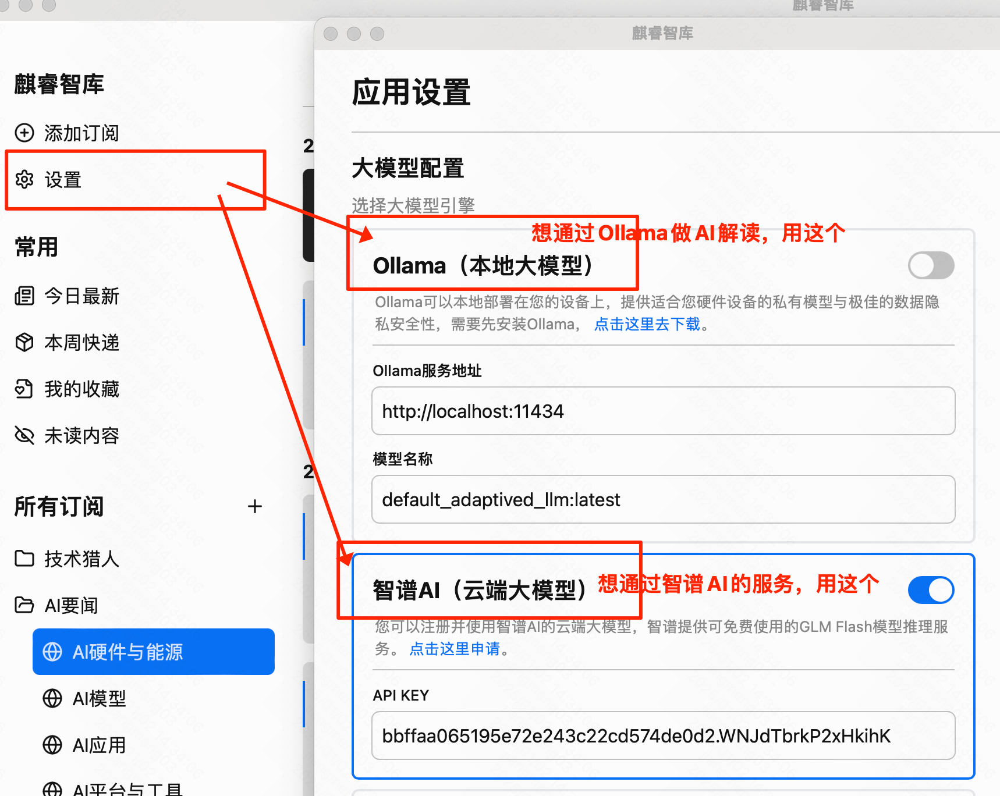
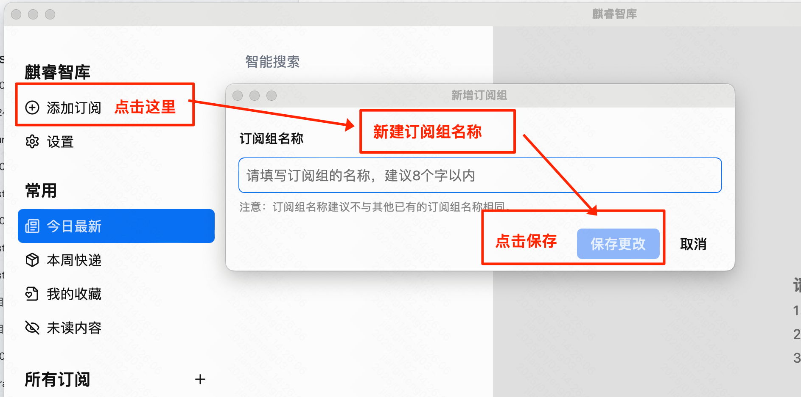
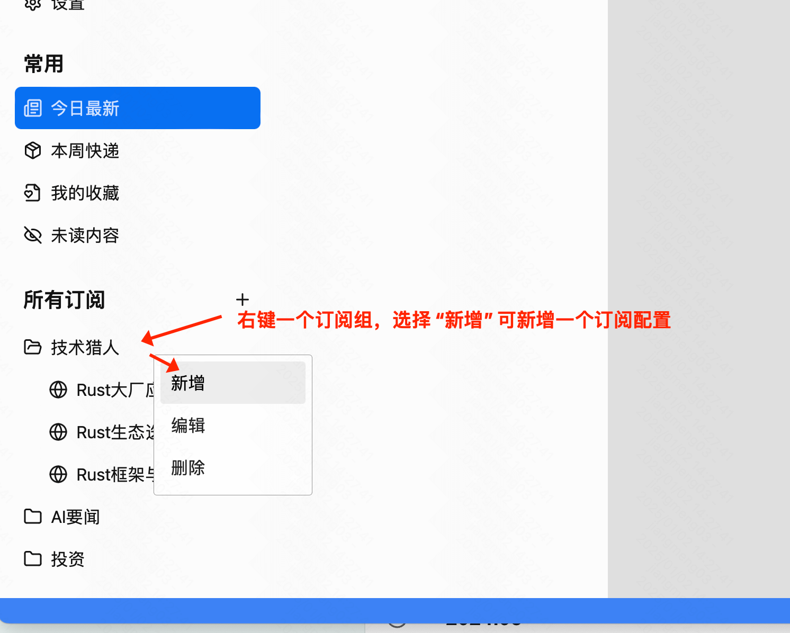
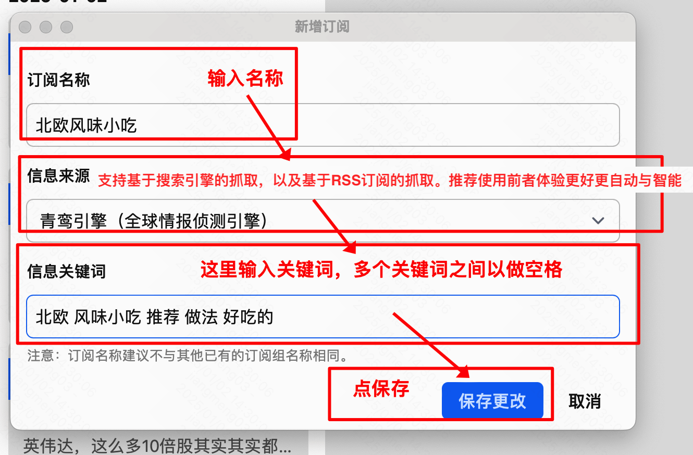

### Installation
**1. Download**

**Method 1 - Use the pre-compiled installation package**: Download from the [official website](https://aiqino.netlify.app) or [Github Releases](https://github.com/sopaco/saga-reader/releases).

**Method 2 - Build from the source code**: For details, refer to the [README - Development Section Instructions](https://github.com/sopaco/saga-reader?tab=readme-ov-file#development).

**2. Installation**
If you install using Method 2, you can directly run the program after compilation.

If you install using Method 1, since you haven't purchased the developer services and signatures from Microsoft and Apple, you need to set the operation authorization.

Taking MacOS as an example, when you directly run the program, you will encounter the following prompt.


You only need to run the following command and then install.
``` sh
sudo xattr -rd com.apple.quarantine /Applications/麒睿智库.app
```

### Initial Configuration Steps
**1. Configure the AI service. The program will summarize and interpret the articles through the AI service.**

Three modes are available for you to choose the one that suits you best:
- Local Large Model: A local large model deployed based on Ollama.
- Cloud Large Model: Supports mainstream large models, i.e., any large model service compatible with the OpenAI API can be configured. Refer to the documentation of the large model service you are using.
- Zhipu AI (Free): A free cloud large model service provided by ZhipuAI.



### Configure the Subscription Group
**2. Create a New Subscription Group**


**3. Add a New Subscription Configuration**


**4. Fill in the Subscription Configuration**

+ Support information crawling based on internet engines.
+ Support RSS subscription sources.



### Q & A
Q: Where does the subscription content come from?
A: It supports intelligent crawling based on search engines. If you are used to using RSS, you can also add a subscription and select "RSS feed source" in the "Information Source"

Q: How is the subscribed content updated?
A: The program will update automatically. If you need to refresh manually, you can click the refresh button in the interface. The program will update the data automatically. If you want to manually trigger the update of a subscription, you can click this button.

Q: What is Ollama and how to install it?
A: Ollama is a very popular local running engine for large language models in the AIGC community. You can download open-source large language models on your own device and run inferences without having to access other commercial online services. You can download Ollama [here](https://ollama.com/download).
