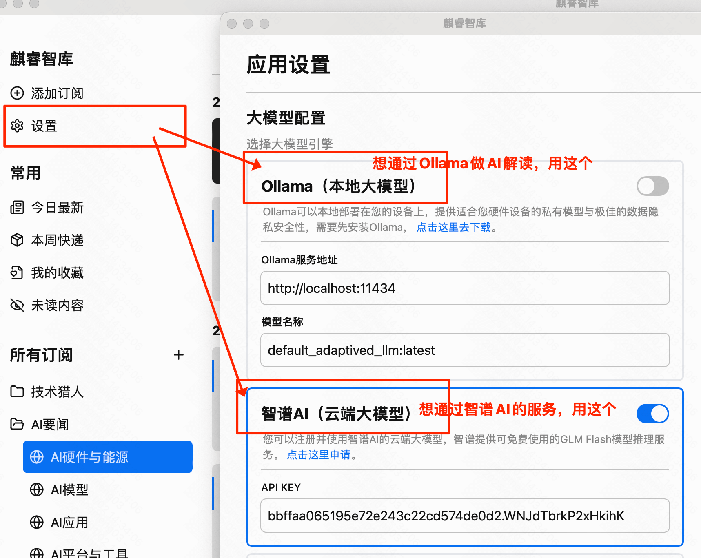
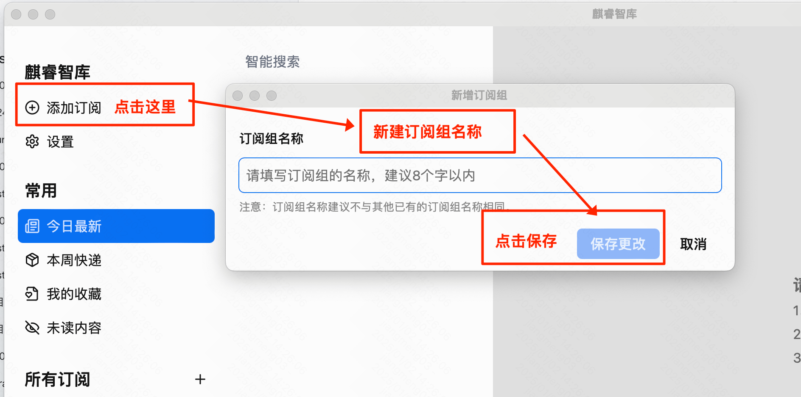
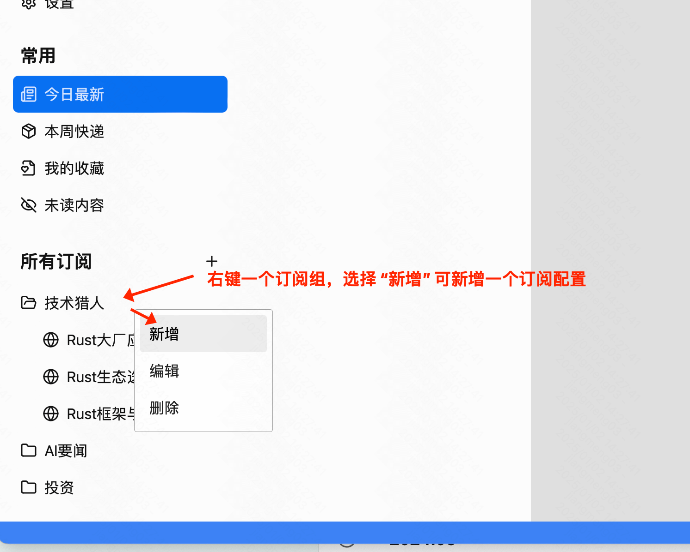

### 安装
**1、下载**

方法一 - 使用预编译好的安装包：从[官网](https://aiqino.netlify.app) 或 [Github Releases](https://github.com/sopaco/saga-reader/releases)

方法二 - 从源码构建，详见[README - 开发章节说明](https://github.com/sopaco/saga-reader?tab=readme-ov-file#development)。

**2、安装**

如果你使用的是方法二安装，编译完后可直接运行。

如果你使用的是方法一安装，目前没有购买微软和苹果的开发者服务和签名，需要设置一下运行授权。

以MacOS为例，直接运行会遇到下面提示。

只需要运行下面命令后再安装即可。
``` sh
sudo xattr -rd com.apple.quarantine /Applications/麒睿智库.app
```


### 初始配置步骤

**1、配置AI服务，程序会通过AI服务对文章做总结和解读**

三种模式可供选择，选择适合你的方式
- 本地大模型：基于Ollama部署的本地大模型。
- 云端大模型：支持主流大模型，即可以配置任何与OpenAI API兼容的大模型服务，具体参照你所使用的大模型服务文档。
- 智谱AI（免费）：由知名清华校企、国内头部大模型公司清华智谱提供的免费云端大模型服务。



### 配置订阅组

**2、新建订阅组**



**3、新增一个订阅配置**



**4、填写订阅配置**

+ 支持基于互联网引擎的信息抓取。
+ 支持RSS订阅源。


### Q & A
Q：订阅内容是从哪里来的？
A：支持基于搜索引擎的智能抓取，如果你习惯使用RSS，同样可以新增订阅时候在“信息来源”中选择“RSS订阅源”

Q：订阅内容是如何更新的？
A：程序会自动更新，如果需要手动刷新，可以点击界面中的刷新按钮，程序会自动更新数据，如果要手动触发一个订阅的更新可点击这个按钮。

Q：Ollama是什么，如何安装？
A：Ollama是AIGC社区非常流行的一款大模型本地运行引擎，可以在你自己的设备商下载开源的大模型并运行推理，而不需要接入其他在线的商业化的服务。 你可以在[这里下载Ollama](https://ollama.com/download)