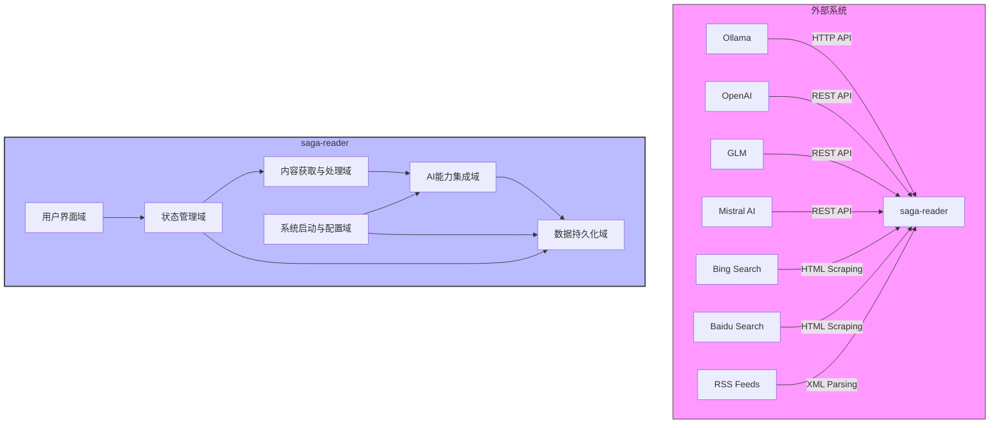

# 项目概述

## 1. 系统概览

### 1.1 项目简介
**项目名称**：`saga-reader`  
**项目类型**：全栈桌面端信息聚合与智能阅读应用（FullStack Desktop App）  
**核心定位**：为知识工作者和技术爱好者提供一站式的深度内容获取、净化与理解平台，融合自动化信息抓取与本地/云端大语言模型能力，打造高效、私密且智能化的阅读体验。

`saga-reader` 是一个基于 **Tauri + SvelteKit + Rust** 技术栈构建的跨平台桌面应用程序。它通过集成 RSS 订阅、搜索引擎爬虫和 JavaScript 渲染网页抓取技术，从多种来源聚合互联网上的高质量内容，并利用大语言模型（LLM）对文章进行“净化 → 优化 → 融合”三级处理，帮助用户去除噪音、提炼要点并生成洞察性摘要。

该系统强调**本地化 AI 处理能力**，支持 Ollama 等本地 LLM 运行时，保障用户数据隐私；同时兼容 OpenAI、GLM、Mistral 等主流云服务，实现灵活可扩展的智能处理架构。

---

### 1.2 核心功能与业务价值

| 功能模块 | 描述 | 业务价值 |
|--------|------|---------|
| **多源内容聚合** | 支持 RSS Feed、Bing/Baidu 搜索结果页的内容抓取 | 打破信息孤岛，统一管理分散的知识源 |
| **智能内容提取** | 使用 Tauri Webview 实现 JS 渲染页面抓取，自动识别跳转逻辑 | 提升复杂网页的解析成功率，确保内容完整性 |
| **AI 内容处理管道** | 构建 Purge（去噪）、Optimize（润色）、Melt（融合）三阶段 LLM 流水线 | 将原始文本转化为结构清晰、重点突出的可读内容 |
| **本地 LLM 集成** | 内置对 Ollama 的启停控制与调用接口，支持离线运行 | 保护敏感信息不外泄，满足高隐私需求场景 |
| **统一 AI 接口抽象** | 通过 LLM Agent 层屏蔽不同提供商（OpenAI/GLM/Mistral）的差异 | 用户可自由切换模型服务商，提升系统灵活性 |
| **状态驱动 UI 架构** | 基于 Svelte stores 实现集中式状态管理，驱动界面响应式更新 | 提供流畅一致的交互体验，降低前端复杂度 |

> ✅ **关键优势总结**：
- **隐私优先**：默认使用本地模型处理敏感内容
- **智能增强**：AI 不仅用于摘要，更参与全文重构与语义融合
- **开箱即用**：新用户自动加载预设订阅包，降低上手门槛
- **极客友好**：支持自定义规则、插件扩展与多模型配置

---

### 1.3 技术特征概述

| 维度 | 技术选型 | 说明 |
|------|--------|------|
| **前端框架** | SvelteKit | 轻量级、高性能的现代前端框架，适合构建桌面级单页应用 |
| **后端逻辑** | Rust (via Tauri) | 利用内存安全与并发性能优势处理爬虫、AI 调用等重负载任务 |
| **UI 构建** | Tailwind CSS + Svelte Svelte Components | 快速构建美观、响应式的三栏布局界面 |
| **状态管理** | Svelte Stores | 集中式 store 管理 feeds、articles、tasks 等全局状态 |
| **数据持久化** | SQLite + SeaORM | 轻量嵌入式数据库，适用于本地存储文章记录与用户配置 |
| **AI 集成方式** | RESTful API / HTTP + 进程控制 | 对接 Ollama（本地）、OpenAI、GLM、Mistral 等多种 LLM 提供商 |
| **构建工具链** | Vite + Bun + Cargo | 高效开发构建流程，支持热重载与快速编译 |

---

## 2. 目标用户

### 2.1 用户角色定义

#### 👤 知识工作者（Knowledge Workers）
- **典型人群**：研究员、产品经理、工程师、分析师
- **核心诉求**：
  - 高效跟踪行业动态与技术趋势
  - 快速筛选出有价值的信息片段
  - 在不泄露工作相关内容的前提下完成内容提炼
  - 获取去除广告、导航栏等干扰元素的纯净阅读视图

#### 🧪 技术爱好者（Tech Enthusiasts / Developers）
- **典型人群**：开发者、极客、开源贡献者
- **核心诉求**：
  - 可控性强：希望了解并干预内容抓取与 AI 处理过程
  - 支持本地部署的大模型（如 Ollama），避免依赖云服务
  - 具备插件化或脚本化扩展能力
  - 跨平台运行（Windows/macOS/Linux）

---

### 2.2 使用场景描述

| 场景 | 描述 |
|------|------|
| **每日晨读模式** | 用户启动应用后，系统自动刷新所有订阅源，展示最新文章列表，点击即可查看 AI 生成的优化版内容 |
| **专题研究模式** | 用户输入关键词，系统通过 Bing/Baidu 搜索获取相关网页，批量抓取并调用 LLM 进行“熔炼”处理，形成综述报告 |
| **离线学习模式** | 用户在无网络环境下打开已缓存的文章，仍可通过本地 Ollama 模型重新生成摘要或提问 |
| **AI 对话辅助阅读** | 在阅读器中激活悬浮 AI 助手面板，针对当前文章提出问题，获得上下文感知的回答 |

---

## 3. 系统边界

### 3.1 系统范围定义
`saga-reader` 是一个完整的**桌面端信息聚合与智能阅读系统**，涵盖从内容采集、AI 处理到用户交互的全流程闭环。

#### ✅ 包含的核心组件：

| 组件类别 | 具体功能 |
|--------|--------|
| **内容获取层** | 
| - RSS 解析引擎 | 解析标准 RSS/XML 源，提取标题、链接、发布时间等元信息 |
| - 搜索引擎爬虫 | 从 Bing 和 Baidu 结果页提取目标 URL 并抓取正文 |
| - 智能网页抓取器 | 借助 Tauri Webview 执行 JS 渲染后的 DOM 提取，支持 SPA 页面 |
| **AI 处理层** |
| - 文章处理流水线 | Purge → Optimize → Melt 三阶段处理管道 |
| - LLM 代理服务 | 统一调度本地（Ollama）与云端（OpenAI/GLM/Mistral）模型 |
| - 提示词工程管理 | 内置结构化 prompt 模板库，支持动态注入上下文 |
| **状态与数据层** |
| - 集中式状态存储 | 基于 Svelte stores 管理 feed、article、task 状态 |
| - 数据持久化服务 | 使用 SeaORM 操作 SQLite 存储文章记录与用户配置 |
| - 数据路径管理 | 自动创建 `~/.saga-reader` 目录存放配置与数据库文件 |
| **系统基础设施** |
| - 启动流程控制器 | 分阶段初始化配置、日志、用户档案与 LLM 服务 |
| - 日志系统 | 按天轮转的日志输出，便于调试与监控 |
| - 托盘守护进程 | 应用最小化至系统托盘，保持后台任务运行 |

---

#### ❌ 明确排除的外部依赖与功能：

| 排除项 | 原因说明 |
|-------|----------|
| 第三方 AI 模型的训练与维护 | 仅作为推理客户端使用，不涉及模型训练 |
| 搜索引擎的索引构建 | 不建立自己的搜索引擎，仅消费现有搜索结果 |
| 云同步服务 | 当前版本仅支持本地存储，未实现账户体系或多设备同步 |
| 社交分享功能 | 不提供一键分享至微博、微信、Twitter 等社交平台 |
| 浏览器插件集成 | 不提供 Chrome/Firefox 插件用于网页收藏或划词翻译 |

> ⚠️ **边界说明**：本系统聚焦于“**个人知识流的终端处理环节**”，而非内容生产、分发或社交传播。其设计哲学是“**把互联网变成你的私人图书馆**”。

---

## 4. 外部系统交互

### 4.1 外部系统列表及交互方式

| 外部系统 | 作用描述 | 交互方式 | 安全性考虑 |
|--------|--------|--------|-----------|
| **Ollama** | 本地大语言模型运行时，执行文章净化、优化、融合等任务 | HTTP API 调用 + 进程启停控制 | 数据不出本地，完全私有化处理 |
| **OpenAI** | 云端通用大模型服务（如 GPT-4），作为可选 AI 引擎 | RESTful API 调用（兼容 OpenAI 格式） | 需用户自行配置 API Key，敏感内容建议禁用 |
| **GLM (智谱AI)** | 国产中文大模型，擅长处理中文语境下的语义理解与生成 | RESTful API 调用 | 支持国产替代方案，符合信创要求 |
| **Mistral AI** | 国际先进开源模型提供商，提供高性能推理服务 | RESTful API 调用 | 支持前沿模型接入，提升处理质量 |
| **Bing Search** | 英文内容检索的主要来源之一 | HTML 爬取 + CSS 选择器解析 | 遵守 robots.txt，限制请求频率 |
| **Baidu Search** | 中文搜索引擎，用于获取中文优质内容 | HTML 爬取 + 动态渲染检测 | 防止被反爬机制封禁 |
| **RSS Feeds** | 用户订阅的技术博客、新闻站点等内容源 | RSS XML 解析 | 支持 Atom、JSON Feed 等变体格式 |

---

### 4.2 依赖关系分析



> 🔗 **关键交互路径说明**：
- **内容获取 → AI处理 → 持久化**：抓取的文章经由 `ArticleProcessor` 调用 `LLMAgent` 发送到指定模型，处理结果写回数据库。
- **UI ↔ 状态管理**：前端组件通过 Svelte stores 订阅数据变化，实现响应式更新。
- **启动流程协调**：`init_app_config.rs` 和 `init_user_profile.rs` 在启动时加载配置，`init_llm.rs` 尝试唤醒 Ollama 服务。

---

## 5. 系统上下文图（C4 Model - System Context）

```mermaid
C4Context
    title 系统上下文图：saga-reader

    Person_Ext(knowledge_worker, "知识工作者", "需要持续学习的专业人士，如研究员、PM、工程师")
    Person_Ext(tech_enthusiast, "技术爱好者", "关注前沿技术的开发者或极客用户")

    System(saga_reader, "saga-reader", "基于Tauri的桌面端信息聚合与智能阅读应用")

    Rel(knowledge_worker, saga_reader, "使用")
    Rel(tech_enthusiast, saga_reader, "使用")

    System_Ext(ollama, "Ollama", "本地大语言模型运行时")
    System_Ext(openai, "OpenAI", "云端大语言模型服务")
    System_Ext(glm, "GLM (智谱AI)", "国产大语言模型服务")
    System_Ext(mistral, "Mistral AI", "国际开源大模型服务")
    System_Ext(bing, "Bing Search", "英文搜索引擎内容源")
    System_Ext(baidu, "Baidu Search", "中文搜索引擎内容源")
    System_Ext(rss, "RSS Feeds", "用户订阅的内容源")

    Rel(saga_reader, ollama, "HTTP API 调用\n启动/停止服务")
    Rel(saga_reader, openai, "RESTful API 调用")
    Rel(saga_reader, glm, "RESTful API 调用")
    Rel(saga_reader, mistral, "RESTful API 调用")
    Rel(saga_reader, bing, "HTML 爬取与解析")
    Rel(saga_reader, baidu, "HTML 爬取与解析")
    Rel(saga_reader, rss, "RSS XML 解析")

    UpdateLayoutConfig($c4DiagramType,"NeuralGrid")
```

> 📌 **图表说明**：
- 本图为 C4 模型的第一层级 —— **System Context Diagram**
- 展示了 `saga-reader` 作为一个独立系统，与其用户和外部依赖之间的关系
- 所有外部系统均标记为 `System_Ext`，表示不属于本项目控制范围
- 用户角色分为两类，体现不同的使用动机与需求层次

---

## 6. 技术架构概览

### 6.1 主要技术栈

| 层级 | 技术 | 用途 |
|------|------|------|
| **前端 UI** | SvelteKit, Tailwind CSS, Vite | 构建现代化响应式界面 |
| **前端状态** | Svelte Stores | 全局状态管理，驱动 UI 更新 |
| **桥接层** | Tauri | 安全地将前端与 Rust 后端连接 |
| **后端逻辑** | Rust (async/.await) | 高性能异步任务处理（爬虫、AI 调用） |
| **数据访问** | SeaORM + SQLite | 类型安全的 ORM 操作本地数据库 |
| **AI 集成** | reqwest, serde_json, tokio | 发起 HTTP 请求并与 LLM 交互 |
| **构建工具** | Bun, Vite, Cargo | 开发服务器、打包与发布 |

---

### 6.2 架构模式

#### 分层架构设计（Layered Architecture）

```text
+----------------------------+
|       用户界面域           | ← Svelte 组件 + Stores
+----------------------------+
            ↓
+----------------------------+
|       状态管理域           | ← 集中式 Store 协调数据流
+----------------------------+
            ↓
+----------------------------+
|   内容获取与处理域         | ← RSS/爬虫 + LLM 处理管道
+----------------------------+
            ↓
+----------------------------+
|     AI能力集成域           | ← LLM Agent + Provider 适配器
+----------------------------+
            ↓
+----------------------------+
|     数据持久化域           | ← SeaORM + SQLite
+----------------------------+
            ↓
+----------------------------+
|  系统启动与配置域          | ← 初始化流程 + 日志 + 路径管理
+----------------------------+
```

> ✅ **各层职责分明**：
- 上层依赖下层服务，但不直接越级调用
- 状态管理作为“中枢神经”，串联 UI 与业务逻辑
- AI 能力以“服务”形式被内容处理模块调用

---

### 6.3 关键设计决策

| 决策 | 说明 | 影响 |
|------|------|------|
| **采用 Tauri 而非 Electron** | 减少资源占用，提升安全性，Rust 后端更适合系统级操作 | 更轻量、更快启动、更低功耗 |
| **Svelte Stores 集中式管理** | 避免 prop drilling，统一状态变更入口 | 提高可维护性，便于调试 |
| **LLM 代理模式（LLM Agent）** | 抽象不同提供商接口，支持运行时切换 | 提升可扩展性，降低耦合度 |
| **本地优先的数据策略** | 所有数据默认保存在本地 SQLite 中 | 无需联网也可使用，保障隐私 |
| **分阶段启动流程** | 先初始化配置，再并行加载用户数据与 LLM 服务 | 缩短冷启动时间，提升用户体验 |

---

### 6.4 架构洞察与未来演进建议

| 方向 | 当前状态 | 建议 |
|------|----------|------|
| **可扩展性** | 已预留插件机制接口（`crates/tauri-plugin-feed-api`） | 可引入插件市场，支持自定义抓取规则或 AI 模型封装 |
| **多端同步** | 仅本地存储 | 可在未来引入加密云同步（如 Dropbox/SyncThing 集成） |
| **AI 工作流编排** | 固定三段式流水线 | 可发展为可视化 AI 工作流编辑器，支持条件分支与循环 |
| **性能监控** | 基础日志记录 | 建议增加处理延迟、API 成本统计等可观测性指标 |

---

## 总结

`saga-reader` 是一个定位清晰、架构合理、技术先进的智能阅读工具。它成功地将 **信息聚合、内容清洗、AI 增强与本地隐私保护** 四大要素融合在一起，为目标用户提供了真正有价值的生产力解决方案。

通过本次 C4 System Context 分析，我们明确了系统的边界、用户画像、外部依赖和技术架构，为后续的详细设计（Container、Component、Code 层级）奠定了坚实基础。该文档可作为产品、研发与架构团队共同协作的权威参考依据。