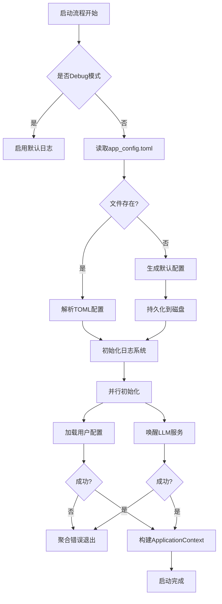

# **系统启动与配置域技术实现文档**

---

## **1. 模块概述**

### **模块名称**  
`系统启动与配置域`（System Startup & Configuration Domain）

### **所属层级**  
基础设施域（Infrastructure Layer）

### **核心职责**  
负责应用程序的初始化流程、全局配置管理、日志系统构建以及关键依赖服务（如本地LLM运行时）的状态准备。该模块是整个应用生命周期的起点，确保后续业务逻辑在稳定、一致的环境中运行。

### **设计目标**
- 实现**分阶段、可扩展的启动策略**，提升启动效率。
- 提供**健壮的配置加载机制**，支持默认值生成与持久化。
- 统一管理**日志输出行为**，便于调试和监控。
- 预检并激活**AI模型运行环境**（如Ollama），保障核心功能可用性。
- 通过**错误聚合机制**保证初始化过程的可靠性。

---

## **2. 架构设计与核心组件**

本模块采用**分层+插件式初始化架构**，以 `Startup` 结构体为核心控制器，协调多个独立子模块完成系统初始化任务。整体结构如下：

```rust
// crates/feed_api_rs/src/startup/mod.rs
pub struct Startup {
    context: ApplicationContext,
}

impl Startup {
    pub async fn launch() -> anyhow::Result<Startup>;
}
```

### **主要子模块构成**

| 子模块 | 功能描述 | 关键文件 |
|-------|--------|---------|
| **启动流程管理** | 控制整体初始化顺序，实现同步与并行阶段划分 | `mod.rs`, `tiger0_1()` |
| **应用配置管理** | 加载/创建 `app_config.toml`，提供全局配置对象 | `init_app_config.rs` |
| **用户配置管理** | 管理用户级订阅数据（`user_config.toml`） | `init_user_profile.rs` |
| **LLM运行时管理** | 检查并唤醒本地LLM服务（如Ollama） | `init_llm.rs` |
| **日志系统** | 初始化结构化日志输出，支持磁盘轮转 | `init_logger.rs` |
| **初始化任务抽象** | 封装通用初始化行为，支持耗时统计与状态追踪 | `task.rs`, `types.rs` |

---

## **3. 启动流程详解（Tiger0_1 分阶段策略）**

系统采用名为 **"Tiger0_1"** 的两阶段初始化策略，旨在分离阻塞型与非阻塞型操作，优化启动性能。

### **3.1 流程图示**



### **3.2 阶段说明**

#### **阶段一：Tiger0 —— 同步关键初始化**
此阶段为串行执行，必须成功才能进入下一阶段。

1. **加载应用配置 (`init_app_config::call`)**
   - 尝试从 `$APPDATA/saga-reader/app_config.toml` 读取配置。
   - 若文件不存在，则调用 `default_app_config()` 生成默认配置，并立即持久化至磁盘。
   - 使用 `tokio::fs::File` 异步I/O避免主线程阻塞。

2. **初始化日志系统 (`init_logger::call`)**
   - 根据 `app_config.log` 设置决定日志行为：
     - Debug模式：强制开启控制台输出，级别为 `All`。
     - 正式环境：根据 `enable` 和 `output_type` 决定输出方式（Stdout / Disk）。
   - 日志写入采用 `spdlog-rs`，支持按天轮转（`RotatingFileSink`），路径为 `$APPDATA/saga-reader/logs/app*.log`。
   - 自定义格式器输出 `[日期 时间.毫秒] [线程ID] [级别] 日志内容`。

> ✅ **优势**：即使配置损坏或缺失，也能降级运行，保障基本可用性。

#### **阶段二：Tiger1 —— 并行依赖初始化**
使用 `tokio::join!` 实现并发加载，缩短总启动时间。

```rust
let (r1, r2) = tokio::join!(
    init_user_profile::call(),
    init_llm::call(llm_section)
);
```

- **并行任务A：用户配置加载**
  - 读取 `user_config.toml`。
  - 若为新用户，生成包含预设订阅包（如“未分类”组 + 默认关键词抓取）的初始配置，并持久化。

- **并行任务B：LLM服务状态检查**
  - 根据当前激活的 LLM 提供商类型进行处理：
    - **Ollama**：调用 `ollama::query_platform(&endpoint)` 探测安装与运行状态。
      - 已安装但未运行 → 调用 `ollama::launch().await` 唤醒服务。
      - 未安装 → 记录状态，不中断启动。
    - 其他提供商（OpenAI/GLM等）→ 执行空初始化（仅占位）。

> ⚠️ **失败处理**：任一并行任务失败将导致整体启动中止，并通过 `anyhow::Error::msg(format!("..."))` 聚合错误信息返回。

---

## **4. 核心技术实现细节**

### **4.1 配置管理机制**

#### **配置文件格式**
- 文件名：`app_config.toml`, `user_config.toml`
- 格式：TOML（易于人类编辑）
- 序列化库：`toml` crate

#### **默认配置生成**
- `default_app_config()` 返回一个完整的 `AppConfig` 对象，包含：
  ```rust
  AppConfig {
      llm: LLMSection {
          provider_ollama: OllamaLLMProvider { endpoint: "http://localhost:11434".into() },
          provider_glm: GLMLLMProvider { model_name: "GLM-4.5-Flash".to_string(), ... },
          active_provider_type: LLMProviderType::Ollama,
          max_parallel: Some(5),
          instruct: LLMInstructOption::default(),
      },
      scrap: ScrapSection::default(),
      log: Default::default(),
      daemon: Default::default(),
      diagnostic: Default::default(),
  }
  ```

- `sync_to(...)` 函数负责将内存中的配置对象写回磁盘，确保变更持久化。

#### **路径管理**
- 所有配置文件路径由 `recorder::path::get_appdata_file(...)` 统一生成，遵循各平台标准目录规范（如 Windows `%APPDATA%`, macOS `~/Library/Application Support`）。

---

### **4.2 日志系统实现**

#### **日志库选择**
- 使用 `spdlog-rs`（Rust绑定自C++ spdlog），具备高性能、低开销、多后端支持等优点。

#### **初始化逻辑**
```rust
pub fn init_by(log_section: &AppConfigLogSection) -> anyhow::Result<()> {
    if cfg!(debug_assertions) {
        // Debug模式自动启用全量日志
        specify_logger_format(&spdlog::default_logger());
        spdlog::default_logger().set_level_filter(LevelFilter::All);
        return Ok(());
    }

    if !log_section.enable {
        spdlog::default_logger().set_level_filter(LevelFilter::Off);
        return Ok(());
    }

    match log_section.output_type {
        OutputType::Stdout => { /* 控制台输出 */ }
        OutputType::Disk => {
            let path = get_appdata_file_in_dir("logs", format!("app{}.log", tail));
            let file_sink = RotatingFileSink::builder()
                .base_path(path)
                .rotation_policy(RotationPolicy::Daily { hour: 0, minute: 0 })
                .build()?;
            let new_logger = spdlog::default_logger().fork_with(|new| {
                new.sinks_mut().push(Arc::new(file_sink));
                Ok(())
            })?;
            spdlog::set_default_logger(new_logger);
            specify_logger_format(&spdlog::default_logger());
        }
        _ => { /* fallback to stdout */ }
    }
    Ok(())
}
```

#### **日志格式**
```
[2025-04-05 14:23:01.123] [thread-12345] [INFO] starting up...tiger0_1, application configuration and logger initialized
```

---

### **4.3 LLM 运行时管理（以 Ollama 为例）**

#### **状态探测机制**
`ollama::query_platform()` 实现双通道检测：

1. **进程级检测（优先）**
   - 在 Unix 系统上调用 `ollama -v` 检查是否存在可执行文件。
   - 成功返回版本号且无连接错误 → `ProgramStatus::Running`
   - 存在可执行文件但无法连接 → `ProgramStatus::InstallButNotRunning`
   - 命令执行失败 → `ProgramStatus::Uninstall`

2. **HTTP API 探测（备用）**
   - 向 `http://localhost:11434` 发送 GET 请求。
   - 响应体为 `"Ollama is running"` → 判断为运行中。
   - 否则视为未安装或不可达。

#### **服务唤醒**
- 调用 `ollama::launch()` 通过 shell 命令触发后台服务启动：
  ```rust
  #[cfg(unix)]
  Command::new("sh").arg("-c").arg("/usr/local/bin/ollama list")
  #[cfg(windows)]
  Command::new("cmd").arg("/C").arg("ollama list").creation_flags(0x08000000) // CREATE_NO_WINDOW
  ```
- 注意：仅发送命令，不等待结果，防止阻塞主流程。

---

### **4.4 初始化任务抽象（InitTask）**

为统一管理各类初始化操作，定义了泛型结构 `InitTask<T>` 与 trait `TaskInitializer`。

#### **核心结构**
```rust
pub struct InitTask<TData> {
    pub result: Option<TData>,
    pub task_cost: u128,       // 耗时（毫秒）
    pub task_status: Status,   // UnLaunch/Running/Completed/Error
}

pub enum Status {
    UnLaunch, Running, Completed, Aborted, Error
}
```

#### **使用模式**
```rust
let mut task = InitTask::default();
task.start("app_config", || async {
    // 具体初始化逻辑
}).await?;
```

- 自动记录开始/结束时间。
- 成功时设置 `result` 和 `Completed` 状态。
- 失败时记录错误日志并抛出异常。

> 📌 **价值**：提供标准化接口，便于未来扩展延迟初始化（Tiger2）或健康检查功能。

---

## **5. 上下文传递：ApplicationContext**

所有初始化成果最终封装为 `ApplicationContext`，作为后续业务模块共享的上下文对象。

```rust
#[derive(Clone)]
pub struct ApplicationContext {
    pub app_config: AppConfig,
    pub user_config: UserConfig,
}
```

- 通过 `ContextHost` trait 实现上下文持有者模式：
  ```rust
  pub trait ContextHost {
      fn new(context: ApplicationContext) -> Self;
      fn get_context(&self) -> &ApplicationContext;
      fn copy_context(&self) -> ApplicationContext;
  }
  ```

- `Startup` 实现该 trait，允许其他模块安全访问配置信息。

---

## **6. 错误处理与可观测性**

### **错误传播机制**
- 使用 `anyhow::Result` 进行链式错误传播。
- 启动失败时聚合多个子任务错误信息，便于定位问题根源。

### **日志观测点**
| 阶段 | 日志内容 |
|------|--------|
| Tiger0 开始 | `starting up...tiger0_1, application configuration and logger initialized` |
| 用户配置加载 | `the task user_profile execute completed, cost 12ms` |
| LLM 初始化 | `the task llm_provider_ollama execute completed, cost 87ms` |
| 启动完成 | `starting up...tiger0_1, end initialize` |
| 启动失败 | `error in startup..., Some(...), None` |

---

## **7. 可扩展性设计（预留 Tiger2）**

当前仅实现 `tiger0_1()`，但已预留 `tiger2(_context: ApplicationContext)` 接口：

```rust
pub async fn tiger2(_context: ApplicationContext) -> anyhow::Result<ApplicationContext> {
    todo!();
}
```

可用于未来实现：
- 插件动态加载
- 守护进程注册
- AI模型预热缓存
- 网络状态检测等非关键路径初始化

---

## **8. 总结与建议**

### **模块亮点**
- ✅ **分阶段启动策略** 显著提升用户体验。
- ✅ **配置即代码** 设计增强可维护性。
- ✅ **本地LLM无缝集成** 支持私有化部署场景。
- ✅ **结构化日志 + 任务追踪** 提升运维能力。

### **改进建议**
1. **增加配置校验机制**：对 `app_config.toml` 添加 schema validation，防止非法输入。
2. **支持热重载配置**：监听文件变化，无需重启即可生效。
3. **完善Ollama自动安装逻辑**：目前仅唤醒，可考虑集成下载安装向导。
4. **引入指标监控**：记录各阶段耗时，用于性能分析。

---

✅ **结论**：`系统启动与配置域` 是一个设计严谨、职责清晰、具备良好扩展性的基础设施模块，为 `saga-reader` 的稳定性与智能化奠定了坚实基础。